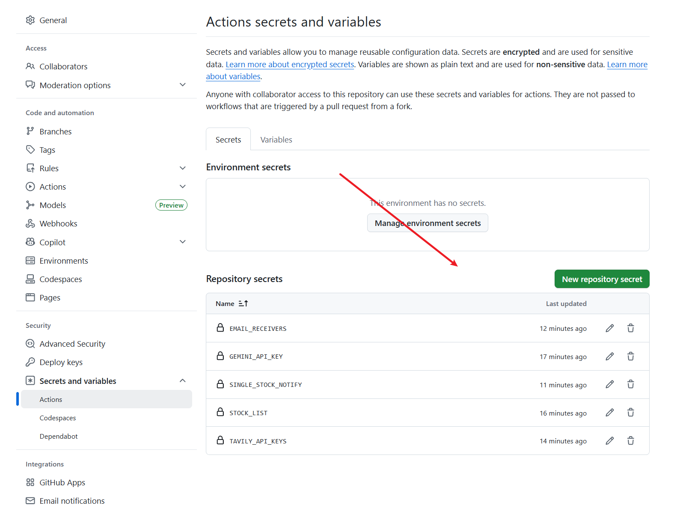

# 馃摉 瀹屾暣閰嶇疆涓庨儴缃叉寚鍗?

鏈枃妗ｅ寘鍚?A鑲℃櫤鑳藉垎鏋愮郴缁熺殑瀹屾暣閰嶇疆璇存槑锛岄€傚悎闇€瑕侀珮绾у姛鑳芥垨鐗规畩閮ㄧ讲鏂瑰紡鐨勭敤鎴枫€?

> 馃挕 蹇€熶笂鎵嬭鍙傝€?[README.md](../README.md)锛屾湰鏂囨。涓鸿繘闃堕厤缃€?

## 馃搧 椤圭洰缁撴瀯

```
daily_stock_analysis/
鈹溾攢鈹€ main.py              # 涓荤▼搴忓叆鍙?
鈹溾攢鈹€ src/                 # 鏍稿績涓氬姟閫昏緫
鈹?  鈹溾攢鈹€ analyzer.py      # AI 鍒嗘瀽鍣?
鈹?  鈹溾攢鈹€ config.py        # 閰嶇疆绠＄悊
鈹?  鈹溾攢鈹€ notification.py  # 娑堟伅鎺ㄩ€?
鈹?  鈹斺攢鈹€ ...
鈹溾攢鈹€ data_provider/       # 澶氭暟鎹簮閫傞厤鍣?
鈹溾攢鈹€ bot/                 # 鏈哄櫒浜轰氦浜掓ā鍧?
鈹溾攢鈹€ api/                 # FastAPI 鍚庣鏈嶅姟
鈹溾攢鈹€ apps/dsa-web/        # React 鍓嶇
鈹溾攢鈹€ docker/              # Docker 閰嶇疆
鈹溾攢鈹€ docs/                # 椤圭洰鏂囨。
鈹斺攢鈹€ .github/workflows/   # GitHub Actions
```

## 馃搼 鐩綍

- [椤圭洰缁撴瀯](#椤圭洰缁撴瀯)
- [GitHub Actions 璇︾粏閰嶇疆](#github-actions-璇︾粏閰嶇疆)
- [鐜鍙橀噺瀹屾暣鍒楄〃](#鐜鍙橀噺瀹屾暣鍒楄〃)
- [Docker 閮ㄧ讲](#docker-閮ㄧ讲)
- [鏈湴杩愯璇︾粏閰嶇疆](#鏈湴杩愯璇︾粏閰嶇疆)
- [瀹氭椂浠诲姟閰嶇疆](#瀹氭椂浠诲姟閰嶇疆)
- [閫氱煡娓犻亾璇︾粏閰嶇疆](#閫氱煡娓犻亾璇︾粏閰嶇疆)
- [鏁版嵁婧愰厤缃甝(#鏁版嵁婧愰厤缃?
- [楂樼骇鍔熻兘](#楂樼骇鍔熻兘)
- [鍥炴祴鍔熻兘](#鍥炴祴鍔熻兘)
- [鏈湴 WebUI 绠＄悊鐣岄潰](#鏈湴-webui-绠＄悊鐣岄潰)

---

## GitHub Actions 璇︾粏閰嶇疆

### 1. Fork 鏈粨搴?

鐐瑰嚮鍙充笂瑙?`Fork` 鎸夐挳

### 2. 閰嶇疆 Secrets

杩涘叆浣?Fork 鐨勪粨搴?鈫?`Settings` 鈫?`Secrets and variables` 鈫?`Actions` 鈫?`New repository secret`

<div align="center">
  
</div>

#### AI 妯″瀷閰嶇疆锛堣嚦灏戦厤缃竴涓級

| Secret 鍚嶇О | 璇存槑 | 蹇呭～ |
|------------|------|:----:|
| `ANSPIRE_API_KEYS` | [Anspire](https://open.anspire.cn/?share_code=QFBC0FYC) API Key锛屼竴 Key 鍚屾椂鍚敤澶фā鍨嬪拰涓枃浼樺寲鑱旂綉鎼滅储锛屽惈鏈」鐩厤璐归搴?| 鎺ㄨ崘 |
| `AIHUBMIX_KEY` | [AIHubMix](https://aihubmix.com/?aff=CfMq) API Key锛屼竴 Key 鍒囨崲浣跨敤鍏ㄧ郴妯″瀷锛屾湰椤圭洰鍙韩 10% 浼樻儬 | 鎺ㄨ崘 |
| `GEMINI_API_KEY` | [Google AI Studio](https://aistudio.google.com/) 鑾峰彇鍏嶈垂 Key | 鍙€?|
| `ANTHROPIC_API_KEY` | Anthropic Claude API Key | 鍙€?|
| `OPENAI_API_KEY` | OpenAI 鍏煎 API Key锛堟敮鎸?DeepSeek銆侀€氫箟鍗冮棶绛夛級 | 鍙€?|
| `OPENAI_BASE_URL` | OpenAI 鍏煎 API 鍦板潃锛堝 `https://api.deepseek.com`锛?| 鍙€?|
| `OPENAI_MODEL` | 妯″瀷鍚嶇О锛堝 `gemini-3.1-pro-preview`銆乣deepseek-v4-flash`銆乣gpt-5.5`锛?| 鍙€?|

> *娉細浠ヤ笂妯″瀷 Key / 娓犻亾鑷冲皯閰嶇疆涓€涓紱鎺ㄨ崘浼樺厛浠?Anspire 鎴?AIHubMix 杩欑被涓€ Key 澶氭ā鍨嬫湇鍔″紑濮嬨€傚惎鍔ㄦ椂閰嶇疆鏍￠獙浼氬湪缂哄皯鍙敤 AI 妯″瀷 Key 鎴栨ā鍨嬫笭閬撴椂缁欏嚭鏄庣‘閿欒鎻愮ず銆?

#### 閫氱煡娓犻亾閰嶇疆锛堝彲鍚屾椂閰嶇疆澶氫釜锛屽叏閮ㄦ帹閫侊級

> 閫氱煡娓犻亾銆乵inimal/advanced key 鍒嗗眰銆丄ctions 鏄犲皠銆乣--check-notify` 璇婃柇銆乄eb 涓€閿祴璇曞拰鏈湴 / Docker / GitHub Actions / Desktop 鍦烘櫙璇存槑璇﹁ [閫氱煡涓撻鏂囨。](notifications.md)銆?

| Secret 鍚嶇О | 璇存槑 | 蹇呭～ |
|------------|------|:----:|
| `WECHAT_WEBHOOK_URL` | 浼佷笟寰俊 Webhook URL | 鍙€?|
| `FEISHU_WEBHOOK_URL` | 椋炰功 Webhook URL | 鍙€?|
| `FEISHU_WEBHOOK_SECRET` | 椋炰功 Webhook 绛惧悕瀵嗛挜锛堝紑鍚€滅鍚嶆牎楠屸€濇椂蹇呭～锛?| 鍙€?|
| `FEISHU_WEBHOOK_KEYWORD` | 椋炰功 Webhook 鍏抽敭璇嶏紙寮€鍚€滃叧閿瘝鈥濇椂蹇呭～锛?| 鍙€?|
| `DINGTALK_WEBHOOK_URL` | 閽夐拤缇ゆ満鍣ㄤ汉 Webhook URL | 鍙€?|
| `DINGTALK_SECRET` | 閽夐拤缇ゆ満鍣ㄤ汉鍔犵瀵嗛挜 (SEC寮€澶? | 鍙€?|
| `TELEGRAM_BOT_TOKEN` | Telegram Bot Token锛園BotFather 鑾峰彇锛?| 鍙€?|
| `TELEGRAM_CHAT_ID` | Telegram Chat ID | 鍙€?|
| `TELEGRAM_MESSAGE_THREAD_ID` | Telegram Topic ID (鐢ㄤ簬鍙戦€佸埌瀛愯瘽棰? | 鍙€?|
| `DISCORD_WEBHOOK_URL` | Discord Webhook URL锛圼鍒涘缓鏂规硶](https://support.discord.com/hc/en-us/articles/228383668)锛?| 鍙€?|
| `DISCORD_BOT_TOKEN` | Discord Bot Token锛堜笌 Webhook 浜岄€変竴锛?| 鍙€?|
| `DISCORD_MAIN_CHANNEL_ID` | Discord Channel ID锛堜娇鐢?Bot 鏃堕渶瑕侊級 | 鍙€?|
| `DISCORD_INTERACTIONS_PUBLIC_KEY` | Discord Public Key锛堜粎鍏ョ珯 Interaction/Webhook 鍥炶皟楠岀鏃堕渶瑕侊級 | 鍙€?|
| `SLACK_BOT_TOKEN` | Slack Bot Token锛堟帹鑽愶紝鏀寔鍥剧墖涓婁紶锛涘悓鏃堕厤缃椂浼樺厛浜?Webhook锛?| 鍙€?|
| `SLACK_CHANNEL_ID` | Slack Channel ID锛堜娇鐢?Bot 鏃堕渶瑕侊級 | 鍙€?|
| `SLACK_WEBHOOK_URL` | Slack Incoming Webhook URL锛堜粎鏂囨湰锛屼笉鏀寔鍥剧墖锛?| 鍙€?|
| `EMAIL_SENDER` | 鍙戜欢浜洪偖绠憋紙濡?`xxx@qq.com`锛?| 鍙€?|
| `EMAIL_PASSWORD` | 閭鎺堟潈鐮侊紙闈炵櫥褰曞瘑鐮侊級 | 鍙€?|
| `EMAIL_RECEIVERS` | 鏀朵欢浜洪偖绠憋紙澶氫釜鐢ㄩ€楀彿鍒嗛殧锛岀暀绌哄垯鍙戠粰鑷繁锛?| 鍙€?|
| `EMAIL_SENDER_NAME` | 鍙戜欢浜烘樉绀哄悕绉帮紙榛樿锛歞aily_stock_analysis鑲＄エ鍒嗘瀽鍔╂墜锛?| 鍙€?|
| `PUSHPLUS_TOKEN` | PushPlus Token锛圼鑾峰彇鍦板潃](https://www.pushplus.plus)锛屽浗鍐呮帹閫佹湇鍔★級 | 鍙€?|
| `SERVERCHAN3_SENDKEY` | Server閰甭?Sendkey锛圼鑾峰彇鍦板潃](https://sc3.ft07.com/)锛屾墜鏈篈PP鎺ㄩ€佹湇鍔★級 | 鍙€?|
| `ASTRBOT_URL` | AstrBot Webhook URL | 鍙€?|
| `ASTRBOT_TOKEN` | AstrBot Bearer Token锛堝彲閫夛級 | 鍙€?|
| `NTFY_URL` | ntfy 瀹屾暣 topic endpoint锛屽繀椤诲寘鍚?topic path锛屼緥濡?`https://ntfy.sh/my-topic` | 鍙€?|
| `NTFY_TOKEN` | ntfy Bearer Token锛堝彲閫夛級 | 鍙€?|
| `GOTIFY_URL` | Gotify server base URL锛屼笉鍖呭惈 `/message`锛涚郴缁熶細鑷姩鎷兼帴 `/message` | 鍙€?|
| `GOTIFY_TOKEN` | Gotify application token锛岄€氳繃 `X-Gotify-Key` Header 鍙戦€?| 鍙€?|
| `CUSTOM_WEBHOOK_URLS` | 鑷畾涔?Webhook锛堟敮鎸侀拤閽夌瓑锛屽涓敤閫楀彿鍒嗛殧锛?| 鍙€?|
| `CUSTOM_WEBHOOK_BEARER_TOKEN` | 鑷畾涔?Webhook 鐨?Bearer Token锛堢敤浜庨渶瑕佽璇佺殑 Webhook锛?| 鍙€?|
| `CUSTOM_WEBHOOK_BODY_TEMPLATE` | 鑷畾涔?Webhook JSON body 妯℃澘锛岄€傞厤 AstrBot銆丯apCat銆佽嚜寤烘湇鍔＄瓑鐗规畩 payload | 鍙€?|
| `WEBHOOK_VERIFY_SSL` | 璇诲彇璇ラ厤缃殑 webhook-style HTTPS 閫氱煡璇锋眰璇佷功鏍￠獙锛堥粯璁?true锛夈€傝涓?false 鍙敮鎸佽嚜绛惧悕璇佷功銆傝鍛婏細鍏抽棴鏈変弗閲嶅畨鍏ㄩ闄╋紙MITM锛夛紝浠呴檺鍙俊鍐呯綉 | 鍙€?|

> *娉細鑷冲皯閰嶇疆涓€涓笭閬擄紝閰嶇疆澶氫釜鍒欏悓鏃舵帹閫併€傚惎鍔ㄦ椂閰嶇疆鏍￠獙浼氭彁绀?Telegram / 閭欢鎴愬瀛楁缂哄け锛屼互鍙婂父瑙?Webhook URL 鏈互 `http://` 鎴?`https://` 寮€澶寸殑闂銆?
>
> 褰撳墠榛樿 `00-daily-analysis.yml` 鍙樉寮忔槧灏勫浐瀹?Secret / Variable 鍚嶇О锛屼笉浼氳嚜鍔ㄦ妸 `STOCK_GROUP_1`銆乣EMAIL_GROUP_1` 杩欑被浠绘剰缂栧彿鍙橀噺瀵煎叆杩愯鐜銆傛墍浠ュ垎缁勯偖绠卞姛鑳界洰鍓嶄笉閫傜敤浜庝粨搴撹嚜甯﹂粯璁?GitHub Actions workflow锛涘畠閫傜敤浜庢湰鍦?`.env`銆丏ocker锛屾垨浣犺嚜琛屾樉寮忔墿灞曡繃 `env:` 鏄犲皠鐨勮繍琛岀幆澧冦€侫ctions 宸叉樉寮忔槧灏?`CUSTOM_WEBHOOK_BODY_TEMPLATE`銆乣WEBHOOK_VERIFY_SSL`銆乣FEISHU_WEBHOOK_SECRET`銆乣FEISHU_WEBHOOK_KEYWORD`銆乣PUSHPLUS_TOPIC`銆乣NTFY_URL`銆乣NTFY_TOKEN`銆乣GOTIFY_URL`銆乣GOTIFY_TOKEN`銆丳3 閫氱煡璺敱閿互鍙?P4 閫氱煡闄嶅櫔閿紱`MARKDOWN_TO_IMAGE_CHANNELS` 鍜?`MERGE_EMAIL_NOTIFICATION` 浠嶄綔涓鸿涓哄紑鍏充笉鍦ㄩ粯璁?workflow 涓嚜鍔ㄦ槧灏勩€?

#### 鎺ㄩ€佽涓洪厤缃?

| Secret 鍚嶇О | 璇存槑 | 蹇呭～ |
|------------|------|:----:|
| `SINGLE_STOCK_NOTIFY` | 鍗曡偂鎺ㄩ€佹ā寮忥細璁句负 `true` 鍒欐瘡鍒嗘瀽瀹屼竴鍙偂绁ㄧ珛鍗虫帹閫?| 鍙€?|
| `REPORT_TYPE` | 鎶ュ憡绫诲瀷锛歚simple`(绮剧畝)銆乣full`(瀹屾暣)銆乣brief`(3-5鍙ユ鎷?锛孌ocker鐜鎺ㄨ崘璁句负 `full` | 鍙€?|
| `REPORT_LANGUAGE` | 鎶ュ憡杈撳嚭璇█锛歚zh`(榛樿涓枃) / `en`(鑻辨枃) / `ko`(闊╂枃)锛涗細鍚屾褰卞搷 Prompt銆佹ā鏉裤€侀€氱煡 fallback 涓?Web 鎶ュ憡椤靛浐瀹氭枃妗堛€俙ko` 澶嶇敤鑻辨枃缁撴瀯楠ㄦ灦骞堕€氳繃杈撳嚭璇█鎸囦护绾︽潫妯″瀷鐢ㄩ煩鏂囪緭鍑猴紝閫氱煡鎸夋姤鍛婅瑷€娓叉煋鏈湴鍖栨爣绛俱€備粨搴撹嚜甯?`00-daily-analysis.yml` 宸叉樉寮忔槧灏勮鍙橀噺锛岀洿鎺ュ湪 Actions Secrets/Variables 涓厤缃嵆鍙敓鏁?| 鍙€?|
| `REPORT_SUMMARY_ONLY` | 浠呭垎鏋愮粨鏋滄憳瑕侊細璁句负 `true` 鏃跺彧鎺ㄩ€佹眹鎬伙紝涓嶅惈涓偂璇︽儏锛涘鑲℃椂閫傚悎蹇€熸祻瑙堬紙榛樿 false锛孖ssue #262锛?| 鍙€?|
| `REPORT_SHOW_LLM_MODEL` | 閫氱煡鎶ュ憡搴曢儴鏄惁鏄剧ず鏈鍒嗘瀽浣跨敤鐨?LLM 妯″瀷鍚嶇О锛岄粯璁?`true`锛涜涓?`false` 鍙殣钘忚繍琛屾椂妯″瀷淇℃伅銆傝鍙橀噺浠呰皟鏁村睍绀猴紝涓嶅奖鍝?provider/model/Base URL銆丩iteLLM 璺敱鎴栬繍琛屾椂妯″瀷淇濆瓨/杩佺Щ/娓呯悊璇箟銆?| 鍙€?|
| `REPORT_TEMPLATES_DIR` | Jinja2 妯℃澘鐩綍锛堢浉瀵归」鐩牴锛岄粯璁?`templates`锛?| 鍙€?|
| `REPORT_RENDERER_ENABLED` | 鍚敤 Jinja2 妯℃澘娓叉煋锛堥粯璁?`false`锛屼繚璇侀浂鍥炲綊锛?| 鍙€?|
| `REPORT_INTEGRITY_ENABLED` | 鍚敤鎶ュ憡瀹屾暣鎬ф牎楠岋紝缂哄け蹇呭～瀛楁鏃堕噸璇曟垨鍗犱綅琛ュ叏锛堥粯璁?`true`锛?| 鍙€?|
| `REPORT_INTEGRITY_RETRY` | 瀹屾暣鎬ф牎楠岄噸璇曟鏁帮紙榛樿 `1`锛宍0` 琛ㄧず浠呭崰浣嶄笉閲嶈瘯锛?| 鍙€?|
| `REPORT_HISTORY_COMPARE_N` | 鍘嗗彶淇″彿瀵规瘮鏉℃暟锛宍0` 鍏抽棴锛堥粯璁わ級锛宍>0` 鍚敤 | 鍙€?|
| `ANALYSIS_DELAY` | 涓偂鍒嗘瀽鍜屽ぇ鐩樺垎鏋愪箣闂寸殑寤惰繜锛堢锛夛紝閬垮厤API闄愭祦锛屽 `10` | 鍙€?|
| `SAVE_CONTEXT_SNAPSHOT` | 鏄惁淇濆瓨鍒嗘瀽鍘嗗彶 `context_snapshot`锛岄粯璁?`true`锛涜涓?`false` 鎴栦娇鐢?`--no-context-snapshot` 鏃朵笉鎸佷箙鍖栨暣浠戒笂涓嬫枃蹇収 | 鍙€?|
| `MERGE_EMAIL_NOTIFICATION` | 涓偂涓庡ぇ鐩樺鐩樺悎骞舵帹閫侊紙榛樿 false锛夛紝鍑忓皯閭欢鏁伴噺銆侀檷浣庡瀮鍦鹃偖浠堕闄╋紱涓?`SINGLE_STOCK_NOTIFY` 浜掓枼锛堝崟鑲℃ā寮忎笅鍚堝苟涓嶇敓鏁堬級 | 鍙€?|
| `MARKDOWN_TO_IMAGE_CHANNELS` | 灏?Markdown 杞负鍥剧墖鍙戦€佺殑娓犻亾锛堢敤閫楀彿鍒嗛殧锛夛細telegram,wechat,custom,email,slack锛涘崟鑲℃帹閫侀渶鍚屾椂閰嶇疆涓斿畨瑁呰浆鍥惧伐鍏?| 鍙€?|
| `NOTIFICATION_REPORT_CHANNELS` | report 璺敱娓犻亾锛堝崟鑲℃帹閫併€佽仛鍚堟棩鎶ャ€佸ぇ鐩樺鐩樸€佸悎骞舵帹閫佺瓑锛夛紱鐣欑┖琛ㄧず鎵€鏈夊凡閰嶇疆娓犻亾 | 鍙€?|
| `NOTIFICATION_ALERT_CHANNELS` | alert 璺敱娓犻亾锛圗ventMonitor 鍛婅锛夛紱鐣欑┖琛ㄧず鎵€鏈夊凡閰嶇疆娓犻亾 | 鍙€?|
| `NOTIFICATION_SYSTEM_ERROR_CHANNELS` | system_error 棰勭暀璺敱娓犻亾锛涘綋鍓嶄笉鏂板鑷姩绯荤粺閿欒鐢熶骇鑰咃紝鐣欑┖琛ㄧず鎵€鏈夊凡閰嶇疆娓犻亾 | 鍙€?|
| `NOTIFICATION_DEDUP_TTL_SECONDS` | 閫氱煡鍘婚噸 TTL 绉掓暟锛宍0` 鍏抽棴锛涘悓涓€绋冲畾鍘婚噸 key 鍦?TTL 鍐呭彧鍙戦€佷竴娆?| 鍙€?|
| `NOTIFICATION_COOLDOWN_SECONDS` | 閫氱煡鍐峰嵈绉掓暟锛宍0` 鍏抽棴锛涘悓涓€鍐峰嵈 key 鍦ㄧ獥鍙ｅ唴闄愰 | 鍙€?|
| `NOTIFICATION_QUIET_HOURS` | 閫氱煡闈欓粯鏃舵锛屾牸寮?`HH:MM-HH:MM`锛屾敮鎸佽法鍗堝锛涚暀绌哄叧闂?| 鍙€?|
| `NOTIFICATION_TIMEZONE` | 闈欓粯鏃舵浣跨敤鐨?IANA 鏃跺尯锛屽 `Asia/Shanghai`锛涚暀绌鸿窡闅?`TZ` 鎴栫郴缁熸湰鍦版椂鍖?| 鍙€?|
| `NOTIFICATION_MIN_SEVERITY` | 鏈€浣庨€氱煡绾у埆锛歚info`銆乣warning`銆乣error`銆乣critical`锛涚暀绌轰繚鎸佺幇鐘?| 鍙€?|
| `NOTIFICATION_DAILY_DIGEST_ENABLED` | 姣忔棩鎽樿棰勭暀寮€鍏筹紱褰撳墠涓嶄細鍙戦€佹憳瑕佹垨鎸佷箙鍖栨憳瑕佸唴瀹?| 鍙€?|
| `MARKDOWN_TO_IMAGE_MAX_CHARS` | 瓒呰繃姝ら暱搴︿笉杞浘鐗囷紝閬垮厤瓒呭ぇ鍥剧墖锛堥粯璁?15000锛?| 鍙€?|
| `MD2IMG_ENGINE` | 杞浘寮曟搸锛歚wkhtmltoimage`锛堥粯璁わ紝闇€ wkhtmltopdf锛夋垨 `markdown-to-file`锛坋moji 鏇村ソ锛岄渶 `npm i -g markdown-to-file`锛?| 鍙€?|
| `PREFETCH_REALTIME_QUOTES` | 璁句负 `false` 鍙鐢ㄥ疄鏃惰鎯呴鍙栵紝閬垮厤 efinance/akshare_em 鍏ㄥ競鍦烘媺鍙栵紙榛樿 true锛?| 鍙€?|

> 鍏煎鎬ц鏄庯細`REPORT_SHOW_LLM_MODEL` 缁存寔榛樿 `true` 鐨勫師濮嬪睍绀鸿涔夛紝鍏抽棴鏃跺彧褰卞搷搴曢儴妯″瀷鏂囨杈撳嚭銆傝閰嶇疆涓嶄細鍙樻洿 provider/model/Base URL銆丩iteLLM 璺敱銆佹ā鍨嬩繚瀛樸€佽縼绉绘垨娓呯悊璇箟锛涘洖閫€鏂瑰紡涓烘仮澶嶆垨鍒犻櫎璇ュ彉閲忥紝骞惰涓?`true`銆?

> 璇存槑锛歚REPORT_LANGUAGE` 鍙奖鍝嶆姤鍛婃枃鏈笌 Web 鎶ュ憡椤靛浐瀹氭枃妗堬紱WebUI 椤甸潰璇█锛堝鑸€佺櫥褰曢〉銆佷晶杈规爮銆佽缃〉銆侀€氱敤鎺т欢锛変娇鐢ㄧ嫭绔嬬姸鎬侊紝涓嶄笌鍏惰仈鍔ㄣ€?
> WebUI 璇█鐘舵€佷繚瀛樺湪娴忚鍣?`localStorage` 鐨?`dsa.uiLanguage`锛屽惎鍔ㄩ『搴忎负锛?
> 1) 鏄庣‘閫夋嫨锛坄localStorage.dsa.uiLanguage`锛屼粎鏀寔 `zh`/`en`锛?
> 2) 娴忚鍣ㄨ瑷€妫€娴嬶紙`navigator.languages` / `navigator.language`锛宍zh-*` 鎴?`en-*`锛?
> 3) 榛樿鍥為€€ `zh`銆?

#### 鍏朵粬閰嶇疆

| Secret 鍚嶇О | 璇存槑 | 蹇呭～ |
|------------|------|:----:|
| `STOCK_LIST` | 鑷€夎偂浠ｇ爜锛屽 `600519,300750,002594,7203.T,005930.KS`锛涙帹鑽愪娇鐢ㄨ嫳鏂囬€楀彿锛屼腑鏂囬€楀彿銆侀】鍙枫€佸垎鍙枫€佺┖鏍煎拰鎹㈣浼氳璇嗗埆骞惰鑼冧负鑻辨枃閫楀彿 | 鉁?|
| `ANSPIRE_API_KEYS` | [Anspire AI Search](https://aisearch.anspire.cn/) 閽堝涓枃鍐呭鐗瑰埆浼樺寲锛涘悓涓€ Key 鍙敤浜庢悳绱笌 Anspire 澶фā鍨嬬綉鍏崇殑鍏滃簳绀轰緥锛堟槸鍚﹀彲鐢ㄤ互鎺у埗鍙颁笌璐﹀彿鏉冮檺涓哄噯锛?| 鎺ㄨ崘 |
| `SERPAPI_API_KEYS` | [SerpAPI](https://serpapi.com/baidu-search-api?utm_source=github_daily_stock_analysis) 鎼滅储寮曟搸缁撴灉琛ュ己锛岄€傚悎瀹炴椂閲戣瀺鏂伴椈 | 鎺ㄨ崘 |
| `TAVILY_API_KEYS` | [Tavily](https://tavily.com/) 鎼滅储 API锛堟柊闂绘悳绱級 | 鍙€?|
| `BOCHA_API_KEYS` | [鍗氭煡鎼滅储](https://open.bocha.cn/) Web Search API锛堜腑鏂囨悳绱紭鍖栵紝鏀寔AI鎽樿锛屽涓猭ey鐢ㄩ€楀彿鍒嗛殧锛?| 鍙€?|
| `BRAVE_API_KEYS` | [Brave Search](https://brave.com/search/api/) API锛堥殣绉佷紭鍏堬紝缇庤偂浼樺寲锛屽涓猭ey鐢ㄩ€楀彿鍒嗛殧锛?| 鍙€?|
| `MINIMAX_API_KEYS` | [MiniMax](https://platform.minimax.io/) Coding Plan Web Search锛堢粨鏋勫寲鎼滅储缁撴灉锛?| 鍙€?|
| `SEARXNG_BASE_URLS` | SearXNG 鑷缓瀹炰緥锛堟棤閰嶉鍏滃簳锛岄渶鍦?settings.yml 鍚敤 format: json锛夛紱鐣欑┖鏃堕粯璁よ嚜鍔ㄥ彂鐜板叕鍏卞疄渚?| 鍙€?|
| `SEARXNG_PUBLIC_INSTANCES_ENABLED` | 鏄惁鍦?`SEARXNG_BASE_URLS` 涓虹┖鏃惰嚜鍔ㄤ粠 `searx.space` 鑾峰彇鍏叡瀹炰緥锛堥粯璁?`true`锛?| 鍙€?|
| `TUSHARE_TOKEN` | [Tushare Pro](https://tushare.pro/weborder/#/login?reg=834638 ) Token | 鍙€?|
> Note: The app also includes a built-in 360 News direct search path for Chinese news discovery, so the default route can work without an API key or proxy.
| `LONGBRIDGE_OAUTH_CLIENT_ID` | [Longbridge OpenAPI](https://open.longbridge.com/) OAuth client_id锛涚暀绌轰笖鏃?Legacy Access Token 鏃朵細鍏煎浣跨敤 `LONGBRIDGE_APP_KEY` | 鍙€?|
| `LONGBRIDGE_OAUTH_TOKEN_CACHE_B64` | OAuth token 缂撳瓨鏂囦欢鐨?base64 鍐呭锛屼緵 GitHub Actions / Docker 绛?headless 鐜鎭㈠ SDK token 缂撳瓨 | 鍙€?|
| `LONGBRIDGE_APP_KEY` | Longbridge Legacy App Key锛涙棤 `LONGBRIDGE_ACCESS_TOKEN` 鏃朵篃鍙綔涓?OAuth client_id 鍏煎鍒悕 | 鍙€?|
| `LONGBRIDGE_APP_SECRET` | Longbridge App Secret | 鍙€?|
| `LONGBRIDGE_ACCESS_TOKEN` | Longbridge Legacy Access Token锛堜笉鏄?OAuth access token锛?| 鍙€?|
| `LONGBRIDGE_STATIC_INFO_TTL_SECONDS` | 闀挎ˉ `static_info` 杩涚▼鍐呯紦瀛樼鏁帮紙榛樿 86400锛?=涓嶇紦瀛橈級 | 鍙€?|
| `LONGBRIDGE_CONNECTION_COOLDOWN_SECONDS` | 闀挎ˉ杩炴帴鍏抽棴绫诲紓甯稿悗鐨勫喎鍗寸鏁帮紙榛樿 15锛涘喎鍗存湡鍐呬复鏃惰烦杩?Longbridge锛岄伩鍏嶉绻侀噸杩烇級 | 鍙€?|
| `LONGBRIDGE_HTTP_URL` | HTTP 鎺ュ彛鍦板潃锛堥粯璁?`https://openapi.longbridge.com`锛?| 鍙€?|
| `LONGBRIDGE_QUOTE_WS_URL` | 琛屾儏 WebSocket 鍦板潃锛堥粯璁?`wss://openapi-quote.longbridge.com/v2`锛?| 鍙€?|
| `LONGBRIDGE_TRADE_WS_URL` | 浜ゆ槗 WebSocket 鍦板潃锛堥粯璁?`wss://openapi-trade.longbridge.com/v2`锛?| 鍙€?|
| `LONGBRIDGE_REGION` | 瑕嗙洊鎺ュ叆鐐癸紱SDK 浼氭寜缃戠粶鑷姩閫夋嫨锛岄粯璁?`hk`锛岃嫢鍒ゆ柇涓嶆纭彲璁剧疆锛堝 `cn`銆乣hk`锛?| 鍙€?|
| `LONGBRIDGE_ENABLE_OVERNIGHT` | 鏄惁寮€鍚鐩樿鎯?`true` / `false`锛岄粯璁?`false` | 鍙€?|
| `LONGBRIDGE_PUSH_CANDLESTICK_MODE` | K 绾挎帹閫佹ā寮忥細`realtime` 鎴?`confirmed`锛堥粯璁?`realtime`锛?| 鍙€?|
| `LONGBRIDGE_PRINT_QUOTE_PACKAGES` | 杩炴帴鏃舵槸鍚︽墦鍗拌鎯呭寘锛堟湭璁剧疆鏃堕粯璁?`false`锛涜涓?`1`/`true`/`yes` 寮€鍚級 | 鍙€?|
| `ENABLE_CHIP_DISTRIBUTION` | 鍚敤绛圭爜鍒嗗竷锛圓ctions 榛樿 false锛涢渶绛圭爜鏁版嵁鏃跺湪 Variables 涓涓?true锛屾帴鍙ｅ彲鑳戒笉绋冲畾锛?| 鍙€?|

> **GitHub Actions锛?* 浠撳簱鑷甫 `00-daily-analysis.yml` 宸叉妸涓婅〃涓殑 `LONGBRIDGE_*` 鏄犲皠鍒颁换鍔＄幆澧冦€侽Auth 鏂瑰紡闇€瑕佷竴涓?client_id锛堜紭鍏?`LONGBRIDGE_OAUTH_CLIENT_ID`锛涚暀绌轰笖鏃?Legacy Access Token 鏃朵娇鐢?`LONGBRIDGE_APP_KEY` 鍏煎锛夛紝骞舵妸鏈満 `~/.longbridge/openapi/tokens/<client_id>` 鏂囦欢 base64 鍚庝繚瀛樹负 Secret `LONGBRIDGE_OAUTH_TOKEN_CACHE_B64`锛汱egacy 鏂瑰紡浠嶅彲閰嶇疆 `LONGBRIDGE_APP_KEY`銆乣LONGBRIDGE_APP_SECRET`銆乣LONGBRIDGE_ACCESS_TOKEN`銆傚彲閫夋帴鍏ョ偣鍙橀噺锛堝 `LONGBRIDGE_REGION`锛夊彲鏀惧湪 **Variables** 鎴?**Secrets**銆?

> **Longbridge 杩愯鏃惰涓猴細** 鏈厤缃嚟鎹椂涓嶄細瀹炰緥鍖?Longbridge 杩欎釜鍙€?fetcher锛涜嫢杩愯鏃堕亣鍒?`client is closed`銆乣context closed`銆乣connection closed` 绛夎繛鎺ュ叧闂被寮傚父锛屼細杩涘叆鍐峰嵈鏈燂紙榛樿 15 绉掞紝鍙敤 `LONGBRIDGE_CONNECTION_COOLDOWN_SECONDS` 璋冩暣锛夛紝鍐峰嵈鏈熷唴缇庤偂/娓偂鐨勫疄鏃朵笌鏃ョ嚎璇锋眰浼氳嚜鍔ㄨ烦杩?Longbridge锛岄€€鍥?YFinance / AkShare 绛夊厹搴曢摼璺€?

> 琛ュ厖璇存槑
- TUSHARE_TOKEN锛屽綋姝ゅ弬鏁伴厤缃悗锛屼絾涓嶅叿澶囨腐鑲℃棩绾挎帴鍙ｆ潈闄愭椂锛屼篃浼氬嚭鐜版腐鑲℃暟鎹煡璇笉鍑烘潵鎴栬€呴敊璇殑鎯呭喌锛屽拰鑰佺増鏈彁绀轰笉鏀寔娓偂鏁堟灉鐩稿悓

#### 鉁?鏈€灏忛厤缃ず渚?

濡傛灉浣犳兂蹇€熷紑濮嬶紝鏈€灏戦渶瑕侀厤缃互涓嬮」锛?

1. **AI 妯″瀷**锛歚ANSPIRE_API_KEYS`锛堜竴 Key 鍚屾椂鍚敤澶фā鍨嬪拰鎼滅储锛夈€乣AIHUBMIX_KEY`锛圼AIHubmix](https://aihubmix.com/?aff=CfMq)锛屼竴 Key 澶氭ā鍨嬶級銆乣GEMINI_API_KEY` 鎴?`OPENAI_API_KEY`
2. **閫氱煡娓犻亾**锛氳嚦灏戦厤缃竴涓紝濡?`WECHAT_WEBHOOK_URL` 鎴?`EMAIL_SENDER` + `EMAIL_PASSWORD`
3. **鑲＄エ鍒楄〃**锛歚STOCK_LIST`锛堝繀濉級
4. **鎼滅储 API**锛歚ANSPIRE_API_KEYS` 鎴?`SERPAPI_API_KEYS`锛堟帹鑽愶紝鐢ㄤ簬鏂伴椈涓庤垎鎯呮悳绱級

> 馃挕 閰嶇疆瀹屼互涓?4 椤瑰嵆鍙紑濮嬩娇鐢紒

### 3. 鍚敤 Actions

1. 杩涘叆浣?Fork 鐨勪粨搴?
2. 鐐瑰嚮椤堕儴鐨?`Actions` 鏍囩
3. 濡傛灉鐪嬪埌鎻愮ず锛岀偣鍑?`I understand my workflows, go ahead and enable them`

### 4. 鎵嬪姩娴嬭瘯

1. 杩涘叆 `Actions` 鏍囩
2. 宸︿晶閫夋嫨 `姣忔棩鑲＄エ鍒嗘瀽` workflow
3. 鐐瑰嚮鍙充晶鐨?`Run workflow` 鎸夐挳
4. 閫夋嫨杩愯妯″紡
5. 鐐瑰嚮缁胯壊鐨?`Run workflow` 纭

### 5. 瀹屾垚锛?

榛樿姣忎釜宸ヤ綔鏃?**18:00锛堝寳浜椂闂达級** 鑷姩鎵ц銆?

---

## 鐜鍙橀噺瀹屾暣鍒楄〃

### AI 妯″瀷閰嶇疆

> 瀹屾暣璇存槑瑙?[LLM 閰嶇疆鎸囧崡](LLM_CONFIG_GUIDE.md)锛堜笁灞傞厤缃€佹笭閬撴ā寮忋€乂ision銆丄gent銆佹帓閿欙級锛涘父鐢ㄦ湇鍔″晢棰勮銆丄ctions 鍙橀噺瀵圭収鍜岄敊璇帓闅滆 [LLM 鏈嶅姟鍟嗛厤缃寚鍗梋(llm-providers.md)銆?
> 鍏煎鎬ц鏄庯紙Issue #1306/#1391锛岄『甯︾‘璁?#1381锛夛細鏈妭鐩稿叧鏀瑰姩鍙鐢ㄥ凡鏈夊巻鍙插啓鍏ラ摼璺睍绀哄ぇ鐩樺鐩樼粨鏋滐紝涓嶆柊澧?API/API 鍙傛暟銆乄eb 闃舵缁撴灉鐙珛灞曠ず銆佹棩鎶ュ洓闃舵缁撴瀯鍖栨寔涔呭寲鎴栨棩鎶ョ姸鎬佽〃锛屼笉淇敼 `provider` / `model` / `base_url` 杩愯鏃惰矾鐢变笌榛樿妯″瀷琛屼负锛?1381 鍚屾牱浠呬负鍚庣 runtime 澶嶇敤锛屼笉鏂板閰嶇疆杩佺Щ/娓呯悊/鍥炲啓鍒嗘敮銆傝嫢 Issue #1381 鐨?API/Web/鏃ユ姤缁撴瀯鍖栭獙鏀舵湭鍚屾钀藉湴锛屾湰 PR 涓嶅簲浣滀负瀹屾暣浜や粯鏀跺彛锛岄渶鐣欏緟鍚庣画 PR 缁х画浜や粯銆傚洖閫€璺緞涓哄彂甯冨洖婊氾紙鍙洿鎺?revert 褰撳墠鎻愪氦锛屾垨鎸夌幇鏈夐厤缃洖閫€閾捐矾锛夈€傚吋瀹归獙璇佷富瑕佹部鐢ㄦ棦鏈夌害鏉熸鏌ワ紙`requirements.txt`锛歚litellm` 鐗堟湰绾︽潫锛変笌鏃㈡湁閰嶇疆鍥炲綊娴嬭瘯锛歚tests/test_system_config_service.py`銆乣tests/test_system_config_api.py`銆乣tests/test_llm_channel_config.py`銆乣tests/test_market_review_runtime.py`锛涘畼鏂规簮鍙傝€冿細[LiteLLM OpenAI-compatible](https://docs.litellm.ai/docs/providers/openai_compatible)銆乕OpenAI Chat Completion API](https://platform.openai.com/docs/api-reference/chat)銆?
> #1391 Phase 2 鐨勭粨鏋勫寲妫€娴嬮闄╂潵鑷?`src/agent/factory.py` 鐨?`agent_max_steps` / `agent_orchestrator_timeout_s` int 瀹夊叏鍏滃簳锛屽睘浜庨厤缃鍙栦晶鐨勭被鍨嬪吋瀹瑰寮猴紝涓嶄細鏀瑰啓 `litellm_model`銆乣agent_litellm_model`銆乣openai_base_url` 鎴?`LLM_*` 璺敱鐘舵€侊紱鍥炲綊鍙鏍?`tests/test_agent_pipeline.py::TestAgentConfig::test_build_agent_executor_does_not_mutate_llm_route_config` 涓?`tests/test_agent_pipeline.py::TestAgentConfig::test_build_agent_executor_multi_arch_does_not_mutate_llm_route_config`銆傚綋閰嶇疆鍊奸潪娉曪紙濡傞潪鏁板瓧锛夋椂锛宍src.agent.factory` 浼氳褰?warning 骞跺洖閫€鍒伴粯璁ゅ€硷紝渚夸簬鎺掗殰涓庨伩鍏嶈鍒ら厤缃凡鐢熸晥銆?
> #1815 Phase 3 鐨勫吋瀹硅竟鐣岃鏄庯細鏈疆浠呮敹鏁?JP/KR 涓?Market Light 鐨勬湇鍔¤竟鐣岋紝涓嶆柊澧?LLM provider/model/base_url 杩佺Щ閫昏緫锛屼笉鏀瑰啓 `.env` 涓昏矾鐢辨ā鍨嬫寔涔呭寲璇箟銆俙MarketSymbol`銆佸憡璀︽灇涓句笌蹇収 `data_quality/limitations` 璋冩暣鎸夊凡鏈?`.env` 鍘熷瓙 upsert 璇箟鍐欏叆淇濆瓨閰嶇疆锛涙湭鏄剧ず鎻愪氦鐨勯敭涓嶄細琚竻绌恒€?
> 鏈妭浠呭悓姝ユā鍨?娓犻亾閰嶇疆娓呭崟锛屼笉棰濆寮曞叆鏂扮殑澶栭儴 provider / Base URL 鍏煎绾﹀畾锛涘吋瀹硅涔変互褰撳墠浠撳簱 `requirements.txt` 渚濊禆绾︽潫鍜岀浉鍏虫祴璇曚负鍑嗭紝鍘嗗彶鍥為€€璺緞瑙佷笂杩颁袱浠芥枃妗ｄ腑鈥滃洖閫€/鎭㈠鈥濊鏄庛€?

| 鍙橀噺鍚?| 璇存槑 | 榛樿鍊?| 蹇呭～ |
|--------|------|--------|:----:|
| `GENERATION_BACKEND` | 鏅€氬垎鏋愮敓鎴愬悗绔紱鏀寔 `litellm` 鎴栨樉寮?opt-in 鐨?`codex_cli` / `claude_code_cli` / `opencode_cli`锛坋xperimental/limited锛?| `litellm` | 鍚?|
| `OPENCODE_CLI_MODEL` | `GENERATION_BACKEND=opencode_cli` 鏃跺彲閫変紶缁?OpenCode `--model` 鐨勬ā鍨嬭鐩栵紱鐣欑┖鍒欎娇鐢ㄦ湰鏈?OpenCode 榛樿妯″瀷锛岃璇佸拰妯″瀷鍙敤鎬х敱鏈満 OpenCode 閰嶇疆璐熻矗 | 绌?| 鍚?|
| `GENERATION_FALLBACK_BACKEND` | backend 绾?fallback锛涙湭閰嶇疆榛樿 `litellm`锛岀┖鍊肩鐢紝self fallback 瑙ｆ瀽涓?no-op | `litellm` | 鍚?|
| `GENERATION_BACKEND_TIMEOUT_SECONDS` | 鍗曟 generation backend 璋冪敤瓒呮椂绉掓暟锛屼富瑕佺敤浜庢湰鍦?CLI backend锛涜寖鍥?`1-3600` | `300` | 鍚?|
| `GENERATION_BACKEND_MAX_OUTPUT_BYTES` | 鍗曟鏈湴 CLI backend 璇婃柇 stdout/stderr 涓庢渶缁堝搷搴旀崟鑾锋€讳笂闄愶紱`--output-last-message` 閲嶅鎵撳嵃鍒?stdout 鐨勬渶缁堝搷搴斾笉閲嶅璁″叆锛涜寖鍥?`1-33554432` | `1048576` | 鍚?|
| `GENERATION_BACKEND_MAX_CONCURRENCY` | generation backend 鍏ㄥ眬骞跺彂涓婇檺锛涜寖鍥?`1-16`锛屼笉鏀瑰彉 LiteLLM Router / `MAX_WORKERS` 琛屼负 | `1` | 鍚?|
| `LOCAL_CLI_BACKEND_MAX_CONCURRENCY` | 鏈湴 CLI backend 骞跺彂涓婇檺锛涜寖鍥?`1-4`锛屾湁鏁堝苟鍙戝彇瀹冧笌 `GENERATION_BACKEND_MAX_CONCURRENCY` 鐨勮緝灏忓€?| `1` | 鍚?|
| `AGENT_GENERATION_BACKEND` | Agent Chat 鐢熸垚鍚庣锛沇eb 璁剧疆椤典粎鏆撮湶 `auto|litellm`锛屾墜鍐?local CLI backend 浼氳繑鍥?unsupported tool-calling 璇婃柇 | `auto` | 鍚?|
| `LITELLM_MODEL` | 涓绘ā鍨嬶紝鏍煎紡 `provider/model`锛堝 `gemini/gemini-3.1-pro-preview`锛夛紝鎺ㄨ崘浼樺厛浣跨敤 | - | 鍚?|
| `AGENT_LITELLM_MODEL` | Agent 涓绘ā鍨嬶紙鍙€夛級锛涚暀绌虹户鎵夸富妯″瀷锛屾棤 provider 鍓嶇紑鎸?`openai/<model>` 瑙ｆ瀽 | - | 鍚?|
| `AGENT_CONTEXT_COMPRESSION_ENABLED` | 闂偂鍙瀵硅瘽涓婁笅鏂囧帇缂╁紑鍏筹紱榛樿鍏抽棴锛屽紑鍚悗浠呭帇缂?`session_id` 涓?user/assistant 鏂囨湰鍘嗗彶 | `false` | 鍚?|
| `AGENT_CONTEXT_COMPRESSION_PROFILE` | 闂偂涓婁笅鏂囧帇缂╃瓥鐣ワ細`cost` / `balanced` / `long_context_raw_first` | `balanced` | 鍚?|
| `AGENT_CONTEXT_COMPRESSION_TRIGGER_TOKENS` | 鍘嗗彶 token 浼扮畻瓒呰繃璇ュ€兼椂瑙﹀彂鍘嬬缉锛涚暀绌哄垯璺熼殢 profile preset | - | 鍚?|
| `AGENT_CONTEXT_PROTECTED_TURNS` | 鍘嬬缉鏃舵渶杩?N 涓敤鎴疯疆娆″強鍏跺悗鐨勫洖澶嶄繚鐣欏師鏂囷紱鐣欑┖鍒欒窡闅?profile preset | - | 鍚?|
| `LITELLM_FALLBACK_MODELS` | 澶囬€夋ā鍨嬶紝閫楀彿鍒嗛殧 | - | 鍚?|
| `LLM_CHANNELS` | 娓犻亾鍚嶇О鍒楄〃锛堥€楀彿鍒嗛殧锛夛紝閰嶅悎 `LLM_{NAME}_*` 浣跨敤锛岃瑙?[LLM 閰嶇疆鎸囧崡](LLM_CONFIG_GUIDE.md) | - | 鍚?|
| `LLM_HERMES_API_KEY` | Hermes reserved 鏈湴 HTTP generation 鐨勫崟涓€ API Key锛涘彧搴旀潵鑷?`.env`銆佽繍琛屾椂閰嶇疆鎴?Secrets | - | Hermes 浣跨敤鏃跺繀濉?|
| `LLM_HERMES_BASE_URL` | Hermes 鏈湴 loopback `/v1` 鍦板潃锛涢粯璁?`http://127.0.0.1:8642/v1`锛屼笉鏀寔杩滅▼鍦板潃 | `http://127.0.0.1:8642/v1` | 鍚?|
| `LLM_HERMES_MODELS` | Hermes 鍘熷妯″瀷鍒楄〃锛汸hase 3 榛樿 `hermes-agent`锛岃繍琛屾椂 route 涓?`openai/hermes-agent`锛屼笉鏀寔 Vision / stream / tools / Agent tools | `hermes-agent` | 鍚?|
| `LITELLM_CONFIG` | 楂樼骇妯″瀷璺敱 YAML 閰嶇疆鏂囦欢璺緞锛堥珮绾э級 | - | 鍚?|
| `LLM_PROMPT_CACHE_TELEMETRY_ENABLED` | Provider prompt cache usage / diagnostics 閬ユ祴锛涗笉鎺у埗 provider implicit cache | `true` | 鍚?|
| `LLM_PROMPT_CACHE_HINTS_ENABLED` | 涓诲垎鏋愯矾寰勬槸鍚︿富鍔ㄥ彂閫佸凡楠岃瘉鐨?provider-specific prompt cache hints锛汚gent 璺緞褰撳墠浠呰褰?diagnostics锛屼笉涓诲姩鍙?hints锛涢粯璁ゅ叧闂?| `false` | 鍚?|
| `LLM_PROMPT_CACHE_DIAGNOSTICS_LEVEL` | Prompt cache 璇婃柇绾у埆锛歚off` / `basic` / `debug`锛沚asic/debug 浠呭湪 debug 鏃ュ織鍜屾祴璇曞彲瑙傚療瀵硅薄涓彁渚涜劚鏁忚瘖鏂紝涓嶄綔涓哄叕寮€ Usage API 鎴栨櫘閫氳缃〉杈撳嚭 | `off` | 鍚?|
| `LLM_USAGE_HMAC_SECRET` | LLM 鐢ㄩ噺閬ユ祴 message HMAC 瀵嗛挜锛涚暀绌烘椂鑷姩浣跨敤鏁版嵁鐩綍涓殑鏈湴瀵嗛挜鏂囦欢 | - | 鍚?|
| `LLM_USAGE_HMAC_KEY_VERSION` | LLM 鐢ㄩ噺閬ユ祴 HMAC 瀵嗛挜鐗堟湰鏍囩锛岃疆鎹㈠瘑閽ユ椂鍚屾鏇存柊 | `local-v1` | 鍚?|
| `ANSPIRE_API_KEYS` | [Anspire](https://open.anspire.cn/?share_code=QFBC0FYC) API Key锛屼竴 Key 鍚屾椂鍚敤澶фā鍨嬬綉鍏冲拰鎼滅储 | - | 鍙€?|
| `AIHUBMIX_KEY` | [AIHubmix](https://aihubmix.com/?aff=CfMq) API Key锛屼竴 Key 鍒囨崲浣跨敤鍏ㄧ郴妯″瀷锛屾棤闇€棰濆閰嶇疆 Base URL | - | 鍙€?|
| `GEMINI_API_KEY` | Google Gemini API Key | - | 鍙€?|
| `GEMINI_MODEL` | 涓绘ā鍨嬪悕绉帮紙legacy锛宍LITELLM_MODEL` 浼樺厛锛?| `gemini-3.1-pro-preview` | 鍚?|
| `GEMINI_MODEL_FALLBACK` | 澶囬€夋ā鍨嬶紙legacy锛?| `gemini-3-flash-preview` | 鍚?|
| `OPENAI_API_KEY` | OpenAI 鍏煎 API Key | - | 鍙€?|
| `OPENAI_BASE_URL` | OpenAI 鍏煎 API 鍦板潃 | - | 鍙€?|
| `OLLAMA_API_BASE` | Ollama 鏈湴鏈嶅姟鍦板潃锛堝 `http://localhost:11434`锛夛紝璇﹁ [LLM 閰嶇疆鎸囧崡](LLM_CONFIG_GUIDE.md) | - | 鍙€?|
| `OPENAI_MODEL` | OpenAI 妯″瀷鍚嶇О锛坙egacy锛孉IHubmix 鐢ㄦ埛鍙～濡?`gemini-3.1-pro-preview`銆乣gpt-5.5`锛?| `gpt-5.5` | 鍙€?|
| `ANTHROPIC_API_KEY` | Anthropic Claude API Key | - | 鍙€?|
| `ANTHROPIC_MODEL` | Claude 妯″瀷鍚嶇О | `claude-sonnet-4-6` | 鍙€?|
| `ANTHROPIC_TEMPERATURE` | Claude 娓╁害鍙傛暟锛?.0-1.0锛?| `0.7` | 鍙€?|
| `ANTHROPIC_MAX_TOKENS` | Claude 鍝嶅簲鏈€澶?token 鏁?| `8192` | 鍙€?|

> GitHub Actions 璇存槑锛氫粨搴撹嚜甯?`00-daily-analysis.yml` 鍦?`GENERATION_FALLBACK_BACKEND` 鏈厤缃椂鏄惧紡浣跨敤 `litellm`锛岄伩鍏嶆湭璁剧疆鐨?Secret/Variable 琚鍑轰负绌哄€煎苟鎰忓绂佺敤 backend fallback銆傝嫢瑕佸湪 Actions 涓鐢?backend fallback锛岃灏?fallback 璁句负 primary backend锛岃 resolver 璧?self no-op銆?

> 鐢熸垚鍚庣鐘舵€佽鏄庯細Web 璁剧疆椤电殑蹇€熸鏌ュ彧璇诲彇宸蹭繚瀛橀厤缃€佹湭淇濆瓨鑽夌锛屽苟妫€鏌ユ湰鍦?CLI 鍙墽琛屾枃浠舵槸鍚﹀彲瑙侊紝涓嶅彂璧风湡瀹炴ā鍨嬭姹傦紱JSON 鍐掔儫娴嬭瘯鏄崟鐙殑鏄惧紡鎿嶄綔锛屼細浣跨敤鏈嶅姟绔浐瀹氱殑 JSON 鎻愮ず璇嶅拰 schema 鍙戣捣涓€娆＄湡瀹炶姹傘€俙health_status` 涓?`last_error_code/message` 鍙〃绀烘湰娆＄姸鎬佽绠楁垨鍐掔儫娴嬭瘯缁撴灉锛屼笉鏄巻鍙叉寔涔呭仴搴风姸鎬併€?

> *娉細`ANSPIRE_API_KEYS`銆乣AIHUBMIX_KEY`銆乣GEMINI_API_KEY`銆乣ANTHROPIC_API_KEY`銆乣OPENAI_API_KEY` 鎴?`OLLAMA_API_BASE` 鑷冲皯閰嶇疆涓€涓€俙ANSPIRE_API_KEYS` 涓?`AIHUBMIX_KEY` 鏃犻渶閰嶇疆 `OPENAI_BASE_URL`锛岀郴缁熻嚜鍔ㄩ€傞厤銆?

> 闂偂 single-agent 璺緞浼氬湪鍚庡彴涓?DeepSeek V4 thinking + tool-call 淇濆瓨鏈€杩?3 鏉?provider trace锛屽苟鎸夊師鏃跺簭鍥炴斁 `reasoning_content` / tool 缁撴灉锛涜鑳藉姏涓嶆柊澧為厤缃」锛屼笉杩涘叆 Web 鍘嗗彶 API锛孋laude extended thinking 浠呰鐩栫绾?plumbing锛宮ulti-agent trace 娉ㄥ叆鐣欎綔鍚庣画澧炲己銆?

### 閫氱煡娓犻亾閰嶇疆

鏇村閫氱煡閰嶇疆鍩虹嚎銆佽瘖鏂拰閮ㄧ讲鍦烘櫙璇存槑瑙?[閫氱煡涓撻鏂囨。](notifications.md)銆?

| 鍙橀噺鍚?| 璇存槑 | 蹇呭～ |
|--------|------|:----:|
| `WECHAT_WEBHOOK_URL` | 浼佷笟寰俊鏈哄櫒浜?Webhook URL | 鍙€?|
| `FEISHU_WEBHOOK_URL` | 椋炰功鏈哄櫒浜?Webhook URL | 鍙€?|
| `FEISHU_WEBHOOK_SECRET` | 椋炰功鏈哄櫒浜虹鍚嶅瘑閽ワ紙浠呭湪鏈哄櫒浜哄畨鍏ㄨ缃惎鐢ㄢ€滅鍚嶆牎楠屸€濇椂濉啓锛?| 鍙€?|
| `FEISHU_WEBHOOK_KEYWORD` | 椋炰功鏈哄櫒浜哄叧閿瘝锛堜粎鍦ㄦ満鍣ㄤ汉瀹夊叏璁剧疆鍚敤鈥滃叧閿瘝鈥濇椂濉啓锛?| 鍙€?|
| `TELEGRAM_BOT_TOKEN` | Telegram Bot Token | 鍙€?|
| `TELEGRAM_CHAT_ID` | Telegram Chat ID | 鍙€?|
| `TELEGRAM_MESSAGE_THREAD_ID` | Telegram Topic ID | 鍙€?|
| `DISCORD_WEBHOOK_URL` | Discord Webhook URL | 鍙€?|
| `DISCORD_BOT_TOKEN` | Discord Bot Token锛堜笌 Webhook 浜岄€変竴锛?| 鍙€?|
| `DISCORD_MAIN_CHANNEL_ID` | Discord Channel ID锛堜娇鐢?Bot 鏃堕渶瑕侊級 | 鍙€?|
| `DISCORD_INTERACTIONS_PUBLIC_KEY` | Discord Public Key锛堜粎鍏ョ珯 Interaction/Webhook 鍥炶皟楠岀鏃堕渶瑕侊級 | 鍙€?|
| `DISCORD_MAX_WORDS` | Discord 鍗曟潯娑堟伅 content 涓婇檺锛堥粯璁?2000锛涜繍琛屾椂涓嶄細瓒呰繃 Discord 2000 瀛楃闄愬埗锛岄暱鎶ュ憡浼氳嚜鍔ㄥ垎鐗囧苟瀵?429 闄愭祦鍋氭湁闄愰噸璇曪級 | 鍙€?|
| `SLACK_BOT_TOKEN` | Slack Bot Token锛堟帹鑽愶紝鏀寔鍥剧墖涓婁紶锛涘悓鏃堕厤缃椂浼樺厛浜?Webhook锛?| 鍙€?|
| `SLACK_CHANNEL_ID` | Slack Channel ID锛堜娇鐢?Bot 鏃堕渶瑕侊級 | 鍙€?|
| `SLACK_WEBHOOK_URL` | Slack Incoming Webhook URL锛堜粎鏂囨湰锛屼笉鏀寔鍥剧墖锛?| 鍙€?|
| `EMAIL_SENDER` | 鍙戜欢浜洪偖绠?| 鍙€?|
| `EMAIL_PASSWORD` | 閭鎺堟潈鐮侊紙闈炵櫥褰曞瘑鐮侊級 | 鍙€?|
| `EMAIL_RECEIVERS` | 鏀朵欢浜洪偖绠憋紙閫楀彿鍒嗛殧锛岀暀绌哄彂缁欒嚜宸憋級 | 鍙€?|
| `EMAIL_SENDER_NAME` | 鍙戜欢浜烘樉绀哄悕绉?| 鍙€?|
| `STOCK_GROUP_N` / `EMAIL_GROUP_N` | 閭欢鍒嗙粍璺敱锛圛ssue #268锛夛細`STOCK_GROUP_N` 搴斾负 `STOCK_LIST` 瀛愰泦锛屼粎褰卞搷閭欢鏀朵欢浜猴紝涓嶆敼鍙樺垎鏋愯寖鍥存垨鍏朵粬閫氱煡娓犻亾 | 鍙€?|
| `CUSTOM_WEBHOOK_URLS` | 鑷畾涔?Webhook锛堥€楀彿鍒嗛殧锛?| 鍙€?|
| `CUSTOM_WEBHOOK_BEARER_TOKEN` | 鑷畾涔?Webhook Bearer Token | 鍙€?|
| `WEBHOOK_VERIFY_SSL` | 璇诲彇璇ラ厤缃殑 webhook-style HTTPS 閫氱煡璇锋眰璇佷功鏍￠獙锛堥粯璁?true锛夈€傝涓?false 鍙敮鎸佽嚜绛惧悕銆傝鍛婏細鍏抽棴鏈変弗閲嶅畨鍏ㄩ闄?| 鍙€?|
| `PUSHOVER_USER_KEY` | Pushover 鐢ㄦ埛 Key | 鍙€?|
| `PUSHOVER_API_TOKEN` | Pushover API Token | 鍙€?|
| `NTFY_URL` | ntfy 瀹屾暣 topic endpoint锛屽繀椤诲寘鍚?topic path锛屼緥濡?`https://ntfy.sh/my-topic` | 鍙€?|
| `NTFY_TOKEN` | ntfy Bearer Token锛堝彲閫夛級 | 鍙€?|
| `GOTIFY_URL` | Gotify server base URL锛屼笉鍖呭惈 `/message` | 鍙€?|
| `GOTIFY_TOKEN` | Gotify application token锛岄€氳繃 `X-Gotify-Key` Header 鍙戦€?| 鍙€?|
| `PUSHPLUS_TOKEN` | PushPlus Token锛堝浗鍐呮帹閫佹湇鍔★級 | 鍙€?|
| `SERVERCHAN3_SENDKEY` | Server閰甭?Sendkey | 鍙€?|
| `ASTRBOT_URL` | AstrBot Webhook URL | 鍙€?|
| `ASTRBOT_TOKEN` | AstrBot Bearer Token锛堝彲閫夛級 | 鍙€?|
| `NOTIFICATION_REPORT_CHANNELS` | report 璺敱娓犻亾锛岄€楀彿鍒嗛殧锛涘厑璁稿€硷細wechat,feishu,telegram,email,pushover,ntfy,gotify,pushplus,serverchan3,custom,discord,slack,astrbot | 鍙€?|
| `NOTIFICATION_ALERT_CHANNELS` | alert 璺敱娓犻亾锛岄€楀彿鍒嗛殧锛涚暀绌轰繚鎸佸叏娓犻亾 | 鍙€?|
| `NOTIFICATION_SYSTEM_ERROR_CHANNELS` | system_error 棰勭暀璺敱娓犻亾锛岄€楀彿鍒嗛殧锛涚暀绌轰繚鎸佸叏娓犻亾 | 鍙€?|
| `NOTIFICATION_DEDUP_TTL_SECONDS` | 閫氱煡鍘婚噸 TTL 绉掓暟锛宍0` 鍏抽棴 | 鍙€?|
| `NOTIFICATION_COOLDOWN_SECONDS` | 閫氱煡鍐峰嵈绉掓暟锛宍0` 鍏抽棴 | 鍙€?|
| `NOTIFICATION_QUIET_HOURS` | 闈欓粯鏃舵锛屾牸寮?`HH:MM-HH:MM`锛屾敮鎸佽法鍗堝 | 鍙€?|
| `NOTIFICATION_TIMEZONE` | 闈欓粯鏃舵鏃跺尯锛屽 `Asia/Shanghai`锛涚暀绌鸿窡闅?`TZ` 鎴栫郴缁熸湰鍦版椂鍖?| 鍙€?|
| `NOTIFICATION_MIN_SEVERITY` | 鏈€浣庨€氱煡绾у埆锛歩nfo, warning, error, critical锛涚暀绌轰繚鎸佺幇鐘?| 鍙€?|
| `NOTIFICATION_DAILY_DIGEST_ENABLED` | 姣忔棩鎽樿棰勭暀寮€鍏筹紱褰撳墠涓嶄細鍙戦€佹憳瑕?| 鍙€?|

> 璇存槑锛氶粯璁?`00-daily-analysis.yml` GitHub Actions workflow 鍙槧灏勫浐瀹氬彉閲忓悕锛屼笉浼氳嚜鍔ㄥ鍏ヤ换鎰忕紪鍙风殑 `STOCK_GROUP_N` / `EMAIL_GROUP_N`銆傚洜姝ゅ垎缁勯偖绠辩洰鍓嶄粎鍦ㄦ湰鍦?`.env`銆丏ocker 鎴栧叾浠栧凡鏄惧紡娉ㄥ叆杩欎簺鐜鍙橀噺鐨勮繍琛岀幆澧冧腑鐢熸晥锛涜嫢浣犺鍦ㄨ嚜宸辩殑 GitHub Actions 涓娇鐢紝闇€鍦?workflow 鐨?job `env:` 涓€愮粍鏄惧紡鏄犲皠銆?

#### 椋炰功浜戞枃妗ｉ厤缃紙鍙€夛紝瑙ｅ喅娑堟伅鎴柇闂锛?

| 鍙橀噺鍚?| 璇存槑 | 蹇呭～ |
|--------|------|:----:|
| `FEISHU_APP_ID` | 椋炰功搴旂敤 ID | 鍙€?|
| `FEISHU_APP_SECRET` | 椋炰功搴旂敤 Secret | 鍙€?|
| `FEISHU_FOLDER_TOKEN` | 椋炰功浜戠洏鏂囦欢澶?Token | 鍙€?|

> 椋炰功浜戞枃妗ｉ厤缃楠わ細
> 1. 鍦?[椋炰功寮€鍙戣€呭悗鍙癩(https://open.feishu.cn/app) 鍒涘缓搴旂敤
> 2. 閰嶇疆 GitHub Secrets
> 3. 鍒涘缓缇ょ粍骞舵坊鍔犲簲鐢ㄦ満鍣ㄤ汉
> 4. 鍦ㄤ簯鐩樻枃浠跺す涓坊鍔犵兢缁勪负鍗忎綔鑰咃紙鍙鐞嗘潈闄愶級
>
> 璇存槑锛歚FEISHU_APP_ID` / `FEISHU_APP_SECRET` 鐢ㄤ簬椋炰功搴旂敤銆佷簯鏂囨。鎴?Stream Bot 妯″紡锛屼笉浼氱洿鎺ュ惎鐢ㄧ兢 Webhook 鎺ㄩ€併€傚彧鎯崇畝鍗曟敹缇ら€氱煡鏃讹紝璇蜂紭鍏堥厤缃?`FEISHU_WEBHOOK_URL`銆?
>
> 琛ュ厖锛氳嫢鍚屾椂閰嶇疆 `FEISHU_APP_ID`銆乣FEISHU_APP_SECRET` 鍜?`FEISHU_CHAT_ID`锛屽垯鍙惎鐢ㄩ涔?App Bot 涓诲姩閫氱煡娓犻亾锛屾棤闇€ Webhook 鍗冲彲涓诲姩鍚戞寚瀹?chat 鎴栫敤鎴锋帹閫侊紱`FEISHU_RECEIVE_ID_TYPE` 榛樿 `chat_id`锛岀鑱婃椂鏀逛负 `open_id`銆傝鏂瑰紡璧伴涔?OpenAPI Bot 浼氳瘽锛屼笌缇?Webhook 鏄袱鏉＄嫭绔嬮摼璺€?

### 鎼滅储鏈嶅姟閰嶇疆

| 鍙橀噺鍚?| 璇存槑 | 蹇呭～ |
|--------|------|:----:|
| `ANSPIRE_API_KEYS` | Anspire Open API Key锛堝彲鐢ㄤ簬鎼滅储涓庡ぇ妯″瀷缃戝叧鍏变韩鍦烘櫙鐨勯厤缃ず渚嬶紱鏄惁鍙敤鍙栧喅浜庤处鍙锋潈闄愪笌缃戝叧鍙鎬э紝鍙湁鏁堝寮?A 鑲″垎鏋愭晥鏋滐級 | 鎺ㄨ崘 |
| `SERPAPI_API_KEYS` | SerpAPI 鎼滅储寮曟搸缁撴灉琛ュ己锛岄€傚悎瀹炴椂閲戣瀺鏂伴椈 | 鎺ㄨ崘 |
| `TAVILY_API_KEYS` | Tavily 鎼滅储 API Key | 鍙€?|
| `BOCHA_API_KEYS` | 鍗氭煡鎼滅储 API Key锛堜腑鏂囦紭鍖栵級 | 鍙€?|
| `BRAVE_API_KEYS` | Brave Search API Key锛堢編鑲′紭鍖栵級 | 鍙€?|
| `MINIMAX_API_KEYS` | MiniMax Coding Plan Web Search锛堢粨鏋勫寲鎼滅储缁撴灉锛?| 鍙€?|
| `SOCIAL_SENTIMENT_API_KEY` | Stock Sentiment API Key锛圧eddit / X / Polymarket锛屽彲閫夛級 | 鍙€?|
| `SOCIAL_SENTIMENT_API_URL` | Stock Sentiment API 鍦板潃锛堥粯璁?`https://api.adanos.org`锛?| 鍙€?|
| `SEARXNG_BASE_URLS` | SearXNG 鑷缓瀹炰緥锛堟棤閰嶉鍏滃簳锛岄渶鍦?settings.yml 鍚敤 format: json锛夛紱鐣欑┖鏃堕粯璁よ嚜鍔ㄥ彂鐜板叕鍏卞疄渚?| 鍙€?|
| `SEARXNG_PUBLIC_INSTANCES_ENABLED` | 鏄惁鍦?`SEARXNG_BASE_URLS` 涓虹┖鏃惰嚜鍔ㄤ粠 `searx.space` 鑾峰彇鍏叡瀹炰緥锛堥粯璁?`true`锛?| 鍙€?|
| `NEWS_STRATEGY_PROFILE` | 鏂伴椈绛栫暐绐楀彛妗ｄ綅锛歚ultra_short`(1澶?/`short`(3澶?/`medium`(7澶?/`long`(30澶?锛涘疄闄呯獥鍙ｅ彇涓?`NEWS_MAX_AGE_DAYS` 鐨勬渶灏忓€?| 榛樿 `short` |
| `NEWS_MAX_AGE_DAYS` | 鏂伴椈鏈€澶ф椂鏁堬紙澶╋級锛屾悳绱㈡椂闄愬埗缁撴灉鍦ㄨ繎鏈熷唴 | 榛樿 `3` |
| `BIAS_THRESHOLD` | 涔栫鐜囬槇鍊硷紙%锛夛紝瓒呰繃鎻愮ず涓嶈拷楂橈紱寮哄娍瓒嬪娍鑲¤嚜鍔ㄦ斁瀹藉埌 1.5 鍊?| 榛樿 `5.0` |

> 琛屼负璇存槑锛氭悳绱㈡湇鍔′笌绀句氦鑸嗘儏鏈嶅姟涓哄彲閫夊寮洪摼璺€備换涓€鏈嶅姟鍒濆鍖栧け璐ユ椂锛岀郴缁熶細璁板綍 warning 骞堕檷绾т负璺宠繃璇ユ湇鍔★紝浠呭奖鍝嶅搴旂幆鑺傦紝涓嶄細闃诲鎶€鏈潰涓婚摼璺拰涓讳换鍔℃祦銆?

### 鏂伴椈妫€绱㈠彲瑙ｉ噴鎺掑簭锛圛ssue #1356锛?

`search_stock_news` 瀵规瘡鏉″€欓€夋柊闂讳細璁＄畻銆屽彲瑙ｉ噴鐩稿叧搴︺€嶅苟钀藉湴涓?3 绫绘爣绛撅細

- `direct_company_news`锛氬懡涓洰鏍囦唬鐮併€佸叕鍙稿悕锛堝惈瀹樻柟/浜ゆ槗鎵€鏉ユ簮鍔犳潈锛夛紱
- `sector_related_news`锛氬懡涓涓氭澘鍧楄涔夛紱
- `macro_market_news`锛氭湭鍛戒腑鐩爣涓讳綋鏃剁殑瀹忚/甯傚満璇鏂伴椈銆?

鎺掑簭绛栫暐涓猴細鍏堟寜绫诲埆浼樺厛绾э紙direct > sector > macro锛夋帓搴忥紝鍐嶆寜璇█鍋忓ソ锛堜腑鏂囦紭鍏堬級鍐嶆寜鍒嗘暟鎺掑簭锛屽洜姝ゅ綋鍚屼竴鏃剁獥鍐呭瓨鍦ㄦ槑纭爣鐨勫懡涓殑鏂伴椈鏃朵細浼樺厛灞曠ず銆?

鎺掑簭鍚庤繕浼氭墽琛屼竴灞傚煙鍚嶆棤鍏崇殑鍑嗗叆杩囨护锛氭槑鏄剧殑涓嬭浇/瀹夎鍖?搴旂敤璇勫垎椤点€佹垚浜?鎷涘珫鏈嶅姟鍨冨溇椤典細琚墧闄わ紱褰撳悓涓€鎵规宸茬粡瀛樺湪鐩存帴鏍囩殑鎴栨湁鍒嗘暟鐨勮涓?甯傚満鍊欓€夋椂锛宍score=0` 鐨勮儗鏅～鍏呴」涓嶄細杩涘叆 `news_context`銆丄gent 宸ュ叿杈撳嚭鎴栧巻鍙叉儏鎶ョ紦瀛樸€傝瑙勫垯涓嶅唴缃叿浣撶綉绔欓粦鍚嶅崟锛岄伩鍏嶉潬绌蜂妇鍩熷悕缁存姢銆?

璋冭瘯鍏ュ彛锛?

- 姣忔潯杩斿洖浼氫繚鐣?`relevance_score` / `relevance_category` / `relevance_reasons` 鍏冩暟鎹紝鏈€缁?`to_text()` 涓庢儏鎶ヤ笂涓嬫枃浼氶檮甯﹀搴斻€屽叧鑱斿害銆嶈鏄庯紱
- 鎼滅储閾捐矾鏃ュ織浼氳緭鍑?`[鏂伴椈鐩稿叧搴` 缁熻锛屼究浜庡鐩樹负浣曡鎵规瑙﹀彂浜?direct/sector/macro 鍒嗗眰銆?

鍏煎涓庡洖閫€璇存槑锛氳鏀瑰姩涓嶆柊澧?淇敼妯″瀷銆乸rovider銆丅ase URL銆丩iteLLM route銆侀厤缃竻鐞嗘垨鍥炲啓閫昏緫锛涜嫢鍑虹幇寮傚父锛屽彧鑳介€氳繃鍥炴粴鏈鎻愪氦鎭㈠鏃ф帓搴忚涓猴紝涓嶆秹鍙婂巻鍙查厤缃縼绉汇€?

### 鏁版嵁婧愰厤缃?

| 鍙橀噺鍚?| 璇存槑 | 榛樿鍊?| 蹇呭～ |
|--------|------|--------|:----:|
| `TUSHARE_TOKEN` | Tushare Pro Token | - | 鍙€?|
| `TICKFLOW_API_KEY` | TickFlow API Key锛涘彲閫夛紝鐢ㄤ簬 A 鑲℃棩 K銆佸疄鏃惰鎯呫€佽偂绁ㄥ垪琛?鍚嶇О涓庡ぇ鐩樺鐩樺寮猴紱澶辫触鎴栨潈闄愪笉瓒虫椂鑷姩鍥為€€銆?| - | 鍙€?|
| `TICKFLOW_PRIORITY` | TickFlow 鏃?K 鏁版嵁婧愪紭鍏堢骇锛涙暟瀛楄秺灏忚秺鏃╁皾璇曪紝榛樿 `2`锛涙湭閰嶇疆 API Key 鏃朵笉鍚敤锛涗笉褰卞搷瀹炴椂琛屾儏锛屽疄鏃惰鎯呴『搴忕敱 `REALTIME_SOURCE_PRIORITY` 鎺у埗銆?| `2` | 鍙€?|
| `TICKFLOW_KLINE_ADJUST` | TickFlow 鏃?K 澶嶆潈妯″紡锛歚none`銆乣forward`銆乣backward`銆乣forward_additive`銆乣backward_additive`銆?| `none` | 鍙€?|
| `TICKFLOW_BATCH_DAILY_ENABLED` | 鏄惁鍚敤 TickFlow 鎵归噺鏃?K 棰勫彇锛涙潈闄愪笉瓒充細鐭湡缂撳瓨澶辫触鐘舵€侊紝骞剁户缁蛋甯歌鍥為€€銆?| `true` | 鍙€?|
| `TICKFLOW_BATCH_SIZE` | TickFlow 鏃?K 涓庡疄鏃惰鎯呮壒閲忚姹傜殑鍗曟壒鏈€澶ф爣鐨勬暟銆?| `100` | 鍙€?|
| `LONGBRIDGE_OAUTH_CLIENT_ID` | Longbridge OAuth client_id锛涚暀绌轰笖鏃?Legacy Access Token 鏃朵細鍏煎浣跨敤 `LONGBRIDGE_APP_KEY` | - | 鍙€?|
| `LONGBRIDGE_OAUTH_TOKEN_CACHE_B64` | OAuth token 缂撳瓨鏂囦欢鐨?base64 鍐呭锛屼緵 GitHub Actions / Docker 绛?headless 鐜浣跨敤 | - | 鍙€?|
| `LONGBRIDGE_APP_KEY` | Longbridge Legacy App Key锛涙棤 `LONGBRIDGE_ACCESS_TOKEN` 鏃朵篃鍙綔涓?OAuth client_id 鍏煎鍒悕 | - | 鍙€?|
| `LONGBRIDGE_APP_SECRET` | Longbridge App Secret | - | 鍙€?|
| `LONGBRIDGE_ACCESS_TOKEN` | Longbridge Legacy Access Token锛堜笉鏄?OAuth access token锛?| - | 鍙€?|
| `LONGBRIDGE_*`锛堝彲閫夛級 | 瑙佸畼鏂?[鐜鍙橀噺](https://open.longbridge.com/zh-CN/docs/getting-started#鐜鍙橀噺)锛涘彟鏈?`LONGBRIDGE_STATIC_INFO_TTL_SECONDS` 涓?`LONGBRIDGE_CONNECTION_COOLDOWN_SECONDS` | - | 鍙€?|
| `ENABLE_REALTIME_QUOTE` | 鍚敤瀹炴椂琛屾儏锛堝叧闂悗浣跨敤鍘嗗彶鏀剁洏浠峰垎鏋愶級 | `true` | 鍙€?|
| `ENABLE_REALTIME_TECHNICAL_INDICATORS` | 鐩樹腑瀹炴椂鎶€鏈潰锛氬惎鐢ㄦ椂鐢ㄥ疄鏃朵环璁＄畻 MA5/MA10/MA20 涓庡澶存帓鍒楋紙Issue #234锛夛紱鍏抽棴鍒欑敤鏄ㄦ棩鏀剁洏 | `true` | 鍙€?|
| `ENABLE_CHIP_DISTRIBUTION` | 鍚敤绛圭爜鍒嗗竷鍒嗘瀽锛堣鎺ュ彛涓嶇ǔ瀹氾紝浜戠閮ㄧ讲寤鸿鍏抽棴锛夈€侴itHub Actions 鐢ㄦ埛闇€鍦?Repository Variables 涓缃?`ENABLE_CHIP_DISTRIBUTION=true` 鏂瑰彲鍚敤锛泈orkflow 榛樿鍏抽棴銆?| `true` | 鍙€?|
| `ENABLE_EASTMONEY_PATCH` | 涓滆储鎺ュ彛琛ヤ竵锛氫笢璐㈡帴鍙ｉ绻佸け璐ワ紙濡?RemoteDisconnected銆佽繛鎺ヨ鍏抽棴锛夋椂寤鸿璁句负 `true`锛屾敞鍏?NID 浠ょ墝涓庨殢鏈?User-Agent 浠ラ檷浣庤闄愭祦姒傜巼 | `false` | 鍙€?|
| `REALTIME_SOURCE_PRIORITY` | 瀹炴椂琛屾儏婧愪紭鍏堢骇锛岄€楀彿鍒嗛殧锛屼緥濡?`tencent,akshare_sina,efinance,akshare_em`锛涢渶瑕佹樉寮忓姞鍏?`tickflow` 鎵嶄細浣跨敤 TickFlow 瀹炴椂琛屾儏銆?| 瑙?`.env.example` | 鍙€?|
| `ENABLE_FUNDAMENTAL_PIPELINE` | 鍩烘湰闈㈣仛鍚堟€诲紑鍏筹紱鍏抽棴鏃朵粎杩斿洖 `not_supported` 鍧楋紝涓嶆敼鍙樺師鍒嗘瀽閾捐矾 | `true` | 鍙€?|
| `FUNDAMENTAL_STAGE_TIMEOUT_SECONDS` | 鍩烘湰闈㈤樁娈垫€绘椂寤堕绠楋紙绉掞級 | `8.0` | 鍙€?|
| `FUNDAMENTAL_FETCH_TIMEOUT_SECONDS` | 鍗曡兘鍔涙簮璋冪敤瓒呮椂锛堢锛?| `3.0` | 鍙€?|
| `FUNDAMENTAL_RETRY_MAX` | 鍩烘湰闈㈣兘鍔涢噸璇曟鏁帮紙鍚娆★級 | `1` | 鍙€?|
| `FUNDAMENTAL_CACHE_TTL_SECONDS` | 鍩烘湰闈㈣仛鍚堢紦瀛?TTL锛堢锛夛紝鐭紦瀛樺噺杞婚噸澶嶆媺鍙?| `120` | 鍙€?|
| `FUNDAMENTAL_CACHE_MAX_ENTRIES` | 鍩烘湰闈㈢紦瀛樻渶澶ф潯鐩暟锛圱TL 鍐呮寜鏃堕棿娣樻卑锛?| `256` | 鍙€?|

> 琛屼负璇存槑锛?
> - A 鑲★細鎸?`valuation/growth/earnings/institution/capital_flow/dragon_tiger/boards` 鑱氬悎鑳藉姏杩斿洖锛?
> - ETF锛氳繑鍥炲彲寰楅」锛岀己澶辫兘鍔涙爣璁颁负 `not_supported`锛屾暣浣撲笉褰卞搷鍘熸祦绋嬶紱
> - 缇庤偂/娓偂锛氶€氳繃 yfinance 閫傞厤鍣ㄨ繑鍥?`valuation/growth/earnings/belong_boards`锛堟潵婧?`info.sector`/`industry`锛夛紝`institution/capital_flow/dragon_tiger/boards` 鏆傛棤瀵瑰簲鏁版嵁婧愪粛鏍囪 `not_supported`锛泍finance 涓嶅彲鐢ㄦ垨瀛楁缂哄け鏃舵暣浣撻檷绾у洖 `not_supported`锛屼粛璧?fail-open锛?
> - 鏃ヨ偂/闊╄偂锛氬綋鍓嶄粎璧?Yfinance 鍩虹璺緞鑾峰彇鏃ョ嚎涓庡疄鏃惰鎯咃紱`institution`銆乣capital_flow`銆乣dragon_tiger`銆乣boards` 绛変緷璧?A 鑲′笓灞炴簮/绂诲哺瀹屾暣鐗堢殑鑳藉姏浼氶檷绾т负 `not_supported`锛堣瑙?[甯傚満鏀寔涓庤竟鐣宂(market-support.md)锛夛紱
> - 鍙拌偂锛氬湪缇庤偂/娓偂 offshore 鍩虹璺緞涔嬪锛宍institution` 鍖哄潡棰濆灞曠ず涓夊ぇ娉曚汉鍘熷涔板崠瓒呭噣棰濓紙TWSE T86 / TPEx锛岄粯璁ゅ紑鍚€乫ail-open锛屽彇涓嶅埌鏁版嵁鏃剁淮鎸?`not_supported`锛夛紱`capital_flow`銆乣dragon_tiger`銆乣boards` 浠嶄负 `not_supported`锛?
> - 浠讳綍寮傚父璧?fail-open锛屼粎璁板綍閿欒锛屼笉褰卞搷鎶€鏈潰/鏂伴椈/绛圭爜涓婚摼璺€?
> - 閰嶇疆 `TICKFLOW_API_KEY` 鍚庯紝TickFlow 浼氫綔涓哄彲閫?A 鑲℃棩 K 鏁版嵁婧愬拰澶х洏澶嶇洏澧炲己婧愬疄渚嬪寲锛沗TICKFLOW_PRIORITY` 鍙奖鍝嶆棩 K/閫氱敤鏁版嵁婧愬洖閫€閾俱€傚疄鏃惰鎯呬紭鍏堢骇鐢?`REALTIME_SOURCE_PRIORITY` 鍗曠嫭鎺у埗锛屽彧鏈夋樉寮忓寘鍚?`tickflow` 鏃舵墠浼氫娇鐢?TickFlow 瀹炴椂琛屾儏銆俙REALTIME_SOURCE_PRIORITY` 涓帓鍦?`tickflow` 鍓嶉潰鐨勬暟鎹簮浼氬厛琚皾璇曘€?
> - TickFlow 鏃?K 榛樿 `TICKFLOW_KLINE_ADJUST=none`锛涙棩绾?`volume` 浠庢墜缁熶竴杞负鑲★紝`amount` 淇濇寔鍏冨彛寰勩€?
> - TickFlow 鏃?K 鍖洪棿璇锋眰浼氭樉寮忎紶鍏?`start_time` / `end_time` / `count`锛涘畼鏂?quickstart 鏄庣‘璇存槑鏃堕棿鑼冨洿鏌ヨ浠嶅彈 `count` 闄愬埗銆傝嫢杩斿洖闈炵┖浣嗚鏁版墦婊?`count` 涓旈涓繑鍥炰氦鏄撴棩鏅氫簬璇锋眰璧峰浜ゆ槗鏃ワ紝绯荤粺浼氬垽瀹氫负鐤戜技鎴柇锛屼笉鍐欏叆缂撳瓨骞惰 manager 缁х画鍥為€€銆?
> - 鎵归噺鍒嗘瀽鏃讹紝`prefetch_daily_klines()` 浼氬湪閫愯偂 `get_daily_data()` 涔嬪墠棰勭儹杩涚▼鍐呯紦瀛橈紝涓嶆敼鍙樺澶栬皟鐢ㄨ矾寰勩€?
> - TickFlow 鑳藉姏鎸夊椁愭潈闄愬垎灞傦細鏈夐檺鏉冮檺濂楅浠嶅彲浣跨敤涓绘寚鏁版煡璇紱鏀寔 `CN_Equity_A` 鏍囩殑姹犳煡璇㈢殑濂楅鎵嶄細鍚敤 TickFlow 甯傚満缁熻銆?
> - TickFlow 瀹樻柟 quickstart 鎻愪緵浜?`quotes.get(universes=["CN_Equity_A"])` 鐢ㄦ硶锛屼絾涓嶅悓 API Key 涓嶄竴瀹氭嫢鏈夊搴旀潈闄愶紱鎵归噺鏃?K銆佹繁搴﹀拰璐㈠姟绛夎兘鍔涗篃鎸夋潈闄?fail-open銆?
> - TickFlow 瀹為檯杩斿洖鐨?`change_pct` / `amplitude` 涓烘瘮渚嬪€硷紱绯荤粺宸插湪鎺ュ叆灞傜粺涓€杞崲涓虹櫨鍒嗘瘮鍊硷紝纭繚涓庣幇鏈夋暟鎹簮瀛楁璇箟涓€鑷淬€?
> - A 鑲″ぇ鐩樺鐩樻姤鍛婇噰鐢ㄧ洏鍚庡伐浣滃彴寮忕粨鏋勶細鍥哄畾鍖呭惈鐩橀潰淇″彿銆佹寚鏁版槑缁嗐€佹澘鍧?Top 琛ㄣ€佽繎涓夋棩甯傚満绾跨储銆佹槑鏃ヤ氦鏄撹鍒掑拰椋庨櫓鎻愮ず锛涚洏闈俊鍙蜂互 `66/100锛堝亸鏆栵紝鍙繘鏀伙級` 杩欑被绾枃鏈垎鏁拌〃杈撅紝閬垮厤鑹插潡杩涘害鏉″湪涓嶅悓缁堢鏄剧ず涓嶄竴鑷达紱杩戜笁鏃ュ競鍦虹嚎绱㈠彧鍒楁爣棰樸€佹潵婧愬拰閾炬帴锛屼笉鍐嶅睍绀烘悳绱㈡憳瑕佺墖娈碉紱鑻ラ儴鍒嗘暟鎹簮缂哄け锛屽垯淇濈暀鍙敤鍖哄潡骞跺湪瀵瑰簲浣嶇疆闄嶇骇灞曠ず銆?
> - 瀛楁濂戠害锛?
>   - `fundamental_context.belong_boards` = 涓偂鍏宠仈鏉垮潡鍒楄〃锛汚 鑲′粠 AkShare 鏉垮潡鍚嶅崟鍐欏叆锛岀編鑲?娓偂浠?yfinance `info.sector` / `info.industry` 鍐欏叆锛屾棤鏁版嵁鏃朵负 `[]`锛?
>   - `fundamental_context.boards.data` = `sector_rankings`锛堟澘鍧楁定璺屾锛岀粨鏋?`{top, bottom}`锛孒K/US 褰撳墠涓嶆彁渚涳級锛?
>   - `fundamental_context.concept_boards.data` = `concept_rankings`锛堟蹇?棰樻潗娑ㄨ穼姒滐紝缁撴瀯 `{top, bottom}`锛屽綋鍓嶄粎 A 鑲℃彁渚涳紱涓嶅彲鐢ㄦ椂 fail-open 涓虹┖鎴栫己澶憋級锛?
>   - `fundamental_context.earnings.data.financial_report` = 璐㈡姤鎽樿锛堟姤鍛婃湡銆佽惀鏀躲€佸綊姣嶅噣鍒╂鼎銆佺粡钀ョ幇閲戞祦銆丷OE锛屽強 `currency` 鏉ユ簮 `info.financialCurrency`锛孒K ADR 甯歌涓?CNY锛夛紱
>   - `fundamental_context.earnings.data.dividend` = 鍒嗙孩鎸囨爣锛堜粎鐜伴噾鍒嗙孩绋庡墠鍙ｅ緞锛屽惈 `events`銆乣ttm_cash_dividend_per_share`銆乣ttm_dividend_yield_pct`銆乣currency`锛夈€俙currency` 鐙珛璇诲彇鑷?`info.currency`锛屼笌 `financial_report.currency` 鍙兘涓嶅悓锛圚K ADR 璐㈡姤 CNY銆佸垎绾?HKD锛夛紱TTM yield 榛樿鎸?`ttm_cash / latest_price * 100`锛堝悓甯佺锛夊嵆鏃堕噸绠楋紝浠呭湪 TTM cash 鎴?latest price 缂哄け鏃跺洖閫€鍒?yfinance `trailingAnnualDividendYield` 鎴?`dividendYield`锛?
>   - `get_stock_info.belong_boards` = 涓偂鎵€灞炴澘鍧楀垪琛紱
>   - `get_stock_info.boards` 涓哄吋瀹瑰埆鍚嶏紝鍊间笌 `belong_boards` 鐩稿悓锛堟湭鏉ヤ粎鍦ㄥぇ鐗堟湰鑰冭檻绉婚櫎锛夛紱
>   - `get_stock_info.sector_rankings` 涓?`fundamental_context.boards.data` 淇濇寔涓€鑷淬€?
>   - `AnalysisReport.details.belong_boards` = 缁撴瀯鍖栨姤鍛婅鎯呬腑鐨勫叧鑱旀澘鍧楀垪琛紱
>   - `AnalysisReport.details.sector_rankings` = 缁撴瀯鍖栨姤鍛婅鎯呬腑鐨勬澘鍧楁定璺屾锛堢敤浜庡墠绔澘鍧楄仈鍔ㄥ睍绀猴級銆?
>   - `AnalysisReport.details.concept_rankings` = 缁撴瀯鍖栨姤鍛婅鎯呬腑鐨勬蹇?棰樻潗娑ㄨ穼姒滐紙鐢ㄤ簬鍓嶇鍏宠仈鏉垮潡淇″彿鍖归厤锛屼互鍙婇€氱煡琛ㄦ牸鎸夌被鍨嬪尯鍒嗚涓?姒傚康锛夈€?
> - 鏉垮潡娑ㄨ穼姒滀娇鐢ㄦ暟鎹簮椤哄簭锛氫笌鍏ㄥ眬 priority 涓€鑷淬€?
> - 瓒呮椂鎺у埗涓?`best-effort` 杞秴鏃讹細闃舵浼氭寜棰勭畻蹇€熼檷绾х户缁墽琛岋紝浣嗕笉淇濊瘉纭腑鏂簳灞備笁鏂硅皟鐢ㄣ€?
> - `FUNDAMENTAL_STAGE_TIMEOUT_SECONDS=8.0` 琛ㄧず鏂板鍩烘湰闈㈤樁娈电殑鐩爣棰勭畻锛屼笉鏄弗鏍肩‖ SLA锛沇indows銆丏ocker 鎴栧厤璐规暟鎹簮琚檺娴佹椂鍙户缁皟楂樺埌 `12-15s`銆?
> - 鑻ヨ纭?SLA锛岃鍦ㄥ悗缁増鏈崌绾т负瀛愯繘绋嬮殧绂绘墽琛屽苟鍦ㄨ秴鏃跺悗寮哄埗缁堟銆?

### 鍏朵粬閰嶇疆

| 鍙橀噺鍚?| 璇存槑 | 榛樿鍊?|
|--------|------|--------|
| `STOCK_LIST` | 鑷€夎偂浠ｇ爜锛堥€楀彿鍒嗛殧锛?| - |
| `ADMIN_AUTH_ENABLED` | Web 鐧诲綍锛氳涓?`true` 鍚敤瀵嗙爜淇濇姢锛涢娆¤闂湪缃戦〉璁剧疆鍒濆瀵嗙爜锛屽彲鍦ㄣ€岀郴缁熻缃?> 淇敼瀵嗙爜銆嶄慨鏀癸紱蹇樿瀵嗙爜鎵ц `python -m src.auth reset_password`銆俉eb 鐨?`.env` 澶囦唤瀵煎叆瀵煎嚭浠呭湪寮€鍚寮€鍏冲悗鍙敤锛堟闈㈢涓嶅彈姝ら檺鍒讹級銆?| `false` |
| `TRUST_X_FORWARDED_FOR` | 鍗曞眰鍙俊鍙嶅悜浠ｇ悊閮ㄧ讲鏃惰涓?`true`锛屽彇 `X-Forwarded-For` 鏈€鍙冲€间綔涓虹湡瀹炲鎴风 IP锛堢敤浜庣櫥褰曢檺娴佺瓑锛夛紱鐩磋繛鍏綉鏃朵繚鎸?`false` 闃蹭吉閫犮€傚绾т唬鐞?CDN 鍦烘櫙涓嬮檺娴?key 鍙兘閫€鍖栦负杈圭紭浠ｇ悊 IP锛岄渶棰濆璇勪及 | `false` |
| `MAX_WORKERS` | 骞跺彂绾跨▼鏁?| `3` |
| `MARKET_REVIEW_ENABLED` | 鍚敤澶х洏澶嶇洏 | `true` |
| `DAILY_MARKET_CONTEXT_ENABLED` | 灏嗗綋鏃ュぇ鐩樼幆澧冩憳瑕佹敞鍏ヤ釜鑲″垎鏋?Prompt锛屽苟鍦ㄩ珮椋庨櫓/閫€娼幆澧冧笅杞寲婵€杩涗拱鍏ュ缓璁紱榛樿寮€鍚紝璁句负 `false` 鍚庝粛鍙繍琛屽ぇ鐩樺鐩?| `true` |
| `MARKET_REVIEW_REGION` | 澶х洏澶嶇洏甯傚満鍖哄煙锛歝n(A鑲?銆乭k(娓偂)銆乽s(缇庤偂)銆乯p(鏃ヨ偂)銆乲r(闊╄偂)銆乥oth(浜斿競鍦?锛寀s/jp/kr 閫傚悎浠呭叧娉ㄥ崟鍖哄煙鐢ㄦ埛 | `cn` |
| `MARKET_REVIEW_COLOR_SCHEME` | 澶х洏澶嶇洏鎸囨暟娑ㄨ穼棰滆壊锛歚green_up`=缁挎定绾㈣穼锛堥粯璁わ級锛宍red_up`=绾㈡定缁胯穼 | `green_up` |
| `TRADING_DAY_CHECK_ENABLED` | 浜ゆ槗鏃ユ鏌ワ細榛樿 `true`锛岄潪浜ゆ槗鏃ヨ烦杩囨墽琛岋紱璁句负 `false` 鎴栦娇鐢?`--force-run` 鍙己鍒舵墽琛岋紙Issue #373锛?| `true` |
| `SCHEDULE_ENABLED` | 鍚敤瀹氭椂浠诲姟 | `false` |
| `SCHEDULE_TIME` | 瀹氭椂鎵ц鏃堕棿 | `18:00` |
| `SCHEDULE_TIMES` | 澶氫釜瀹氭椂鎵ц鏃堕棿锛岄€楀彿鍒嗛殧锛涗负绌烘椂浣跨敤 `SCHEDULE_TIME` | 绌?|
| `LOG_DIR` | 鏃ュ織鐩綍 | `./logs` |
| `SAVE_CONTEXT_SNAPSHOT` | 淇濆瓨鍒嗘瀽鍘嗗彶 `context_snapshot`锛涜涓?`false` 鏃舵柊鍘嗗彶涓嶄繚瀛?enhanced_context銆乵arket_phase_summary銆丄nalysisContextPack overview 鎴栬瘖鏂揩鐓э紝浣嗕笉鍏抽棴褰撴 Prompt 浣庢晱鎽樿 | `true` |

---

## Docker 閮ㄧ讲

Dockerfile 浣跨敤澶氶樁娈垫瀯寤猴紝鍓嶇浼氬湪鏋勫缓闀滃儚鏃惰嚜鍔ㄦ墦鍖呭苟鍐呯疆鍒?`static/`銆?
濡傞渶瑕嗙洊闈欐€佽祫婧愶紝鍙寕杞芥湰鍦?`static/` 鍒板鍣ㄥ唴 `/app/static`銆?
杩愯涓殑 `server` 瀹瑰櫒榛樿鐩存帴澶嶇敤 `/app/static` 閲岀殑棰勬瀯寤轰骇鐗╋紝涓嶈姹傚鍣ㄥ唴淇濈暀 `apps/dsa-web` 婧愮爜鐩綍鎴栬繍琛屾椂瀹夎 `npm`锛涜嫢 WebUI 鏃犳硶鎵撳紑锛岃浼樺厛纭 `/app/static/index.html` 鏄惁瀛樺湪銆?

褰撳墠瀹樻柟闀滃儚鍙戝竷鍦板潃锛?

- GHCR锛歚ghcr.io/zhulinsen/daily_stock_analysis:<tag>`
- Docker Hub锛歚<DOCKERHUB_USERNAME>/daily_stock_analysis:<tag>`锛堢敱鍙戝竷鑰呯殑 `DOCKERHUB_USERNAME` secret 鍐冲畾锛屽畼鏂瑰彂甯冧负 `zhulinsen/daily_stock_analysis`锛?

### 蹇€熷惎鍔?

```bash
# 1. 鍏嬮殕浠撳簱
git clone https://github.com/ZhuLinsen/daily_stock_analysis.git
cd daily_stock_analysis

# 2. 閰嶇疆鐜鍙橀噺
cp .env.example .env
vim .env  # 濉叆 API Key 鍜岄厤缃?

# 3. 鍚姩瀹瑰櫒
docker-compose -f ./docker/docker-compose.yml up -d server     # Web 鏈嶅姟妯″紡锛堟帹鑽愶紝鎻愪緵 API 涓?WebUI锛?
docker-compose -f ./docker/docker-compose.yml up -d analyzer   # 瀹氭椂浠诲姟妯″紡
docker-compose -f ./docker/docker-compose.yml up -d            # 鍚屾椂鍚姩涓ょ妯″紡

# 4. 璁块棶 WebUI
# http://localhost:8000

# 5. 鏌ョ湅鏃ュ織
docker-compose -f ./docker/docker-compose.yml logs -f server
```

榛樿 Compose 涓烘瘡涓湇鍔¤缃?`limits.memory: 1G`銆乣reservations.memory: 512M`銆俙512M` 浠呭缓璁敤浜庤交閲?Web/API銆佸崟鑲°€佷綆骞跺彂鍦烘櫙锛屽苟灏?`MAX_WORKERS=1`锛涘父瑙勫畬鏁村垎鏋愬缓璁?`1G`锛屽悓鏃跺惎鍔?`server + analyzer`銆佸鑲＄エ銆佸ぇ鐩樺鐩樸€佹柊闂绘墿灞曘€佸浘鐗囨姤鍛婃垨 AlphaSift 寤鸿 `2G+`銆傚鏋滃彧鑳戒娇鐢?`512M`锛岃閬垮厤鍚屾椂鍚姩涓や釜鏈嶅姟骞跺噺灏戦噸鍨嬪姛鑳姐€?

### 鐩存帴鎷夊畼鏂归暅鍍忚繍琛?

濡傛灉浣犱笉鎵撶畻鍦ㄧ洰鏍囨満鍣ㄤ笂淇濈暀婧愮爜锛屽彲浠ョ洿鎺ユ媺鍙栧畼鏂归暅鍍忥細

```bash
# Web/API 妯″紡
docker pull zhulinsen/daily_stock_analysis:latest
docker run -d \
  --name dsa-server \
  --env-file .env \
  -p 8000:8000 \
  -v "$(pwd)/data:/app/data" \
  -v "$(pwd)/logs:/app/logs" \
  -v "$(pwd)/reports:/app/reports" \
  zhulinsen/daily_stock_analysis:latest \
  python main.py --serve-only --host 0.0.0.0 --port 8000

# 瀹氭椂浠诲姟妯″紡
docker run -d \
  --name dsa-analyzer \
  --env-file .env \
  -v "$(pwd)/data:/app/data" \
  -v "$(pwd)/logs:/app/logs" \
  -v "$(pwd)/reports:/app/reports" \
  zhulinsen/daily_stock_analysis:latest
```

濡傞渶鍥哄畾鐗堟湰鎴栦究浜庡洖婊氾紝璇峰皢 `latest` 鏇挎崲涓哄叿浣撶増鏈?tag锛屼緥濡?`v3.13.0`銆?

### 杩愯妯″紡璇存槑

| 鍛戒护 | 璇存槑 | 绔彛 |
|------|------|------|
| `docker-compose -f ./docker/docker-compose.yml up -d server` | Web 鏈嶅姟妯″紡锛屾彁渚?API 涓?WebUI | 8000 |
| `docker-compose -f ./docker/docker-compose.yml up -d analyzer` | 瀹氭椂浠诲姟妯″紡锛屾瘡鏃ヨ嚜鍔ㄦ墽琛?| - |
| `docker-compose -f ./docker/docker-compose.yml up -d` | 鍚屾椂鍚姩涓ょ妯″紡 | 8000 |

### Docker Compose 閰嶇疆

`docker-compose.yml` 浣跨敤 YAML 閿氱偣澶嶇敤閰嶇疆锛?

```yaml
version: '3.8'

x-common: &common
  build:
    context: ..
    dockerfile: docker/Dockerfile
  restart: unless-stopped
  env_file:
    - ../.env
  environment:
    - TZ=Asia/Shanghai
  volumes:
    - ../data:/app/data
    - ../logs:/app/logs
    - ../reports:/app/reports
    - ../strategies:/app/strategies:ro
  deploy:
    resources:
      limits:
        memory: 1G
      reservations:
        memory: 512M

services:
  # 瀹氭椂浠诲姟妯″紡
  analyzer:
    <<: *common
    container_name: stock-analyzer

  # FastAPI 妯″紡
  server:
    <<: *common
    container_name: stock-server
    command: ["python", "main.py", "--serve-only", "--host", "0.0.0.0", "--port", "${API_PORT:-8000}"]
    ports:
      - "${API_PORT:-8000}:${API_PORT:-8000}"
```

### `.env` 涓庢暟鎹洰褰曟槧灏勮鏄?

鏃犺浣犱娇鐢?`docker run` 杩樻槸 Compose锛岄兘闇€瑕佸尯鍒嗗惎鍔ㄧ幆澧冨彉閲忔敞鍏ュ拰杩愯鏃舵枃浠跺啓鍏ワ細

- 鐜鍙橀噺娉ㄥ叆锛歚--env-file .env` 鎴?Compose 鐨?`env_file`
  浣滅敤锛氭妸 `.env` 涓殑閿€间綔涓哄鍣ㄥ惎鍔ㄦ椂鐨勭幆澧冨彉閲忎紶鍏?Python 杩涚▼銆?
- 杩愯鏃堕厤缃啓鍏ワ細涓嶈鎶婂涓绘満 `.env` 浣滀负鍗曟枃浠?bind mount 瑕嗙洊瀹瑰櫒鍐?`.env` 璺緞銆侱ocker 浼氭妸鍗曟枃浠舵寕杞界洰鏍囦綔涓?mount point锛岄厤缃繚瀛樻椂鐨?`os.replace()` 鍘熷瓙鏇存柊鍙兘澶辫触骞舵姤 `Device or resource busy`锛屽洖閫€鍐欏叆涔熷彲鑳藉彈鏉冮檺闄愬埗銆?

榛樿 Compose 鍜?`docker run` 绀轰緥浠呬娇鐢?`env_file` / `--env-file` 娉ㄥ叆鍚姩閰嶇疆锛屼笉鍐嶆妸瀹夸富鏈?`.env` 鍗曟枃浠舵寕杞借繘瀹瑰櫒銆俉ebUI 璁剧疆椤典細鍦ㄥ綋鍓嶆椿璺?`.env` 鏂囦欢缂哄皯鏌愪簺閿椂灞曠ず鍚姩娉ㄥ叆鐨勫悓鍚嶇幆澧冨彉閲忎綔涓哄厹搴曪紝閬垮厤 Docker 鐢ㄦ埛璇互涓洪厤缃畬鍏ㄦ湭璇诲彇锛涗絾鈥滃鍑?`.env`鈥濅粛鍙鍑哄綋鍓嶆椿璺冮厤缃枃浠跺唴瀹广€?

WebUI 涓繚瀛樼殑杩愯鏃堕厤缃粯璁ゅ啓鍏ュ鍣ㄥ唴閮ㄩ厤缃枃浠讹紝涓嶇瓑鍚屼簬鍥炲啓瀹夸富鏈?`.env`锛涘垹闄ゆ垨閲嶅缓瀹瑰櫒鍚庝粛浠ュ惎鍔ㄦ椂娉ㄥ叆鐨?`.env` 涓哄噯銆傝嫢闇€瑕佹寔涔呭寲杩愯鏃堕厤缃紝璇峰皢鍐欏叆鐩爣鏀惧埌鍙啓鏁版嵁鍗蜂腑锛堜緥濡傞€氳繃 `ENV_FILE=/app/data/runtime.env` 鎸囧悜 `data` volume 涓殑鏂囦欢锛夛紝涓嶈浣跨敤 `.env` 鍗曟枃浠?bind mount銆傛敞鎰忥細濡傛灉鍚姩鏃剁殑 `env_file`銆乣--env-file`銆乣docker run -e` 鎴?Compose `environment:` 涓粛淇濈暀鍚屽悕鏃у€硷紝瀹瑰櫒閲嶅惎鏃惰繖浜涜繘绋嬬幆澧冨彉閲忎粛鍙兘瑕嗙洊杩愯鏃舵枃浠朵腑鐨勪繚瀛樺€硷紱瑕佽 WebUI 淇濆瓨鍊兼帴绠★紝璇峰悓姝ユ洿鏂版垨绉婚櫎鍚姩鐜涓殑鍚屽悕瑕嗙洊銆?

鎺ㄨ崘鍚屾椂鏄犲皠杩欏嚑涓洰褰曪細

- `./data:/app/data`锛氭暟鎹簱銆佺紦瀛樺拰杩愯鏃舵暟鎹?
- `./logs:/app/logs`锛氭棩蹇楄緭鍑?
- `./reports:/app/reports`锛氱敓鎴愮殑鍒嗘瀽鎶ュ憡
- `./strategies:/app/strategies:ro`锛氳嚜瀹氫箟绛栫暐 YAML锛堝彧璇绘寕杞斤級

瀹樻柟 Docker 闀滃儚鍚姩鏃朵細鑷姩鍒涘缓骞朵慨澶?`/app/data`銆乣/app/logs`銆乣/app/reports` 鐨勬寕杞界洰褰曟潈闄愶紝鐒跺悗闄嶆潈涓哄鍣ㄥ唴闈?root 鐢ㄦ埛 `dsa`锛圲ID/GID `1000:1000`锛夎繍琛屽簲鐢ㄣ€傛櫘閫?Docker / Compose 閮ㄧ讲涓嶉渶瑕佹墜鍔?`chown` 鎴?`chmod` 瀹夸富鏈虹洰褰曘€?

濡傛灉浣犻€氳繃 `--user` 鎴?Compose `user:` 鎸囧畾浜嗗叾浠栬繍琛岀敤鎴凤紝鎴栦娇鐢ㄥ彧璇绘寕杞姐€乺ootless Docker銆丯FS 绛夐檺鍒?`chown` 鐨勫瓨鍌ㄧ幆澧冿紝鑷姩淇鍙兘鏃犳硶鐢熸晥銆傛鏃惰纭繚瀹為檯杩愯鐢ㄦ埛瀵?`data`銆乣logs`銆乣reports` 鍏峰鍐欏叆鏉冮檺锛屾垨鏀圭敤鍙啓鍗枫€?

濡傛灉浣犻渶瑕佽鐩栧唴缃潤鎬佽祫婧愶紝杩樺彲浠ラ澶栨寕杞斤細

- `./static:/app/static:ro`

### 甯哥敤鍛戒护

```bash
# 鏌ョ湅杩愯鐘舵€?
docker-compose -f ./docker/docker-compose.yml ps

# 鏌ョ湅鏃ュ織
docker-compose -f ./docker/docker-compose.yml logs -f server

# 鍋滄鏈嶅姟
docker-compose -f ./docker/docker-compose.yml down

# 閲嶅缓闀滃儚锛堜唬鐮佹洿鏂板悗锛?
docker-compose -f ./docker/docker-compose.yml build --no-cache
docker-compose -f ./docker/docker-compose.yml up -d server
```

### 鎵嬪姩鏋勫缓闀滃儚

```bash
docker build -f docker/Dockerfile -t stock-analysis .
docker run -d \
  --name dsa-server-local \
  --env-file .env \
  -p 8000:8000 \
  -v "$(pwd)/data:/app/data" \
  -v "$(pwd)/logs:/app/logs" \
  -v "$(pwd)/reports:/app/reports" \
  stock-analysis \
  python main.py --serve-only --host 0.0.0.0 --port 8000
```

---

## 鏈湴杩愯璇︾粏閰嶇疆

### 瀹夎渚濊禆

```bash
# Python 3.10+ 鎺ㄨ崘
pip install -r requirements.txt

# 鎴栦娇鐢?conda
conda create -n stock python=3.10
conda activate stock
pip install -r requirements.txt
```

Windows PowerShell 鑻ヤ粛浣跨敤绯荤粺榛樿浠ｇ爜椤碉紝棣栨瀹夎渚濊禆鎴栬繍琛岀幆澧冩鏌ュ墠寤鸿鍏堝惎鐢?UTF-8锛岄伩鍏嶇涓夋柟宸ュ叿鎴栫粓绔緭鍑哄湪涓枃瀛楃涓婂け璐ワ細

```powershell
$env:PYTHONUTF8='1'
$env:PYTHONIOENCODING='utf-8'
python -m pip install -r requirements.txt
python scripts/check_env.py --config
```

**鏅鸿兘瀵煎叆渚濊禆**锛歚pypinyin`锛堝悕绉扳啋浠ｇ爜鎷奸煶鍖归厤锛夊拰 `openpyxl`锛圗xcel .xlsx 瑙ｆ瀽锛夊凡鍖呭惈鍦?`requirements.txt` 涓紝鎵ц涓婅堪 `pip install -r requirements.txt` 鏃朵細鑷姩瀹夎銆傝嫢浣跨敤鏅鸿兘瀵煎叆锛堝浘鐗?CSV/Excel/鍓创鏉匡級鍔熻兘锛岃纭繚渚濊禆宸叉纭畨瑁咃紱缂哄け鏃跺彲鑳芥姤 `ModuleNotFoundError`銆?

### 鍛戒护琛屽弬鏁?

```bash
python main.py                        # 瀹屾暣鍒嗘瀽锛堜釜鑲?+ 澶х洏澶嶇洏锛?
python main.py --market-review        # 浠呭ぇ鐩樺鐩?
python main.py --no-market-review     # 浠呬釜鑲″垎鏋?
python main.py --stocks 600519,300750 # 鎸囧畾鑲＄エ
python main.py --dry-run              # 浠呰幏鍙栨暟鎹紝涓?AI 鍒嗘瀽
python main.py --no-notify            # 涓嶅彂閫佹帹閫?
python main.py --schedule             # 瀹氭椂浠诲姟妯″紡
python main.py --force-run            # 闈炰氦鏄撴棩涔熷己鍒舵墽琛岋紙Issue #373锛?
python main.py --debug                # 璋冭瘯妯″紡锛堣缁嗘棩蹇楋級
python main.py --workers 5            # 鎸囧畾骞跺彂鏁?
```

---

## 瀹氭椂浠诲姟閰嶇疆

### GitHub Actions 瀹氭椂

缂栬緫 `.github/workflows/00-daily-analysis.yml`:

```yaml
schedule:
  # UTC 鏃堕棿锛屽寳浜椂闂?= UTC + 8
  - cron: '0 10 * * 1-5'   # 鍛ㄤ竴鍒板懆浜?18:00锛堝寳浜椂闂达級
```

甯哥敤鏃堕棿瀵圭収锛?

| 鍖椾含鏃堕棿 | UTC cron 琛ㄨ揪寮?|
|---------|----------------|
| 09:30 | `'30 1 * * 1-5'` |
| 12:00 | `'0 4 * * 1-5'` |
| 15:00 | `'0 7 * * 1-5'` |
| 18:00 | `'0 10 * * 1-5'` |
| 21:00 | `'0 13 * * 1-5'` |

#### GitHub Actions 闈炰氦鏄撴棩鎵嬪姩杩愯锛圛ssue #461 / #466锛?

`00-daily-analysis.yml` 鏀寔涓ょ鎺у埗鏂瑰紡锛?

- `TRADING_DAY_CHECK_ENABLED`锛氫粨搴撶骇閰嶇疆锛坄Settings 鈫?Secrets and variables 鈫?Actions`锛夛紝榛樿 `true`
- `workflow_dispatch.force_run`锛氭墜鍔ㄨЕ鍙戞椂鐨勫崟娆″紑鍏筹紝榛樿 `false`

鎺ㄨ崘浼樺厛绾х悊瑙ｏ細

| 閰嶇疆缁勫悎 | 闈炰氦鏄撴棩琛屼负 |
|---------|-------------|
| `TRADING_DAY_CHECK_ENABLED=true` + `force_run=false` | 璺宠繃鎵ц锛堥粯璁よ涓猴級 |
| `TRADING_DAY_CHECK_ENABLED=true` + `force_run=true` | 鏈寮哄埗鎵ц |
| `TRADING_DAY_CHECK_ENABLED=false` + `force_run=false` | 濮嬬粓鎵ц锛堝畾鏃跺拰鎵嬪姩閮戒笉妫€鏌ヤ氦鏄撴棩锛?|
| `TRADING_DAY_CHECK_ENABLED=false` + `force_run=true` | 濮嬬粓鎵ц |

鎵嬪姩瑙﹀彂姝ラ锛?

1. 鎵撳紑 `Actions 鈫?姣忔棩鑲＄エ鍒嗘瀽 鈫?Run workflow`
2. 閫夋嫨 `mode`锛坄full` / `market-only` / `stocks-only`锛?
3. 鑻ュ綋澶╂槸闈炰氦鏄撴棩涓斿笇鏈涗粛鎵ц锛屽皢 `force_run` 璁句负 `true`
4. 鐐瑰嚮 `Run workflow`

### 鏈湴瀹氭椂浠诲姟

鍐呭缓鐨勫畾鏃朵换鍔¤皟搴﹀櫒鏀寔姣忓ぉ鍦ㄦ寚瀹氭椂闂达紙榛樿 18:00锛夎繍琛屽垎鏋愩€?

#### 鍛戒护琛屾柟寮?

```bash
# 鍚姩瀹氭椂妯″紡锛堝惎鍔ㄦ椂绔嬪嵆鎵ц涓€娆★紝闅忓悗姣忓ぉ 18:00 鎵ц锛?
python main.py --schedule

# 鍚姩瀹氭椂妯″紡锛堝惎鍔ㄦ椂涓嶆墽琛岋紝浠呯瓑寰呬笅娆″畾鏃惰Е鍙戯級
python main.py --schedule --no-run-immediately
```

> 璇存槑锛氬畾鏃舵ā寮忔瘡娆¤Е鍙戝墠閮戒細閲嶆柊璇诲彇褰撳墠淇濆瓨鐨?`STOCK_LIST`銆傚鏋滃悓鏃朵紶鍏?`--stocks`锛岃鍙傛暟涓嶄細閿佸畾鍚庣画璁″垝鎵ц鐨勮偂绁ㄥ垪琛紱闇€瑕佷复鏃跺彧璺戞寚瀹氳偂绁ㄦ椂锛岃浣跨敤闈炲畾鏃剁殑鍗曟杩愯鍛戒护銆?
>
> 浠?`python main.py --schedule` 鎴栫瓑浠风函 CLI 璋冨害妯″紡鍚姩鍚庯紝WebUI 淇濆瓨鏂扮殑 `SCHEDULE_TIME` / `SCHEDULE_TIMES` 浼氬湪涓嬩竴杞皟搴︽鏌ュ唴鑷姩閲嶇粦 daily jobs锛屾棤闇€閲嶅惎杩涚▼锛涙棫鐨勬墽琛屾椂闂翠笉浼氱户缁繚鐣欍€俙python main.py --serve --schedule` 浼氱敱 Web/API runtime scheduler 鎺ョ瀹氭椂浠诲姟锛學ebUI/API/Desktop 闀胯繍琛岃繘绋嬩繚瀛?`SCHEDULE_ENABLED`銆乣SCHEDULE_TIME` 鎴?`SCHEDULE_TIMES` 鍚庝細鎸夊綋鍓嶉厤缃惎鍋滄垨閲嶅缓 runtime scheduler銆?
>
> Web/API runtime scheduler 鐨勭珛鍗虫墽琛屽叆鍙ｅ彧浼氬湪娌℃湁鍒嗘瀽浠诲姟杩愯鏃舵帴鍙楄姹傦紱濡傛灉宸叉湁鍒嗘瀽鍦ㄦ墽琛岋紝浼氳繑鍥炲繖纰岀姸鎬佽€屼笉鏄亣瑁呮帓闃熸垚鍔熴€?

#### 鐜鍙橀噺鏂瑰紡

浣犱篃鍙互閫氳繃鐜鍙橀噺閰嶇疆瀹氭椂琛屼负锛堥€傜敤浜?Docker 鎴?.env锛夛細

| 鍙橀噺鍚?| 璇存槑 | 榛樿鍊?| 绀轰緥 |
|--------|------|:-------:|:-----:|
| `SCHEDULE_ENABLED` | 鏄惁鍚敤瀹氭椂浠诲姟 | `false` | `true` |
| `SCHEDULE_TIME` | 姣忔棩鎵ц鏃堕棿 (HH:MM) | `18:00` | `09:30` |
| `SCHEDULE_TIMES` | 澶氫釜姣忔棩鎵ц鏃堕棿锛岄€楀彿鍒嗛殧锛涗负绌烘椂浣跨敤 `SCHEDULE_TIME` | 绌?| `09:20,12:30,15:10,18:00` |
| `SCHEDULE_RUN_IMMEDIATELY` | 瀹氭椂妯″紡鍚姩鏃舵槸鍚︾珛鍗宠繍琛屼竴娆★紱鏈樉寮忚缃椂娌跨敤 `RUN_IMMEDIATELY` 鐨勮繍琛屾椂瑕嗙洊璇箟 | `true` | `false` |
| `RUN_IMMEDIATELY` | 闈炲畾鏃舵ā寮忓惎鍔ㄦ椂鏄惁绔嬪嵆杩愯涓€娆★紱鍚屾椂浣滀负鏈樉寮忚缃?`SCHEDULE_RUN_IMMEDIATELY` 鏃剁殑 legacy 鍥為€€ | `true` | `false` |
| `TRADING_DAY_CHECK_ENABLED` | 浜ゆ槗鏃ユ鏌ワ細闈炰氦鏄撴棩璺宠繃鎵ц锛涜涓?`false` 鍙己鍒舵墽琛?| `true` | `false` |

渚嬪鍦?Docker 涓厤缃細

```bash
# 璁剧疆鍚姩鏃朵笉绔嬪嵆鍒嗘瀽
docker run -e SCHEDULE_ENABLED=true -e SCHEDULE_RUN_IMMEDIATELY=false ...
```

> 鍏煎璇存槑锛氬鏋滆繍琛屾椂鏄惧紡浼犲叆 `RUN_IMMEDIATELY`锛屼絾娌℃湁鍗曠嫭浼?`SCHEDULE_RUN_IMMEDIATELY`锛屽唴缃皟搴︽ā寮忎細缁х画缁ф壙鍓嶈€咃紝閬垮厤琚?`.env` 涓寔涔呭寲鐨?`SCHEDULE_RUN_IMMEDIATELY` 鏃у€煎弽鍚戣鐩栥€?

> 鍏煎璇存槑锛圛ssue #1815锛夛細`MARKET_REVIEW_REGION=cn|hk|us|jp|kr|both` 浠呮墿灞曞ぇ鐩樺鐩樿緭鍏ラ泦鍚堬紱JP/KR 浠呬緵澶嶇洏涓婁笅鏂囨秷璐癸紝涓嶄細鏀惧紑 Market Light 鍛婅銆?
> - `src/config.py`銆乣src/core/config_registry.py`銆乣src/services/system_config_service.py` 鐨勬敼鍔ㄤ粎鏄厤缃涔夋墿灞曪紝涓嶆敼 `provider`/`model`/`base_url` 鐨勮繍琛屾椂璺敱锛屼篃涓嶈Е鍙?provider/model/base URL 杩佺Щ鎴栨竻鐞嗛€昏緫銆?
> - 鏈疆瀹為檯鍙楁帶閰嶇疆椤癸細`MARKET_REVIEW_REGION`銆乣MARKET_REVIEW_COLOR_SCHEME`锛沗LITELLM_MODEL`銆乣AGENT_LITELLM_MODEL`銆乣LITELLM_FALLBACK_MODELS`銆乣VISION_MODEL`銆乣OPENAI_BASE_URL` 绛夋棫鍊间繚鎸佸師瀛?upsert 璇箟锛屼笉浼氬湪鏇存柊鍏朵粬瀛楁鏃惰闈欓粯娓呯┖鎴栬鐩栥€?
> - 鍙牳楠岃瘉鎹憳瑕侊細瀹樻柟 provider / Base URL / 妯″瀷鍛藉悕鏉ユ簮娌跨敤 [LLM 閰嶇疆鎸囧崡](LLM_CONFIG_GUIDE.md#甯哥敤瀹樻柟鏂囨。鏉ユ簮鐢ㄤ簬鏍稿棰勮-provider--base-url--妯″瀷鍛藉悕)锛屽綋鍓嶈繍琛屾椂渚濊禆绐楀彛娌跨敤 `requirements.txt` 涓殑 `litellm>=1.80.10,!=1.82.7,!=1.82.8,<2.0.0`锛涙湰杞笉鏂板閰嶇疆杩佺Щ鑴氭湰鎴栨竻鐞嗗垎鏀紝淇濆瓨/瀵煎叆浠嶅彧鍐欐湰娆℃彁浜ら敭銆俙tests/test_system_config_service.py::SystemConfigServiceTestCase::test_update_market_review_region_does_not_trigger_runtime_model_cleanup` 瑕嗙洊鍙繚瀛?`MARKET_REVIEW_REGION` 鏃朵笉娓呯┖鎴栨敼鍐?`LITELLM_CONFIG`銆乣LLM_CHANNELS`銆乣LLM_OPENAI_*`銆乣LITELLM_MODEL`銆乣AGENT_LITELLM_MODEL`銆乣LITELLM_FALLBACK_MODELS`銆乣VISION_MODEL`銆乣OPENAI_*` 绛夋棫閰嶇疆銆?
> - 鏃у€煎洖閫€绛栫暐锛氬厛鎭㈠澶囦唤 `MARKET_REVIEW_REGION` 涓庨厤缃枃浠跺嵆鍙洖鍒版棫杈圭晫锛屾湭鎻愪氦鐨勬ā鍨?璺敱閿繚鐣欏師鍊硷紱蹇呰鏃?`revert` PR 骞舵寜 `.env` 澶囦唤瀹屾垚鍥為€€銆?
> - 鍙洖婊氳矾寰勶細鎭㈠鎻愪氦鍓?`.env` / 閰嶇疆澶囦唤涓殑 `MARKET_REVIEW_REGION` 涓庣浉鍏宠繍琛屾椂鍙橀噺锛屾垨鐩存帴 revert 鏈?PR銆?

#### 浜ゆ槗鏃ュ垽鏂紙Issue #373锛?

榛樿鏍规嵁鑷€夎偂甯傚満锛圓 鑲?/ 娓偂 / 缇庤偂 / 鏃ヨ偂 / 闊╄偂锛夊拰 `MARKET_REVIEW_REGION` 鍒ゆ柇鏄惁涓轰氦鏄撴棩锛?
- 浣跨敤 `exchange-calendars` 鍖哄垎 A 鑲?/ 娓偂 / 缇庤偂 / 鏃ヨ偂 / 闊╄偂鍚勮嚜鐨勪氦鏄撴棩鍘嗭紙鍚妭鍋囨棩锛?
- 娣峰悎鎸佷粨鏃讹紝姣忓彧鑲＄エ鍙湪鍏跺競鍦哄紑甯傛棩鍒嗘瀽锛屼紤甯傝偂绁ㄥ綋鏃ヨ烦杩?
- 鍏ㄩ儴鐩稿叧甯傚満鍧囦负闈炰氦鏄撴棩鏃讹紝鏁翠綋璺宠繃鎵ц锛堜笉鍚姩 pipeline銆佷笉鍙戞帹閫侊級
- 鏂偣缁紶鍜?`--dry-run` 鐨勨€滄暟鎹凡瀛樺湪鈥濆垽鏂叡鐢ㄥ悓涓€濂椻€滄渶鏂板彲澶嶇敤浜ゆ槗鏃モ€濊В鏋愰€昏緫锛屼笉鍐嶇洿鎺ヤ娇鐢ㄦ湇鍔″櫒鑷劧鏃?
- `鏈€鏂板彲澶嶇敤浜ゆ槗鏃 浼氭寜鑲＄エ鎵€灞炲競鍦虹殑鏈湴鏃跺尯瑙ｆ瀽锛欰 鑲′娇鐢?`Asia/Shanghai`锛屾腐鑲′娇鐢?`Asia/Hong_Kong`锛岀編鑲′娇鐢?`America/New_York`锛屾棩鑲′娇鐢?`Asia/Tokyo`锛岄煩鑲′娇鐢?`Asia/Seoul`
- 闈炰氦鏄撴棩锛堝懆鏈?/ 鑺傚亣鏃ワ級杩愯鏃讹紝浼氬洖閫€鍒版渶杩戜竴涓氦鏄撴棩妫€鏌ユ湰鍦版暟鎹紱鑻ヨ浜ゆ槗鏃ユ暟鎹凡瀛樺湪锛屽垯璺宠繃閲嶅鎶撳彇锛屽惁鍒欑户缁ˉ鏁?
- 浜ゆ槗鏃ョ洏涓垨鏀剁洏鍓嶈繍琛屾椂锛屼細浠ヤ笂涓€涓凡瀹屾垚浜ゆ槗鏃ヤ綔涓哄鐢ㄧ洰鏍囷紱浜ゆ槗鏃ユ敹鐩樺悗杩愯鏃讹紝褰撴棩鏁版嵁宸插瓨鍦ㄥ垯鍙洿鎺ヨ烦杩囷紝涓嶅瓨鍦ㄥ垯缁х画鎶撳彇
- 瑕嗙洊鏂瑰紡锛歚TRADING_DAY_CHECK_ENABLED=false` 鎴?鍛戒护琛?`--force-run`

#### 甯傚満闃舵鍩虹嚎锛圛ssue #1386 P0锛?

P0 鍙柊澧炲唴閮ㄥ競鍦洪樁娈垫帹鏂熀绾匡紝涓嶆敼鍙樼幇鏈夋瘡鏃ユ敹鐩樻姤鍛娿€佷氦鏄撴棩璺宠繃銆佹柇鐐圭画浼犮€丄PI銆乄eb銆丅ot銆丄gent 鎴?GitHub Actions 榛樿琛屼负銆傞樁娈垫帹鏂敤浜庡悗缁?P1+ 鐨勪笂涓嬫枃濂戠害鍑嗗锛涙湭瀹夎 `exchange-calendars` 鎴栨棩鍘嗗紓甯告椂锛岄樁娈佃繑鍥?`unknown`锛屼絾鐜版湁浜ゆ槗鏃ュ垽鏂拰鏈€鏂板彲澶嶇敤浜ゆ槗鏃ラ€昏緫浠嶄繚鎸佸師鏉ョ殑 fail-open 琛屼负銆?

闃舵鏋氫妇鍩轰簬 regular session 璇箟锛?

| 闃舵 | 鍚箟 |
| --- | --- |
| `premarket` | 甯歌浜ゆ槗鏃舵寮€鐩樺墠锛涗笉浠ｈ〃宸茬粡鑾峰彇鐩樺墠鎵╁睍鏃舵琛屾儏 |
| `intraday` | 甯歌浜ゆ槗鏃舵鍐咃紝涓斾笉澶勪簬鍗堜紤鎴栦复杩戞敹鐩樼獥鍙?|
| `lunch_break` | 甯傚満鏃ュ巻鎻愪緵鐨勫崍闂翠紤甯傜獥鍙ｏ紱鏃犲崍浼戝競鍦轰笉浼氳繘鍏ユ闃舵 |
| `closing_auction` | 涓磋繎鏀剁洏鍚彂寮忕獥鍙ｏ細A 鑲?3 鍒嗛挓銆佹腐鑲?10 鍒嗛挓銆佺編鑲?5 鍒嗛挓銆佸彴鑲?5 鍒嗛挓锛?3:25鈥?3:30锛夛紱涓嶄唬琛ㄥ畬鏁翠氦鏄撴墍绔炰环鍒跺害 |
| `postmarket` | 甯歌浜ゆ槗鏃舵鏀剁洏鍚庯紱涓嶄唬琛ㄥ凡缁忚幏鍙栫洏鍚庢墿灞曟椂娈佃鎯?|
| `non_trading` | 褰撳墠甯傚満鏈湴鏃ユ湡涓嶆槸浜ゆ槗鏃?|
| `unknown` | 鏈煡甯傚満銆佹棩鍘嗕笉鍙敤鎴栨棩鍘嗗紓甯革紝鏃犳硶鍙潬鎺ㄦ柇闃舵 |

褰撳墠鍏ュ彛鐜扮姸锛?

- 鏅€氫釜鑲″垎鏋愩€丄gent 鍒嗘瀽銆乄eb 鎵嬪姩鍒嗘瀽銆丅ot `/analyze` / `/ask`銆乻chedule銆丟itHub Actions 浠嶆部鐢ㄦ棦鏈夊垎鏋愯矾寰勫拰鐩樺悗澶嶇洏鍙ｅ緞锛屼笉浼氬洜涓?P0 闃舵鍩虹嚎鑷姩鍒囨崲 Prompt 鎴栬緭鍑虹粨鏋勩€?
- 澶х洏澶嶇洏浠嶆寜 `MARKET_REVIEW_REGION` 涓庝氦鏄撴棩杩囨护杩愯锛屼笉娑堣垂甯傚満闃舵鏍囩銆?
- 璺ㄥ競鍦烘贩鍚堣嚜閫夎偂搴旀寜姣忎釜 symbol 鑷韩甯傚満鍒嗗埆鎺ㄦ柇闃舵锛涜仛鍚堟姤鍛婂睍绀衡€滃甯傚満闃舵涓嶄竴鑷粹€濈暀缁?P1+銆?

宸茬煡闂鍩虹嚎锛?

- 鐩樹腑瑙﹀彂鏃讹紝鎶ュ憡浠嶅彲鑳芥妸灏氭湭鏀剁洏鐨勬棩鍐呰鎯呭啓鎴愬畬鏁翠氦鏄撴棩澶嶇洏銆?
- 杈撳嚭浠嶅彲鑳藉亸鍚戔€滀粖鏃ヨ蛋鍔垮鐩?/ 鏄庢棩鍏虫敞鈥濓紝鑰屼笉鏄€滃綋鍓嶇洏涓笅涓€姝ヨ瀵熲€濄€?
- 瀹炴椂琛屾儏鏃堕棿鎴炽€佹暟鎹簮銆佺紦瀛樺拰 stale 鐘舵€佽繕娌℃湁缁熶竴杩涘叆闃舵涓婁笅鏂囥€?
- 鍗堥棿浼戝競銆佷复杩戞敹鐩樸€侀潪浜ゆ槗鏃ュ己鍒惰繍琛岀瓑鍦烘櫙杩樻病鏈夎 Prompt 鍜屾姤鍛婄粨鏋勬樉寮忚〃杈俱€?

P0 涓嶅仛锛氫笉鎺ュ叆 pipeline / Agent / API / Web / Bot锛屼笉淇敼鎶ュ憡 schema锛屼笉鏀瑰憡璀?technical indicator 鐨?partial bar 鍒ゆ柇锛屼篃涓嶆柊澧為厤缃」銆?

#### 杩愯鎬佸競鍦洪樁娈典笂涓嬫枃锛圛ssue #1386 P1a锛?

P1a 鍦ㄦ櫘閫氫釜鑲″垎鏋?pipeline銆乴egacy Agent context 鍜?multi-agent `ctx.meta` 涓瀯閫犲苟浼犻€掑唴閮?`market_phase_context`銆傝涓婁笅鏂囧寘鍚競鍦恒€侀樁娈点€佸競鍦烘湰鍦版棩鏈熴€佹渶鏂板彲澶嶇敤鏃ョ嚎鏃ユ湡銆佷氦鏄撴棩/寮€甯?partial bar 涓夋€佹爣璁般€佸紑鏀剁洏鍒嗛挓鏁?best-effort 浼扮畻锛屼互鍙?`unknown_market`銆乣calendar_unavailable`銆乣calendar_error` 绛夐檷绾?warning code銆?

P1a 鏈韩涓嶆敼鍙?Prompt 鏂囨銆丄PI/Web/Bot 鍙傛暟銆佹姤鍛婄粨鏋勩€乭istory/task status 绋冲畾 metadata 鎴?quote freshness/data quality 璇箟锛涙櫘閫氬垎鏋?history snapshot 鍜?Agent history snapshot 浼氬墺绂昏杩愯鎬佸瓧娈点€傚悗缁?P1b 鍐嶅畾涔夊彲鎸佷箙鍖?metadata 涓庝换鍔＄姸鎬佸睍绀哄绾︺€?

#### 甯傚満闃舵浣庢晱 Metadata锛圛ssue #1386 P1b锛?

P1b 灏?P1a 鐨?runtime `market_phase_context` 鎶曞奖涓虹ǔ瀹氥€佷綆鏁忋€佸彲鍏紑鐨?`market_phase_summary`锛屽苟鍐欏叆 `analysis_history.context_snapshot` 椤跺眰銆傚巻鍙茶鎯呫€佸悓姝ュ垎鏋愬搷搴斿拰 completed `/api/v1/analysis/status/{task_id}` 閮介€氳繃 `report.meta.market_phase_summary` 杩斿洖鍚屼竴浠藉競鍦洪樁娈靛厓淇℃伅锛沜ompleted 浠诲姟鐘舵€佷笉鏂板 `TaskStatus` 椤跺眰瀛楁锛屽彧閫氳繃 `status.result.report.meta.market_phase_summary` 闂存帴鏆撮湶銆?

`market_phase_summary` 鍙寘鍚競鍦恒€侀樁娈点€佸競鍦烘湰鍦版椂闂淬€乻ession date銆乪ffective daily-bar date銆佷氦鏄撴棩/寮€甯?partial-bar 鏍囪銆佸紑鏀剁洏鍒嗛挓鏁般€佽Е鍙戞潵婧愩€佸垎鏋愭剰鍥惧拰 warning code銆傚畠涓嶆毚闇插畬鏁?`market_phase_context`锛屼篃涓嶅姞鍏?quote freshness銆乫allback銆乻tale 鎴?data_quality scoring 瀛楁銆俙report.details.analysis_context_pack_overview` 浠嶈〃绀?#1389 杈撳叆鏁版嵁鍧楄川閲忔憳瑕侊紱API 杩斿洖鐨?`details.context_snapshot` 浼氬墺绂婚《灞?`market_phase_summary` 鍜?`analysis_context_pack_overview`锛岄伩鍏?raw snapshot 閲嶅灞曠ず杩欎簺绋冲畾鍏紑瀛楁銆俙SAVE_CONTEXT_SNAPSHOT=false` 鏃朵笉鎸佷箙鍖栨暣浠?`analysis_history.context_snapshot`锛屾棫鍘嗗彶璁板綍缂哄皯 summary 鏃跺瓧娈典负绌猴紝鎶ュ憡浠嶆甯歌繑鍥炪€?

P1b 涓嶆敼 Prompt銆佷笉鏂板 `analysis_phase` 璇锋眰鍙傛暟銆佷笉鍋?Web 闃舵鏍囩鎴栭〉闈㈠睍绀猴紝涔熶笉瑕嗙洊 pending/processing TaskPanel銆丼SE 杩涜涓簨浠躲€丅ot銆侀€氱煡銆乣market_review` 鎴?P3 鐩樹腑鏁版嵁璐ㄩ噺瀛楁銆?

#### 甯傚満闃舵 Prompt 娉ㄥ叆锛圛ssue #1386 P2-min锛?

P2-min 寮€濮嬪湪宸茶幏寰?`market_phase_context` 鐨勫垎鏋愯矾寰勪腑锛屾妸杩愯鎬佸競鍦洪樁娈垫覆鏌撲负 LLM 鍙鐨?Prompt 鍖哄潡銆傛櫘閫氬垎鏋愩€乻ingle Agent 鍜?multi-agent 浼氬湪 Prompt 涓湅鍒板綋鍓嶉樁娈点€佸競鍦烘湰鍦版椂闂淬€佹渶鏂板彲澶嶇敤瀹屾暣鏃ョ嚎鏃ユ湡浠ュ強鏈€灏忛樁娈电害鏉燂細鐩樺墠涓嶅緱鎻忚堪鈥滀粖鏃ヨ蛋鍔垮凡缁忓彂鐢熲€濓紝鐩樹腑 / 鍗堥棿 / 涓磋繎鏀剁洏闇€璇存槑鏈€鍚庝竴鏍规棩绾垮彲鑳芥湭瀹屾垚锛岀洏鍚庝繚鐣欏畬鏁翠氦鏄撴棩澶嶇洏璇箟锛岄潪浜ゆ槗鏃ユ垨鏈煡闃舵淇濇寔淇濆畧琛ㄨ堪銆?

P2-min 浠嶄笉鏂板 API/Web/Bot 鍙傛暟锛屼笉鍐欏叆 history/task status/report metadata锛屼笉鏀瑰彉鎶ュ憡 JSON schema锛屼篃涓嶅紩鍏ュ畬鏁?quote freshness銆乫allback銆乻tale 鎴?data_quality 濂戠害銆侭ot/API 鐩磋繛 Agent 鑻ユ湭缁忚繃 P1a pipeline 鏋勫缓 `market_phase_context`锛屼粛淇濇寔鏃ц涓猴紱鍏ュ彛閫忎紶鍜屽彲瑙佸睍绀虹暀缁欏悗缁?P4+銆?

#### 鐩樹腑鏁版嵁鍖呬笌瀹炴椂璐ㄩ噺鎺у埗锛圛ssue #1386 P3锛?

P3 琛ラ綈鏅€氬垎鏋愪富璺緞浣跨敤鐨勫疄鏃惰鎯呰川閲忓厓鏁版嵁锛屼絾浠嶄笉鏂板 `analysis_phase` 鍙傛暟锛屼笉鏀?API/Web/Bot 闃舵鍏ュ彛锛屼笉鏀瑰彉鎶ュ憡 JSON schema锛屼篃涓嶅仛 #1389 P5 鏁版嵁璐ㄩ噺璇勫垎鎴栨ā鍨嬬疆淇″害闄愬埗銆傚疄鏃?quote 浼氬甫涓?`fetched_at`銆乣provider_timestamp`銆乣is_stale`銆乣stale_seconds`銆乣fallback_from`锛涘叾涓?`fetched_at` 鏄郴缁熻幏鍙栨椂闂达紝`provider_timestamp` 鍙湪 provider 鐪熷疄鎻愪緵琛屾儏鏃堕棿鏃跺～鍐欍€傜己灏?provider 鏃堕棿鏃朵笉浼氫吉閫?fresh锛宍stale_seconds` 鍜?`is_stale` 淇濇寔绌哄€笺€?

鏁存簮 fallback 鐨勮涔夊浐瀹氫负锛歚source` 淇濈暀瀹為檯鎴愬姛鐨勬暟鎹簮 token锛宍fallback_from` 璁板綍鏈疆澶辫触鐨勬渶楂樹紭鍏堢骇鏁存簮 token锛涢閫夋簮鎴愬姛鍚庡彧浠庡悗缁簮琛ュ瓧娈垫椂涓嶅啓 `fallback_from`銆俙AnalysisContextBuilder` 鍙槧灏勮繖浜涗笂娓?artifact锛屼笉閲嶆柊鍙栨暟銆佷笉鍋氳川閲忚瘎鍒嗭紱quote block 鐘舵€佹寜 `STALE > FALLBACK > AVAILABLE` 褰掑苟銆傜洏涓疄鏃朵环瑕嗙洊 `today` 鏃朵細鏍囪 `is_partial_bar`銆乣is_estimated`銆乣estimated_fields`銆乣realtime_source` 鍜?quote 鍏冩暟鎹紱`daily_bars` block 浠嶈〃绀?storage 涓畬鏁存棩绾跨獥鍙ｏ紝partial/estimated 鍙繘鍏?technical block銆俧reshness scoring銆佺洏涓?cache TTL 鍒嗙骇銆丄gent 宸ュ叿绾у鐢ㄥ拰 API/Web 灞曠ず鐣欑粰鍚庣画闃舵銆?

#### 鍒嗘瀽闃舵鍏ュ彛涓庝换鍔￠槦鍒楅€忎紶锛圛ssue #1386 P4a锛?

P4a 鏂板 `analysis_phase=auto|premarket|intraday|postmarket` 璇锋眰鍙傛暟锛岄粯璁?`auto`锛岀敤浜庤 API 璋冪敤鏂规樉寮忚鐩栨湰娆″垎鏋愰樁娈点€傝鍙傛暟鐩墠鎺ュ叆 `POST /api/v1/analysis/analyze`銆佸紓姝ヤ换鍔￠槦鍒椼€乣AnalysisService`銆佹櫘閫氬垎鏋?pipeline 鍜屽競鍦洪樁娈典笂涓嬫枃锛沇eb 鍓嶇绫诲瀷鍜?API mapper 宸叉壙鎺ヨ瀛楁锛屼絾涓嶆柊澧為〉闈?selector锛孊ot銆乻chedule銆丟itHub Actions 鍜?DB migration 涔熶笉鍦ㄦ湰闃舵鑼冨洿鍐呫€?

`analysis_phase` 鏄姹傝鐩栧€硷紱鏈€缁堟姤鍛婇樁娈典粛浠?`report.meta.market_phase_summary.phase` 涓哄噯銆傚紓姝?accepted response銆佸唴瀛樹换鍔?status銆佷换鍔″垪琛ㄥ拰 SSE payload 浼氬洖鏄捐姹傞樁娈碉紱鍘嗗彶 DB fallback 涓嶆柊澧炴寔涔呭寲瀛楁锛屾棫璁板綍浠嶅彲鑳戒负绌恒€傚悓鑲′笉鍚?phase 浠嶆寜鍚屼竴涓偂绁ㄤ换鍔″幓閲嶏紝閬垮厤骞跺彂閲嶅鍒嗘瀽銆?

鍐呴儴闃舵涓婁笅鏂囨瀯閫犱粛鍏煎鏃у弬鏁?`analysis_intent`锛氫粎褰?`analysis_phase` 淇濇寔 `auto` 鏃讹紝闈?`auto` 鐨?`analysis_intent` 浼氳褰掍竴涓烘湰娆¤姹傞樁娈碉紱澶栭儴璋冪敤鏂瑰簲浼樺厛浣跨敤 `analysis_phase`銆?

`auto` 淇濇寔鏃㈡湁浜ゆ槗鏃ュ巻鎺ㄦ柇锛涢潪 `auto` 鍙鐩?phase 骞堕噸绠?`is_trading_day`銆乣is_market_open_now`銆乣is_partial_bar`銆乣minutes_to_open` 鍜?`minutes_to_close`銆傝鐩栦笉浼氭敼鍐欑湡瀹?`market_local_time` 鎴?`effective_daily_bar_date`锛涘鏋滃綋鍓嶆棩鏈熶笉鏄氦鏄撴棩鎴栨棩鍘嗕笉鏀寔瀵瑰簲 session锛屽垎閽熷瓧娈靛彲浠ヤ负绌恒€?

#### Web 闃舵鏍囩灞曠ず锛圛ssue #1386 P4b锛?

P4b 鍦?Web 绔ˉ榻愰樁娈靛彲瑙佹€э紝浣嗕笉鏂板闃舵瑕嗙洊 selector銆傝繘琛屼腑鐨勪换鍔￠潰鏉垮彧灞曠ず P4a 鍥炴樉鐨勮姹傞樁娈?`analysis_phase`锛屽叾涓?`auto` 鏄庣‘鏄剧ず涓衡€滆嚜鍔ㄩ樁娈碘€濓紝涓嶄吉瑁呮垚鏈€缁堟帹鏂樁娈点€傛渶缁堟姤鍛婇〉浠?`report.meta.market_phase_summary.phase` 灞曠ず瀹為檯甯傚満闃舵鏍囩锛屽苟鍦?`is_partial_bar=true` 鏃舵彁绀衡€滄棩绾挎湭瀹屾垚鈥濄€?

鏁版嵁璐ㄩ噺鎽樿缁х画澶嶇敤 `report.details.analysis_context_pack_overview.data_quality` 鍜岀幇鏈?`AnalysisContextSummary`锛沇eb 浼氬湪鍚屼竴鎶ュ憡璇︽儏椤靛睍绀洪樁娈垫爣绛撅紝骞剁户缁鐢ㄤ綆鏁忔暟鎹川閲忔憳瑕侊紝涓嶆毚闇插畬鏁?`AnalysisContextPack`銆丳rompt summary銆乺aw payload 鎴栧凡鍓ョ鐨?snapshot 鍐呴儴瀛楁銆傚巻鍙插垪琛ㄣ€丅ot銆乻chedule銆丟itHub Actions銆丏esktop銆侀€氱煡鎽樿鍜岄珮绾ч樁娈佃鐩栧叆鍙ｄ粛涓哄悗缁伐浣溿€?

#### AnalysisContextPack Prompt 鎽樿锛圛ssue #1389 P3锛?

P3 鍦ㄦ櫘閫氬垎鏋愬拰 Agent 鍒濆涓婁笅鏂囦腑鎺ュ叆 `AnalysisContextPack` 浣庢晱鎽樿銆侾ipeline 浼氱敤宸茶幏鍙栫殑琛屾儏銆佹棩绾裤€佽秼鍔裤€佺鐮併€佸熀鏈潰銆佹柊闂诲拰甯傚満闃舵 artifacts 缁勮 pack锛屽啀鎶?`analysis_context_pack_summary` 鎻掑叆 Prompt锛涘湪杩欎釜鏂板鐨?pack 鎽樿鍖哄潡涓紝LLM 鍙湅鍒?subject銆佺増鏈€佸悇鏁版嵁鍧楃殑鐘舵€?鏉ユ簮/warning/missing reason 鍜屾柊闂荤粨鏋滄暟锛屼笉浼氶€氳繃璇ュ尯鍧楃湅鍒板畬鏁?`news.content`銆乣trend_result`銆佺鐮佹垨鍩烘湰闈㈠師濮?payload銆傛棦鏈?`news_context`銆丄gent pre-fetched JSON 鍜?`enhanced_context` 鍘熷鏁版嵁閫氶亾淇濇寔 P3 鍓嶈涓猴紝涓嶇敱鏈憳瑕佹浛浠ｆ垨鑴辨晱銆?

P3 褰撴椂涓嶆柊澧?API/Web/Bot 鍙傛暟锛屼笉鍐欏叆 history/task status/report metadata锛屼笉鏀瑰彉鎶ュ憡 JSON schema锛屼篃涓嶆妸瀹屾暣 pack 鏆撮湶鍒板巻鍙层€侀€氱煡鎴?Web銆侫gent 宸ュ叿绾у鐢?pack 鏁版嵁鍜?P5 鏁版嵁璐ㄩ噺璇勫垎鐣欑粰鍚庣画闃舵銆?

#### AnalysisContextPack 浣庢晱鍙鎬э紙Issue #1389 P4锛?

P4 鏂板 `report.details.analysis_context_pack_overview`锛屽巻鍙茶鎯呭拰 completed `/api/v1/analysis/status/{task_id}` 浼氫粠宸叉寔涔呭寲鐨?`context_snapshot` 杩斿洖鍚屼竴浠戒綆鏁?overview锛涘悓姝ュ垎鏋愬搷搴斾篃浼氳鍙栨湰娆″凡钀藉簱鐨?`analysis_history.context_snapshot` 鎻愬彇 overview锛屽洜姝?`SAVE_CONTEXT_SNAPSHOT=false` 鏃舵柊璁板綍涓嶄繚璇佽繑鍥炶瀛楁銆俉eb 绔姤鍛婇〉鍦ㄢ€滅瓥鐣ョ偣浣嶁€濆拰鈥滆祫璁€濅箣鍚庡睍绀洪粯璁ゆ姌鍙犵殑鏁版嵁鍧楁憳瑕侊紝鎶樺彔澶撮儴灞曠ず鍙敤鏁般€佺己澶辨暟銆侀潪闆剁殑鍏朵粬鐘舵€佽鏁板拰瑙﹀彂鏉ユ簮锛屽睍寮€鍚庡睍绀烘暟鎹潡鐘舵€併€佹潵婧愩€亀arning銆乵issing reason銆佺姸鎬佽鏁板拰鏂伴椈缁撴灉鏁般€侫PI 杩斿洖鐨?`details.context_snapshot` 浼氬墺绂婚《灞?`analysis_context_pack_overview`锛岄伩鍏嶉€忔槑搴﹂潰鏉块噸澶嶅睍绀?raw snapshot銆?

璇?overview 涓嶅寘鍚畬鏁?pack銆乣analysis_context_pack_summary` Prompt 瀛楃涓层€乣items.value`銆佹柊闂绘鏂囥€乣trend_result`銆佺鐮佹垨鍩烘湰闈㈠師濮?payload銆俙SAVE_CONTEXT_SNAPSHOT=false` 鏃朵笉鎸佷箙鍖栨暣浠?`analysis_history.context_snapshot`锛屽洜姝や笉浼氫粠鏂板巻鍙茶褰曡鍙?overview锛涙棫鍘嗗彶璁板綍缂哄皯 overview 鏃跺瓧娈典负绌猴紝鎶ュ憡浠嶆甯歌繑鍥炪€傛湰闃舵涓嶈鐩?pending/processing TaskPanel銆丼SE 杩涜涓簨浠躲€侀€氱煡鎽樿銆丅ot/Desktop 涓撳睘灞曠ず銆乣market_review` overview 鎴栨暟鎹川閲忚瘎鍒嗐€?

#### AnalysisContextPack 鏁版嵁璐ㄩ噺璇勫垎涓?Prompt 鏁版嵁闄愬埗锛圛ssue #1389 P5锛?

P5 鍦ㄤ笉淇敼 `PACK_VERSION = "1.0"`銆佷笉鏂板鏁版嵁婧愬拰涓嶆敼鍙樻姤鍛?JSON schema 鐨勫墠鎻愪笅锛岀粰 `AnalysisContextPack` 澧炲姞杞婚噺鏁版嵁璐ㄩ噺璇勫垎涓庢ā鍨嬪彲璇荤殑鏁版嵁闄愬埗鍖哄潡銆俙ContextFieldStatus` 鏂板 `fetch_failed`锛屽彧琛ㄧず瀛楁鎴栨暟鎹潡鏈鎶撳彇鏄庣‘澶辫触锛涢鐗堜粎鎶?`fundamental_context.status == "failed"` 鏄犲皠涓?`fetch_failed`锛岀┖鏂伴椈銆佹湭閰嶇疆鎼滅储銆佹棤瀹炴椂 quote 鎴?chip 缂哄け浠嶆寜鏃㈡湁 `missing` / `not_supported` 澶勭悊銆?

`DataQuality` 鐜板湪鍖呭惈 `overall_score`銆乣level`銆乣block_scores`銆乣limitations`锛屽苟淇濈暀鏃?`warnings` / `metadata`銆傝瘎鍒嗗浐瀹氳鐩?`quote`銆乣daily_bars`銆乣technical`銆乣news`銆乣fundamentals`銆乣chip` 鍏潡锛屼笉鍥犺緟鍔╁潡缂哄け閲嶅綊涓€鍖栵紱鏍稿績鍧楅檷绾т細鍦?Prompt 鐨勨€滄暟鎹檺鍒垛€濆尯鍧椾腑瑕佹眰妯″瀷涓嶈杈撳嚭楂樼疆淇″害锛岃緟鍔╁潡缂哄け鍙檺鍒跺搴斿垎鏋愭钀斤紝涓嶅簲琚В閲婁负鍒╁ソ鎴栧埄绌恒€傝 Prompt 鍖哄潡鐢?`format_analysis_context_pack_prompt_section()` 缁熶竴鐢熸垚锛屾櫘閫氬垎鏋愩€乻ingle Agent 鍜?multi-agent 娌跨敤鍚屼竴浣庢晱 summary锛屼笉鏆撮湶 raw payload銆佹柊闂绘鏂囥€佽秼鍔垮師濮嬪€笺€乻ecret銆乼oken 鎴?webhook銆?

鍘嗗彶璇︽儏銆佸悓姝ュ垎鏋愬搷搴斿拰 completed 浠诲姟鐘舵€佺户缁彧閫氳繃 `report.details.analysis_context_pack_overview` 鏆撮湶浣庢晱瀛楁锛汸5 鍙湪璇?overview 涓嬫柊澧?`data_quality`锛屽寘鍚?score銆乴evel銆乥lock_scores 鍜?limitations锛屼笉閲嶅鍏紑 `warnings`銆俉eb 鎶ュ憡椤典粛榛樿鎶樺彔灞曠ず鏁版嵁鍧楁憳瑕侊紝鎶樺彔澶撮儴鏂板璐ㄩ噺鍒?绛夌骇锛屽睍寮€鍚庡睍绀洪檺鍒惰鏄庡拰 `fetch_failed` 鐘舵€侊紱`details.context_snapshot` 缁х画鍓ョ椤跺眰 `analysis_context_pack_overview`銆?

#### AnalysisContextPack 鏂囨。銆佽縼绉讳笌鍥炴粴锛圛ssue #1389 P6锛?

P6 鍙仛鏂囨。涓庨厤缃彲瑙佹€ф敹鍙ｏ紝涓嶆柊澧?pack runtime銆佷笉鏂板 pack enable/disable feature flag銆佷笉淇敼 `PACK_VERSION = "1.0"`銆佷笉鏂板 API 鍙傛暟銆佷笉鏀瑰彉鎶ュ憡 JSON schema锛屼篃涓嶅仛鏁版嵁搴撹縼绉汇€傚畬鏁村绾︺€佸瓧娈电姸鎬併€佷綆鏁忔憳瑕佸彲瑙佹€с€佽劚鏁忚竟鐣屻€佽縼绉诲拰鍥炴粴璇存槑瑙?[AnalysisContextPack 涓撻鏂囨。](analysis-context-pack.md)銆?

`SAVE_CONTEXT_SNAPSHOT` 鏄棦鏈夌幆澧冨彉閲忥紝P6 鍙槸鎶婂畠鍚屾鍒?`.env.example`銆侀厤缃敞鍐岃〃鍜?Web 璁剧疆甯姪銆傞粯璁?`true`锛涜涓?`false` 鎴?CLI 浣跨敤 `--no-context-snapshot` 鏃讹紝鏂板巻鍙茶褰曚笉鍐嶆寔涔呭寲鏁翠唤 `analysis_history.context_snapshot`锛屽寘鎷?`enhanced_context`銆乣market_phase_summary`銆乣analysis_context_pack_overview`銆佽瘖鏂揩鐓у拰 raw snapshot 瀛楁銆傝璁剧疆涓嶅叧闂綋娆?`AnalysisContextPack` 鏋勫缓锛屼笉绉婚櫎 Prompt 涓殑浣庢晱 `analysis_context_pack_summary`锛屼篃涓嶆敼鍙樺垎鏋愮粨鏋?JSON schema 鎴?API 璇锋眰鍙傛暟銆?

褰撳墠娌℃湁杩愯鏃?pack 鎬诲紑鍏筹紱濡傛灉闇€瑕佸叧闂?P3-P5 鐨?pack Prompt 鎽樿銆乷verview 鎴栨暟鎹川閲忔帴鍏ワ紝鍙兘閫氳繃鍙戝竷鍥炴粴鎴栦唬鐮佸洖婊氬畬鎴愩€傛棫鍘嗗彶璁板綍娌℃湁 `analysis_context_pack_overview` / `data_quality` 鏃剁户缁繑鍥炵┖瀛楁锛屾姤鍛婅鍙栦繚鎸佸吋瀹广€?

#### 鐩樹腑鍐崇瓥鎶ゆ爮涓庤川閲忔牎楠岋紙Issue #1386 P5锛?

P5 鍦ㄤ釜鑲″垎鏋愭姤鍛婄殑 `dashboard.phase_decision` 涓拷鍔犻樁娈靛寲鍐崇瓥瀛楁锛歚phase_context`銆乣action_window`銆乣immediate_action`銆乣watch_conditions`銆乣next_check_time`銆乣confidence_reason` 鍜?`data_limitations`銆傝瀛楁鍙綔涓烘姤鍛?JSON 鐨勫悜鍚庡吋瀹规墿灞曡繘鍏ュ巻鍙?`raw_result`锛涗笉鏂板 `analysis_phase` API 鍙傛暟銆佷笉鏀瑰彉 Web 闃舵鍏ュ彛銆佷笉鏂板閰嶇疆椤癸紝涔熶笉褰卞搷姣忔棩鏀剁洏澶嶇洏榛樿琛屼负銆?

鏅€氬垎鏋愪笌 Agent 鍒嗘瀽浼氬湪淇濆瓨鍘嗗彶鍓嶅鐢ㄥ綋娆?`market_phase_summary` 鍜?`analysis_context_pack_overview.data_quality` 鎵ц杞婚噺鎶ゆ爮锛氭牳蹇?quote / daily_bars / technical 鏁版嵁 stale銆乫allback銆乵issing銆乫etch_failed銆乸artial 鎴?estimated 鏃讹紝涓嶅厑璁搁珮缃俊缁撹锛涚洏鍓嶃€侀潪浜ゆ槗鏃ユ垨鏈煡闃舵涓嶅緱杈撳嚭楂樼疆淇＄洏涓拱鍗栵紱鐩樹腑銆佸崍闂村拰涓磋繎鏀剁洏浼氭鏌ヤ富缁撹閲岀殑鐩樺悗澶嶇洏鍙ｅ惢锛屽苟鎶婃槑鏄剧殑"浠婃棩鏀剁洏鍚庡鐩樻樉绀?"鏄庢棩閲嶇偣鍏虫敞"绫绘帾杈炴敼涓洪樁娈靛畨鍏ㄧ殑瑙傚療/绛夊緟琛ㄨ堪銆傛姢鏍忓彧琛ヤ綆鏁?`phase_context` 鍜屾暟鎹檺鍒讹紝涓嶇紪閫犺瀵熸潯浠舵垨涓嬩竴娆℃鏌ユ椂闂达紱閫氱煡鎽樿銆佸憡璀︺€佹寔浠撳拰鍥炴祴鑱斿姩鐣欑粰鍚庣画 P6銆?

#### 淇″彿褰掑洜鍒嗘瀽锛圛ssue #1742锛?

Issue #1742 鍦ㄤ釜鑲″垎鏋愭姤鍛婄殑 `dashboard.signal_attribution` 涓柊澧炰俊鍙峰綊鍥犲垎鏋愬瓧娈碉細`technical_indicators`銆乣news_sentiment`銆乣fundamentals`銆乣market_conditions`锛堝洓涓础鐚害锛涙湁鏁堥潪闆惰础鐚害褰掍竴鍖栧埌 100锛涘叏闆惰〃绀烘棤鏈夋晥淇″彿锛夈€乣strongest_bullish_signal` 鍜?`strongest_bearish_signal`銆傝瀛楁瑙ｉ噴鎺ㄨ崘鐞嗙敱鐨勬瀯鎴愶紝甯姪鐢ㄦ埛鐞嗚В AI 鍐崇瓥鐨勫綊鍥犳潈閲嶃€?

淇″彿褰掑洜鍒嗘瀽鍦ㄦ墍鏈夋姤鍛婃覆鏌撹矾寰勪腑鍚屾灞曠ず锛?
- `generate_dashboard_report()`锛堥粯璁ら€氱煡鎶ュ憡锛?
- `generate_single_stock_report()`锛堝崟鑲℃帹閫佹姤鍛婏級
- `templates/report_markdown.j2`锛圝inja2 妯℃澘锛?
- `HistoryService._generate_single_stock_markdown()`锛圵eb 鍘嗗彶鎶藉眽锛?

褰掍竴鍖栧嚱鏁板湪 `_parse_response()` 鍜?`parse_dashboard_json()` 涓樉寮忚皟鐢紝纭繚锛?
- 瀛楃涓茬櫨鍒嗘瘮杞负 int锛堝 `"35%"` 鈫?`35`锛?
- 璐熸暟杞负 0
- 鎬诲拰鈮?00 鏃跺綊涓€鍖栦负鎬诲拰=100
- 鍊艰鍓埌 [0, 100] 鑼冨洿

`signal_attribution` 鏄彲閫夊睍绀哄瓧娈碉紙闈炲繀濉級銆傜己澶变笉浼氬け璐ュ畬鏁存€ф鏌ワ紝涔熶笉浼氬啓鍏?`missing` 鍒楄〃鎴栬Е鍙戣ˉ鍏?prompt锛涘瓨鍦ㄦ椂浼氳褰掍竴鍖栧苟鍦ㄦ敮鎸佺殑鎶ュ憡璺緞灞曠ず銆?

#### 鍛婅銆佹寔浠撳拰鍘嗗彶鑱斿姩锛圛ssue #1386 P6锛?

P6 灏嗘棦鏈?`market_phase_summary` 涓?`analysis_context_pack_overview` 澶嶇敤鍒板憡璀︺€佹寔浠撱€佸巻鍙层€佸洖娴嬪拰閫氱煡閾捐矾锛屼笉鏂板 phase/pack 鍗忚锛屼篃涓嶅仛鏁版嵁搴撹縼绉汇€傚憡璀﹁Е鍙戣褰曚粛浣跨敤鐜版湁 `diagnostics` 鏂囨湰瀛楁锛涘綋 diagnostics 鍙?JSON 鍖栨椂锛寃orker 浼氬湪 `status=triggered` 璁板綍涓悎骞跺啓鍏?`analysis_visibility.market_phase_summary`銆乣analysis_visibility.analysis_context_pack_overview` 鍜?`analysis_visibility.source`銆傛棫绾枃鏈?diagnostics 缁х画淇濈暀鍘熸枃锛孉lert API 娲剧敓瀛楁涓虹┖涓?`analysis_visibility_source=legacy_text`銆?

鍛婅 phase 鎽樿鏉ヨ嚜瑙﹀彂鏃朵笂涓嬫枃锛歴ymbol 鐩爣鎸夎偂绁ㄥ競鍦烘帹鏂紝`target_scope=market` 鐩存帴浣跨敤 `cn|hk|us|jp|kr` 甯傚満鍖哄煙锛岃处鎴风骇鏃犳硶鍞竴瀹氫綅鏃跺厑璁歌惤涓?`unknown`銆俻ack overview 鍙潵鑷瘎浼板櫒宸插甫 overview 鎴栨渶杩?30 澶╁巻鍙?snapshot 鐨勪綆鏁?overview锛岀己澶辨椂杩斿洖 `null`锛屼笉浼€?pack锛屼笉鑷姩瑙﹀彂杞婚噺 LLM 鍒嗘瀽銆傚叕寮€ source 鍙栧€间负 `alert_trigger_market_context`銆乣analysis_history_snapshot`銆乣evaluator_snapshot`銆乣legacy_text` 鎴?`null`銆?

鎸佷粨椤垫柊澧炴墜鍔ㄥ崟鑲″垎鏋愬叆鍙ｏ紝瀵瑰簲 `POST /api/v1/portfolio/positions/{symbol}/analysis`銆傝姹傚瓧娈典负 `account_id`銆乣analysis_phase=auto|premarket|intraday|postmarket` 鍜?`force`锛涘彧鏈夊綋鍓嶆寔浠撳揩鐓т腑闈為浂鎸佷粨鍙彁浜わ紝鏃犳寔浠撹繑鍥?404锛屽璐︽埛鍚屾寔涓€鍙偂绁ㄤ絾鏈紶 `account_id` 杩斿洖 `400 ambiguous_position_account`銆傝鍏ュ彛娌跨敤寮傛浠诲姟 accepted / duplicate 璇箟锛宍force` 鍙奖鍝嶅垎鏋愬埛鏂帮紝涓嶇粫杩?in-flight duplicate銆傚悗绔彧鎶婁綆鏁?`portfolio_context` 浼犲叆鍐呴儴 pipeline 鍜?context pack 鐨勫彲閫?`portfolio` block锛涜 block 涓嶅弬涓庢棦鏈夊叚鍧楁暟鎹川閲忔€诲垎锛屼篃涓嶄細鍑虹幇鍦ㄤ换鍔″垪琛ㄦ垨 SSE payload 涓€?

鍘嗗彶鍒楄〃銆佸崟鑲″巻鍙层€丼tockBar 鍜岃鎯呬細浠?`context_snapshot` 鎻愬彇 `market_phase_summary`锛涙棫璁板綍銆佺己澶?snapshot 鎴栬В鏋愬け璐ヨ繑鍥?`null`銆傚洖娴嬬粨鏋滈」澧炲姞 `market_phase` 涓?`market_phase_summary`锛岀粨鏋滃垪琛ㄥ拰 performance/summary 鏌ヨ鏀寔 `analysis_phase=premarket|intraday|postmarket|unknown`锛涚粺璁＄粺涓€鎶?`intraday`銆乣lunch_break`銆乣closing_auction` 褰掑叆 intraday锛屾妸 `non_trading`銆佺己澶卞拰闈炴硶鍊煎綊鍏?unknown銆傚甫 phase 杩囨护鐨勫洖娴嬫煡璇細鍦?repository 灞傛寜 SQL 鏉′欢鎵归噺璇诲彇缁撴灉鍜?snapshot锛屽厛 bucket 鍐嶅垎椤碉紝骞跺湪 summary diagnostics 涓繑鍥?`phase_breakdown` 涓?`raw_phase_counts`銆?

閫氱煡鎽樿澶嶇敤缁熶竴鍏紑鏍煎紡鍖?helper锛屽彧杈撳嚭闃舵鏍囩銆乼rigger source銆乸artial-bar warning銆佹暟鎹川閲忕瓑绾у拰鍓嶄袱鏉?limitations锛涗笉浼氳緭鍑?raw context pack銆丳rompt銆佹柊闂绘鏂囨垨鎸佷粨鏁忔劅鏄庣粏銆俉eb 鍛婅鍘嗗彶銆佹寔浠撱€佸巻鍙插垪琛ㄣ€丼tockBar 鍜屽洖娴嬮〉鍚屾灞曠ず闃舵 badge銆佽川閲忔憳瑕併€乸hase filter 涓?breakdown銆?

#### 鏂囨。銆侀厤缃笌杩佺Щ璇存槑锛圛ssue #1386 P7锛?

P7 鍙仛鐩樺墠 / 鐩樹腑 / 鐩樺悗鍒嗘瀽鐨勭敤鎴峰彲瑙佽鏄庢敹鍙ｏ紝涓嶆柊澧炶繍琛屾椂鑳藉姏銆侀厤缃」銆丄PI 鍙傛暟銆佹暟鎹簱杩佺Щ銆乄eb 闃舵瑕嗙洊 selector銆丅ot phase 鍙傛暟鎴?GitHub Actions 鐩樹腑 workflow銆傞粯璁ゆ瘡鏃ユ敹鐩樺垎鏋愩€侀粯璁?GitHub Actions 鍜岀幇鏈?schedule 琛屼负淇濇寔涓嶅彉銆?

鎺ㄨ崘浣跨敤鏂瑰紡锛?

| 鍦烘櫙 | 鎺ㄨ崘鐢ㄩ€?| 璇存槑 |
| --- | --- | --- |
| 鐩樺墠 | 鐢熸垚寮€鐩樿鍒掑拰瑙傚療鏉′欢 | 涓嶈兘鎶婂皻鏈彂鐢熺殑浠婃棩璧板娍鍐欐垚浜嬪疄锛涢噸鐐圭湅涓婁竴瀹屾暣浜ゆ槗鏃ャ€侀殧澶滀俊鎭拰寮€鐩樿Е鍙戞潯浠躲€?|
| 鐩樹腑 / 鍗堥棿 / 涓磋繎鏀剁洏 | 鍋氬疄鏃剁姸鎬佸垽鏂€侀闄╁拰鏈轰細鎻愰啋 | 鍏虫敞褰撳墠浠枫€佸疄鏃惰鎯呮柊椴滃害銆乸artial bar銆佹暟鎹檺鍒跺拰涓嬩竴姝ヨ瀵熸潯浠讹紝涓嶆浛浠ｇ洏鍚庡畬鏁村鐩樸€?|
| 鐩樺悗 | 淇濈暀瀹屾暣澶嶇洏鍜屾鏃ヨ鍒?| 浣跨敤瀹屾暣浜ゆ槗鏃ヨ涔夛紝鏄粯璁ゆ瘡鏃ュ垎鏋愭渶鎺ヨ繎鐨勫満鏅€?|

鍏ュ彛涓庡彲瑙佹€э細

| 鍏ュ彛 | 闃舵琛屼负 |
| --- | --- |
| `POST /api/v1/analysis/analyze` | 鏀寔 `analysis_phase=auto|premarket|intraday|postmarket`锛涗笉浼犳椂榛樿 `auto`銆?|
| Web 涓诲垎鏋?/ 閲嶆柊鍒嗘瀽 / 鎸佷粨鎵嬪姩鍒嗘瀽 | 褰撳墠娌℃湁闃舵瑕嗙洊 selector锛涘墠绔皟鐢ㄩ粯璁や紶 `auto`銆傝繘琛屼腑浠诲姟闈㈡澘灞曠ず璇锋眰闃舵锛屾渶缁堟姤鍛婇〉灞曠ず鏈€缁堥樁娈垫爣绛俱€?|
| Bot / CLI / schedule / 榛樿 GitHub Actions | 涓嶄紶 `analysis_phase`锛岀户缁蛋 `auto` 鎺ㄦ柇锛涢粯璁ゆ敹鐩樺垎鏋愯涓轰笉鍙樸€?|
| 鍘嗗彶 / 鍥炴祴 / 閫氱煡 / 鍛婅 | 鍙秷璐瑰叕寮€ `market_phase_summary` 鍜屼綆鏁?`analysis_context_pack_overview`锛涗笉鍏紑瀹屾暣 pack銆丳rompt summary銆佹柊闂绘鏂囨垨鎸佷粨鏁忔劅鏄庣粏銆?|

`analysis_phase` 鏄姹傝鐩栧€硷紝鏈€缁堟姤鍛婇樁娈典粛浠?`report.meta.market_phase_summary.phase` 涓哄噯銆傛棫璋冪敤涓嶄紶 `analysis_phase` 鏃朵繚鎸佸吋瀹癸紱鏃у巻鍙茬己灏?`market_phase_summary` 鎴?`analysis_context_pack_overview` 鏃惰繑鍥炵┖瀛楁锛屼笉褰卞搷鎶ュ憡璇诲彇銆傚洖娴嬫煡璇㈡敮鎸?`analysis_phase=premarket|intraday|postmarket|unknown` 杩囨护锛屽苟鎸?P6 瑙勫垯鎶婂崍闂村拰涓磋繎鏀剁洏褰掑叆 intraday銆?

`SAVE_CONTEXT_SNAPSHOT=false` 鎴?CLI `--no-context-snapshot` 鍙仠姝㈡柊鍘嗗彶鎸佷箙鍖栨暣浠?`context_snapshot`锛屽洜姝ゆ柊鍘嗗彶涓嶅啀鍏紑 phase summary / pack overview / diagnostics snapshot 绛夋寔涔呭寲鎽樿锛涘畠涓嶅叧闂綋娆?`AnalysisContextPack` 鏋勫缓锛屼笉绉婚櫎 Prompt 涓殑浣庢晱 `analysis_context_pack_summary`锛屼篃涓嶆敼鍙樻姤鍛?JSON schema銆傝皟鐢ㄦ柟鑻ヨ涓存椂鍥炲埌鏇存帴杩戞棫鐩樺悗鍙ｅ緞鐨勮緭鍑猴紝鍙浐瀹氫紶 `analysis_phase=postmarket`锛涜嫢瑕佸交搴曠Щ闄?P0-P6 闃舵/pack runtime 鎺ュ叆锛岄渶瑕佸彂甯冨洖婊氭垨浠ｇ爜鍥炴粴銆?

#### 浣跨敤 Crontab

濡傛灉涓嶆兂浣跨敤甯搁┗杩涚▼锛屼篃鍙互浣跨敤绯荤粺鐨?Cron锛?

```bash
crontab -e
# 娣诲姞锛? 18 * * 1-5 cd /path/to/project && python main.py
```

---

## 閫氱煡娓犻亾璇︾粏閰嶇疆

閫氱煡娓犻亾鐭╅樀銆乵inimal/advanced key 鍒嗗眰銆乣--check-notify` 璇婃柇鍙ｅ緞鍜屽満鏅寲閰嶇疆璇存槑瑙?[閫氱煡涓撻鏂囨。](notifications.md)銆?

### 浼佷笟寰俊

1. 鍦ㄤ紒涓氬井淇＄兢鑱婁腑娣诲姞"缇ゆ満鍣ㄤ汉"
2. 澶嶅埗 Webhook URL
3. 璁剧疆 `WECHAT_WEBHOOK_URL`

### 椋炰功

> 鈿狅笍 **鍏抽敭鍖哄垎**锛歚FEISHU_WEBHOOK_SECRET`锛圵ebhook 绛惧悕瀵嗛挜锛夊拰 `FEISHU_APP_SECRET`锛堥涔﹀簲鐢?Secret锛夋槸涓や釜瀹屽叏涓嶅悓鐨勯厤缃紝涓嶈兘浜掓崲銆?

**鏈€灏忓彲鐢ㄩ厤缃紙鏃犲畨鍏ㄩ檺鍒讹級锛?*

```env
FEISHU_WEBHOOK_URL=https://open.feishu.cn/open-apis/bot/v2/hook/your_hook_token
```

**瀹屾暣姝ラ锛?*

1. **鍦ㄩ涔︾兢鑱婁腑鍒涘缓鑷畾涔夋満鍣ㄤ汉**锛?
   - 鎵撳紑鐩爣缇よ亰 鈫?鍙充笂瑙掋€岀兢璁剧疆銆嶁啋銆岀兢鏈哄櫒浜恒€嶁啋銆屾坊鍔犳満鍣ㄤ汉銆嶁啋銆岃嚜瀹氫箟鏈哄櫒浜恒€?
   - 濉啓鏈哄櫒浜哄悕绉帮紝澶嶅埗鐢熸垚鐨?**Webhook URL**锛堟牸寮忥細`https://open.feishu.cn/open-apis/bot/v2/hook/...`锛?
2. 璁剧疆 `FEISHU_WEBHOOK_URL`锛堝嵆涓婁竴姝ュ鍒剁殑 URL锛夈€?
3. 鏌ョ湅鏈哄櫒浜?*瀹夊叏璁剧疆**锛屾牴鎹惎鐢ㄧ殑瀹夊叏椤瑰喅瀹氭槸鍚﹂渶瑕佽ˉ鍏呴厤缃細
   - **鏃犻澶栧畨鍏ㄨ缃?*锛氫粎濉?`FEISHU_WEBHOOK_URL` 鍗冲彲銆?
   - **寮€鍚簡銆岀鍚嶆牎楠屻€?*锛氭妸椋炰功鏄剧ず鐨?secret 濉埌 `FEISHU_WEBHOOK_SECRET`銆備袱绔繀椤诲悓鏃跺惎鐢ㄦ垨鍚屾椂涓嶅～锛屽惁鍒欓涔﹁繑鍥炵鍚嶆牎楠屽け璐ャ€?
   - **寮€鍚簡銆屽叧閿瘝銆?*锛氭妸鍚屼竴涓叧閿瘝濉埌 `FEISHU_WEBHOOK_KEYWORD`锛涚郴缁熶細鑷姩鍦ㄦ瘡鏉℃秷鎭墠琛ヤ笂锛屾棤闇€鎵嬪姩淇敼鎶ュ憡妯℃澘銆?
   - **寮€鍚簡 IP 鐧藉悕鍗?*锛氱‘淇濆綋鍓嶈繍琛岀幆澧冪殑鍑哄彛 IP 鍦ㄧ櫧鍚嶅崟涓紙鏈湴/Docker/GitHub Actions 鍑哄彛 IP 鍚勪笉鐩稿悓锛夈€?
4. `FEISHU_APP_ID` / `FEISHU_APP_SECRET` 鏄涔﹀簲鐢?/ Stream Bot / 浜戞枃妗ｆā寮忎笓鐢紝涓嶄細瑙﹀彂缇?Webhook 鎺ㄩ€侊紝涓嶈鍙敤瀹冧滑鏇夸唬 `FEISHU_WEBHOOK_URL`銆?
5. 鑻ュ凡閰嶇疆 `FEISHU_APP_ID` / `FEISHU_APP_SECRET`锛屽啀閰嶇疆 `FEISHU_CHAT_ID`锛屽垯鍙€氳繃椋炰功 App Bot 鐩存帴鍚戞寚瀹氱兢鑱婃垨鐢ㄦ埛鎺ㄩ€侀€氱煡锛屾棤闇€渚濊禆缇?Webhook锛沗FEISHU_RECEIVE_ID_TYPE` 榛樿 `chat_id`锛岀鑱婃椂鏀逛负 `open_id`銆傝鏂瑰紡璧伴涔?OpenAPI Bot 浼氳瘽锛屼笌缇?Webhook 鏄袱鏉＄嫭绔嬮摼璺€?
6. App Bot 鍙戦€佽矾寰勫鐢?`requirements.txt` 涓凡鏈夌殑 `lark-oapi>=1.0.0`锛屾爣鍑嗘簮鐮佸畨瑁呫€丏ocker銆丟itHub Actions daily workflow 鍜屾闈㈡瀯寤洪摼璺兘浼氶€氳繃 `pip install -r requirements.txt` 瀹夎锛屼笉闇€瑕佸崟鐙畨瑁呮柊搴撱€傚弬鑰冿細[Feishu message create OpenAPI](https://open.feishu.cn/document/server-docs/im-v1/message/create)銆乕lark-oapi PyPI](https://pypi.org/project/lark-oapi/)銆乕SDK repo](https://github.com/larksuite/oapi-sdk-python)銆?

**甯歌澶辫触鍘熷洜锛?*
- 鍙～浜?`FEISHU_APP_ID` / `FEISHU_APP_SECRET`锛屾棦娌℃湁閰嶇疆 `FEISHU_WEBHOOK_URL`锛屼篃娌℃湁閰嶇疆 App Bot 涓诲姩鎺ㄩ€佹墍闇€鐨?`FEISHU_CHAT_ID`
- 椋炰功鏈哄櫒浜哄紑鍚簡銆岀鍚嶆牎楠屻€嶏紝浣?`FEISHU_WEBHOOK_SECRET` 鏈厤缃紙鎴栬濉负 `FEISHU_APP_SECRET`锛?
- 椋炰功鏈哄櫒浜哄紑鍚簡銆屽叧閿瘝銆嶏紝浣嗘湰鍦版病鏈夊悓姝ラ厤缃?`FEISHU_WEBHOOK_KEYWORD`
- 鏈哄櫒浜烘病鏈夎鍔犲叆鐩爣缇わ紝鎴栫兢绠＄悊鍛橀檺鍒朵簡鏈哄櫒浜哄彂瑷€
- 椋炰功渚ч澶栭厤缃簡 IP 鐧藉悕鍗曪紝浣嗗綋鍓嶈繍琛岀幆澧?IP 涓嶅湪鐧藉悕鍗曚腑
- 娑堟伅鍐呭瓒呴暱锛氶涔﹀崟鏉℃秷鎭湁闀垮害闄愬埗锛岀郴缁熶細鑷姩鍒嗘鍙戦€侊紱濡傞渶鍦ㄤ竴涓枃妗ｅ唴鏌ョ湅瀹屾暣鍐呭锛屽彲閰嶇疆椋炰功浜戞枃妗ｅ姛鑳斤紙`FEISHU_APP_ID` / `FEISHU_APP_SECRET` / `FEISHU_FOLDER_TOKEN`锛?

鏇村畬鏁寸殑鍥炬枃鎺掓煡璇风湅 [docs/bot/feishu-bot-config.md](bot/feishu-bot-config.md)銆?
### Telegram

1. 涓?@BotFather 瀵硅瘽鍒涘缓 Bot
2. 鑾峰彇 Bot Token
3. 鑾峰彇 Chat ID锛堝彲閫氳繃 @userinfobot锛?
4. 璁剧疆 `TELEGRAM_BOT_TOKEN` 鍜?`TELEGRAM_CHAT_ID`
5. (鍙€? 濡傞渶鍙戦€佸埌 Topic锛岃缃?`TELEGRAM_MESSAGE_THREAD_ID` (浠?Topic 閾炬帴鏈熬鑾峰彇)

### 閭欢

1. 寮€鍚偖绠辩殑 SMTP 鏈嶅姟
2. 鑾峰彇鎺堟潈鐮侊紙闈炵櫥褰曞瘑鐮侊級
3. 璁剧疆 `EMAIL_SENDER`銆乣EMAIL_PASSWORD`銆乣EMAIL_RECEIVERS`

鏀寔鐨勯偖绠憋細
- QQ 閭锛歴mtp.qq.com:465
- 163 閭锛歴mtp.163.com:465
- Gmail锛歴mtp.gmail.com:587

**鑲＄エ鍒嗙粍鍙戝線涓嶅悓閭**锛圛ssue #268锛屽彲閫夛級锛?
閰嶇疆 `STOCK_GROUP_N` 涓?`EMAIL_GROUP_N` 鍙疄鐜颁笉鍚岃偂绁ㄧ粍鐨勬姤鍛婂彂閫佸埌涓嶅悓閭锛屼緥濡傚浜哄叡浜垎鏋愭椂浜掍笉骞叉壈銆俙STOCK_LIST` 浠嶅喅瀹氭湰娆″疄闄呭垎鏋愮殑鑲＄エ闆嗗悎锛宍STOCK_GROUP_N` 搴斿啓鎴?`STOCK_LIST` 鐨勫瓙闆嗭紱瀹冨彧褰卞搷閭欢鏀朵欢浜猴紝涓嶄細鏀瑰彉 Telegram銆佷紒涓氬井淇°€乄ebhook 绛夊叾浠栨笭閬撴敹鍒扮殑瀹屾暣鎶ュ憡銆傚ぇ鐩樺鐩樹細鍙戝線鎵€鏈夐厤缃殑閭銆?

> GitHub Actions 闄愬埗锛氭埅鑷?2026-03-29锛屼粨搴撹嚜甯?`00-daily-analysis.yml` 涓嶄細鑷姩瀵煎叆浠绘剰缂栧彿鐨?`STOCK_GROUP_N` / `EMAIL_GROUP_N`銆傚洜姝ゅ鏋滀綘鍙湪浠撳簱 Secrets / Variables 涓柊澧炶繖浜涘彉閲忥紝鑰屾病鏈変慨鏀?workflow 鏄惧紡鏄犲皠锛屽畠浠笉浼氳繘鍏ヨ繍琛岃繘绋嬶紝鐪嬭捣鏉ュ氨鍍忊€滃垎缁勯厤缃笉鐢熸晥鈥濄€?

```bash
STOCK_LIST=600519,300750,002594,AAPL
STOCK_GROUP_1=600519,300750
EMAIL_GROUP_1=user1@example.com
STOCK_GROUP_2=002594,AAPL
EMAIL_GROUP_2=user2@example.com
```

### 鑷畾涔?Webhook

鏀寔浠绘剰 POST JSON 鐨?Webhook锛屽寘鎷細
- 閽夐拤鏈哄櫒浜?
- Discord Webhook
- Slack Webhook
- Bark锛坕OS 鎺ㄩ€侊級
- 鑷缓鏈嶅姟

璁剧疆 `CUSTOM_WEBHOOK_URLS`锛屽涓敤閫楀彿鍒嗛殧銆?

濡傞渶閫傞厤 AstrBot銆丯apCat 鎴栬嚜寤烘湇鍔＄殑鐗规畩 body锛屽彲璁剧疆 `CUSTOM_WEBHOOK_BODY_TEMPLATE`銆傝繖鏄叏灞€妯℃澘锛屼細鍏堜簬 Bark銆丼lack銆丏iscord 绛?URL 鑷姩璇嗗埆 payload 鐢熸晥锛涘鏋滄覆鏌撳悗涓嶆槸 JSON object锛岀郴缁熶細鍥為€€榛樿 payload銆傛帹鑽愪娇鐢?`$content_json` / `$title_json` 閬垮厤鎹㈣鍜屽紩鍙风牬鍧?JSON锛?

```env
CUSTOM_WEBHOOK_BODY_TEMPLATE={"msg_type":"text","content":$content_json}
```

鍙敤鍗犱綅绗︼細`$content_json`銆乣$content`銆乣$title_json`銆乣$title`銆傚叾涓?`$content` / `$title` 鏄８瀛楃涓诧紝涓嶅仛 JSON 杞箟锛涙鏂囧惈鍙屽紩鍙锋垨鎹㈣鏃跺彲鑳借Е鍙?fallback銆?

Docker Compose 閮ㄧ讲涓紝閫氳繃 Web 璁剧疆椤典繚瀛樻椂浼氭妸杩欎簺搴旂敤鍗犱綅绗﹀啓鎴?`$$content_json` / `$$title_json` 绛夊舰寮忥紝閬垮厤 Compose 閲嶆柊閮ㄧ讲鏃跺皢鍏跺睍寮€涓虹┖锛涘簲鐢ㄨ繍琛屾椂浼氳繕鍘熶负鍗曚釜 `$`銆傚鏋滄墜鍔ㄧ紪杈?Docker 浣跨敤鐨?`.env`锛岃鍚屾牱浣跨敤 `$$content_json` 杩欑被鍐欐硶銆?

Bark 浣跨敤鍏ㄥ眬妯℃澘鏃堕渶鏄惧紡鍐欏嚭 Bark body锛?

```env
CUSTOM_WEBHOOK_BODY_TEMPLATE={"title":$title_json,"body":$content_json,"group":"stock"}
```

NapCat / OneBot 绀轰緥闇€鎸夊疄闄?endpoint銆乣user_id` 鎴?`group_id` 璋冩暣锛?

```env
CUSTOM_WEBHOOK_BODY_TEMPLATE={"user_id":123456,"message":$content_json}
```

### ntfy / Gotify

ntfy 鍜?Gotify 閮芥槸涓€绛夐€氱煡娓犻亾锛屽彧鍙戦€佹枃鏈?/ JSON锛屼笉鍙備笌 Markdown 杞浘鐗囥€?

ntfy 浣跨敤瀹屾暣 topic endpoint锛屾渶鍚庝竴涓?path segment 浼氫綔涓?topic锛?

```env
NTFY_URL=https://ntfy.sh/my-topic
NTFY_TOKEN=
```

Gotify 浣跨敤 server base URL锛岀郴缁熶細鑷姩鎷兼帴鍥哄畾 `/message` API锛屽苟閫氳繃 `X-Gotify-Key` Header 鍙戦€?application token銆俙GOTIFY_URL` 鍙寘鍚弽鍚戜唬鐞?path prefix锛屼絾涓嶈鍖呭惈 `/message`锛?

```env
GOTIFY_URL=https://gotify.example
GOTIFY_TOKEN=app-token
```

```env
# 瀹為檯璇锋眰浼氬彂閫佸埌 https://example.com/gotify/message
GOTIFY_URL=https://example.com/gotify
GOTIFY_TOKEN=app-token
```

`NTFY_URL` 涓?`GOTIFY_URL` 鐨勮涔変笉鍚屾槸涓や釜鏈嶅姟 API 璁捐涓嶅悓瀵艰嚧鐨勫埢鎰忛€夋嫨锛歯tfy 鐢辩敤鎴?topic 鏋勬垚 endpoint锛孏otify 鐨?`/message` 鏄浐瀹氭湇鍔?API銆?

### Discord

Discord 鏀寔涓ょ鏂瑰紡鎺ㄩ€侊細

闀挎姤鍛婁細鎸?Discord 鍗曟潯 content 2000 瀛楃涓婇檺鑷姩鍒嗙墖鍙戦€侊紱濡傛灉鏌愪竴鐗囬亣鍒?429 闄愭祦锛屽彂閫佸櫒浼氭寜 Discord 杩斿洖鐨?`retry_after` 鎴?`Retry-After` 鍋氭湁闄愰噸璇曪紝骞剁户缁皾璇曞悗缁垎鐗囥€俙DISCORD_MAX_WORDS` 鍙皟浣庡崟鐗囬暱搴︼紝浣嗚繍琛屾椂涓嶄細鍏佽瓒呰繃 2000銆?

**鏂瑰紡涓€锛歐ebhook锛堟帹鑽愶紝绠€鍗曪級**

1. 鍦?Discord 棰戦亾璁剧疆涓垱寤?Webhook
2. 澶嶅埗 Webhook URL
3. 閰嶇疆鐜鍙橀噺锛?

```bash
DISCORD_WEBHOOK_URL=https://discord.com/api/webhooks/xxx/yyy
```

**鏂瑰紡浜岋細Bot API锛堥渶瑕佹洿澶氭潈闄愶級**

1. 鍦?[Discord Developer Portal](https://discord.com/developers/applications) 鍒涘缓搴旂敤
2. 鍒涘缓 Bot 骞惰幏鍙?Token
3. 閭€璇?Bot 鍒版湇鍔″櫒
4. 鑾峰彇棰戦亾 ID锛堝紑鍙戣€呮ā寮忎笅鍙抽敭棰戦亾澶嶅埗锛?
5. 閰嶇疆鐜鍙橀噺锛?

```bash
DISCORD_BOT_TOKEN=your_bot_token
DISCORD_MAIN_CHANNEL_ID=your_channel_id
```

濡傛灉浣犺鎺ユ敹 Discord Slash Command / Interaction 鍥炶皟锛岃€屼笉浠呮槸鍚?Discord 鎺ㄩ€佹秷鎭紝杩橀渶瑕佸湪 Discord Developer Portal 鐨?`General Information -> Public Key` 澶嶅埗鍏挜骞堕厤缃細

```bash
DISCORD_INTERACTIONS_PUBLIC_KEY=your_public_key
```

鏈厤缃鍏挜鏃讹紝绯荤粺浼氭嫆缁濇墍鏈?Discord 鍏ョ珯 webhook 璇锋眰銆?

### Slack

Slack 鏀寔涓ょ鏂瑰紡鎺ㄩ€侊紝鍚屾椂閰嶇疆鏃朵紭鍏堜娇鐢?Bot API锛岀‘淇濇枃鏈笌鍥剧墖鍙戦€佸埌鍚屼竴棰戦亾锛?

**鏂瑰紡涓€锛欱ot API锛堟帹鑽愶紝鏀寔鍥剧墖涓婁紶锛?*

1. 鍒涘缓 Slack App锛歨ttps://api.slack.com/apps 鈫?Create New App
2. 娣诲姞 Bot Token Scopes锛歚chat:write`銆乣files:write`
3. 瀹夎鍒板伐浣滃尯骞惰幏鍙?Bot Token (xoxb-...)
4. 鑾峰彇棰戦亾 ID锛氶閬撹鎯?鈫?搴曢儴澶嶅埗棰戦亾 ID
5. 閰嶇疆鐜鍙橀噺锛?

```bash
SLACK_BOT_TOKEN=xoxb-...
SLACK_CHANNEL_ID=C01234567
```

**鏂瑰紡浜岋細Incoming Webhook锛堥厤缃畝鍗曪紝浠呮枃鏈級**

1. 鍦?Slack App 绠＄悊椤甸潰鍒涘缓 Incoming Webhook
2. 澶嶅埗 Webhook URL
3. 閰嶇疆鐜鍙橀噺锛?

```bash
SLACK_WEBHOOK_URL=https://hooks.slack.com/services/T.../B.../xxx
```

### Pushover锛坕OS/Android 鎺ㄩ€侊級

[Pushover](https://pushover.net/) 鏄竴涓法骞冲彴鐨勬帹閫佹湇鍔★紝鏀寔 iOS 鍜?Android銆?

1. 娉ㄥ唽 Pushover 璐﹀彿骞朵笅杞?App
2. 鍦?[Pushover Dashboard](https://pushover.net/) 鑾峰彇 User Key
3. 鍒涘缓 Application 鑾峰彇 API Token
4. 閰嶇疆鐜鍙橀噺锛?

```bash
PUSHOVER_USER_KEY=your_user_key
PUSHOVER_API_TOKEN=your_api_token
```

鐗圭偣锛?
- 鏀寔 iOS/Android 鍙屽钩鍙?
- 鏀寔閫氱煡浼樺厛绾у拰澹伴煶璁剧疆
- 鍏嶈垂棰濆害瓒冲涓汉浣跨敤锛堟瘡鏈?10,000 鏉★級
- 娑堟伅鍙繚鐣?7 澶?

### Markdown 杞浘鐗囷紙鍙€夛級

閰嶇疆 `MARKDOWN_TO_IMAGE_CHANNELS` 鍙皢鎶ュ憡浠ュ浘鐗囧舰寮忓彂閫佽嚦涓嶆敮鎸?Markdown 鐨勬笭閬擄紙telegram, wechat, custom, email, slack锛夈€?

**渚濊禆瀹夎**锛?

1. **imgkit**锛氬凡鍖呭惈鍦?`requirements.txt`锛屾墽琛?`pip install -r requirements.txt` 鏃朵細鑷姩瀹夎
2. **wkhtmltopdf**锛堥粯璁ゅ紩鎿庯級锛氱郴缁熺骇渚濊禆锛岄渶鎵嬪姩瀹夎锛?
   - **macOS**锛歚brew install wkhtmltopdf`
   - **Debian/Ubuntu**锛歚apt install wkhtmltopdf`
3. **markdown-to-file**锛堝彲閫夛紝emoji 鏀寔鏇村ソ锛夛細`npm i -g markdown-to-file`锛屽苟璁剧疆 `MD2IMG_ENGINE=markdown-to-file`

鏈畨瑁呮垨瀹夎澶辫触鏃讹紝灏嗚嚜鍔ㄥ洖閫€涓?Markdown 鏂囨湰鍙戦€併€?

**鍗曡偂鎺ㄩ€?+ 鍥剧墖鍙戦€?*锛圛ssue #455锛夛細

鍗曡偂鎺ㄩ€佹ā寮忥紙`SINGLE_STOCK_NOTIFY=true`锛変笅锛岃嫢甯屾湜 Telegram 绛夋笭閬撲互鍥剧墖褰㈠紡鎺ㄩ€侊紝闇€鍚屾椂閰嶇疆 `MARKDOWN_TO_IMAGE_CHANNELS=telegram` 骞跺畨瑁呰浆鍥惧伐鍏凤紙wkhtmltopdf 鎴?markdown-to-file锛夈€備釜鑲℃棩鎶ユ眹鎬诲悓鏍锋敮鎸佽浆鍥撅紝鏃犻渶棰濆閰嶇疆銆?

**鏁呴殰鎺掓煡**锛氳嫢鏃ュ織鍑虹幇銆孧arkdown 杞浘鐗囧け璐ワ紝灏嗗洖閫€涓烘枃鏈彂閫併€嶏紝璇锋鏌?`MARKDOWN_TO_IMAGE_CHANNELS` 閰嶇疆鍙婅浆鍥惧伐鍏锋槸鍚﹀凡姝ｇ‘瀹夎锛坄which wkhtmltoimage` 鎴?`which m2f`锛夈€?

---

## 鏁版嵁婧愰厤缃?

绯荤粺榛樿浣跨敤 AkShare锛堝厤璐癸級锛屼篃鏀寔鍏朵粬鏁版嵁婧愶細

### AkShare锛堥粯璁わ級
- 鍏嶈垂锛屾棤闇€閰嶇疆
- 鏁版嵁鏉ユ簮锛氫笢鏂硅储瀵岀埇铏?

### Tushare Pro
- 闇€瑕佹敞鍐岃幏鍙?Token
- 鏇寸ǔ瀹氾紝鏁版嵁鏇村叏
- 璁剧疆 `TUSHARE_TOKEN`

### Baostock
- 鍏嶈垂锛屾棤闇€閰嶇疆
- 浣滀负澶囩敤鏁版嵁婧?

### YFinance
- 鍏嶈垂锛屾棤闇€閰嶇疆
- 鏀寔缇庤偂/娓偂鏁版嵁
- 缇庤偂鍘嗗彶鏁版嵁涓庡疄鏃惰鎯呭潎缁熶竴浣跨敤 YFinance锛屼互閬垮厤 akshare 缇庤偂澶嶆潈寮傚父瀵艰嚧鐨勬妧鏈寚鏍囬敊璇?

### Longbridge锛堥暱妗ワ級
- 缇庤偂/娓偂鏁版嵁鍏滃簳锛岃ˉ鍏?YFinance 缂哄け鐨勯噺姣斻€佹崲鎵嬬巼銆丳E 绛夊瓧娈?
- 鏂版帴鍏ユ帹鑽愪娇鐢?Longbridge 瀹樻柟 OAuth 2.0锛歝lient_id 浼樺厛浣跨敤 `LONGBRIDGE_OAUTH_CLIENT_ID`锛岀暀绌轰笖娌℃湁 Legacy Access Token 鏃跺吋瀹逛娇鐢?`LONGBRIDGE_APP_KEY`锛涘厛鍦ㄥ彲浜や簰鐜鎵ц `python scripts/generate_longbridge_oauth_token.py --client-id <client_id>` 鐢熸垚 SDK token 缂撳瓨
- GitHub Actions / Docker 绛?headless 鐜涓嶈兘鍦ㄥ垎鏋愪换鍔￠噷绛夊緟娴忚鍣ㄦ巿鏉冿紱鍙皢鏈満 `~/.longbridge/openapi/tokens/<client_id>` 鏂囦欢 base64 鍚庨厤缃负 `LONGBRIDGE_OAUTH_TOKEN_CACHE_B64`
- OAuth 杩愯鏃朵緷璧?SDK 鎻愪緵 `OAuthBuilder` / `Config.from_oauth`锛涜嫢褰撳墠 Linux/Docker 鐜鍙兘瀹夎鏃х増 SDK锛屾棩蹇椾細鏄庣‘鎻愮ず骞惰嚜鍔ㄨ烦杩?Longbridge锛屼笉褰卞搷 YFinance / AkShare 鍏滃簳
- Legacy API Key 浠嶅吋瀹癸細璁剧疆 `LONGBRIDGE_APP_KEY`銆乣LONGBRIDGE_APP_SECRET`銆乣LONGBRIDGE_ACCESS_TOKEN`锛涘叾涓?Access Token 鏄棫鐗?API Key 鍑瘉锛屼笉鏄?OAuth access token
- 鍙€夎缃?`LONGBRIDGE_CONNECTION_COOLDOWN_SECONDS` 鎺у埗杩炴帴鍏抽棴绫诲紓甯稿悗鐨勫喎鍗寸鏁帮紙榛樿 15锛?
- 鎺ュ叆鐐瑰彲閰?`LONGBRIDGE_HTTP_URL`銆乣LONGBRIDGE_QUOTE_WS_URL`銆乣LONGBRIDGE_TRADE_WS_URL`銆乣LONGBRIDGE_REGION`
- 鍏朵綑鍙€夊弬鏁拌瀹樻柟 [鐜鍙橀噺璇存槑](https://open.longbridge.com/zh-CN/docs/getting-started#鐜鍙橀噺)
- 浠呭湪 YFinance锛堢編鑲★級鎴?AkShare锛堟腐鑲★級杩斿洖鏁版嵁涓嶅畬鏁存椂鑷姩瑙﹀彂锛屼笉褰卞搷 A 鑲￠摼璺?
- 鏈厤缃嚟鎹椂涓嶄細瀹炰緥鍖栬鍙€夋暟鎹簮锛涜嫢杩愯鏃跺嚭鐜拌繛鎺ュ叧闂被寮傚父锛屼細鍦ㄥ喎鍗存湡鍐呬复鏃惰烦杩?Longbridge锛岄伩鍏嶈姹傜骇棰戠箒閲嶈繛

### 涓滆储鎺ュ彛棰戠箒澶辫触鏃剁殑澶勭悊

鑻ユ棩蹇楀嚭鐜?`RemoteDisconnected`銆乣push2his.eastmoney.com` 杩炴帴琚叧闂瓑锛屽涓轰笢璐㈤檺娴併€傚缓璁細

1. 鍦?`.env` 涓缃?`ENABLE_EASTMONEY_PATCH=true`
2. 灏?`MAX_WORKERS=1` 闄嶄綆骞跺彂
3. 鑻ュ凡閰嶇疆 Tushare锛屽彲浼樺厛浣跨敤 Tushare 鏁版嵁婧?

---

## 楂樼骇鍔熻兘

### 娓偂鏀寔

浣跨敤 `hk` 鍓嶇紑鎸囧畾娓偂浠ｇ爜锛?

```bash
STOCK_LIST=600519,hk00700,hk01810
```

娓偂鏃ョ嚎浼氳烦杩?efinance銆乸ytdx銆乥aostock 绛変笉鏀寔娓偂鏃ョ嚎鐨勬暟鎹簮锛岄伩鍏嶆妸娓偂浠ｇ爜閿欓厤鍒伴潪娓偂甯傚満锛涢粯璁ゆ敼鐢?AkShare/Tushare/YFinance/Longbridge 绛夋腐鑲¤矾寰勭户缁厹搴曘€?

### ETF 涓庢寚鏁板垎鏋?

閽堝鎸囨暟璺熻釜鍨?ETF 鍜岀編鑲℃寚鏁帮紙濡?VOO銆丵QQ銆丼PY銆?10050銆丼PX銆丏JI銆両XIC锛夛紝鍒嗘瀽浠呭叧娉?*鎸囨暟璧板娍銆佽窡韪宸€佸競鍦烘祦鍔ㄦ€?*锛屼笉绾冲叆鍩洪噾绠＄悊浜?鍙戣鏂圭殑鍏徃灞傞潰椋庨櫓锛堣瘔璁笺€佸０瑾夈€侀珮绠″彉鍔ㄧ瓑锛夈€傞闄╄鎶ヤ笌涓氱哗棰勬湡鍧囧熀浜庢寚鏁版垚鍒嗚偂鏁翠綋琛ㄧ幇锛岄伩鍏嶅皢鍩洪噾鍏徃鏂伴椈璇垽涓烘爣鐨勬湰韬埄绌恒€傝瑙?Issue #274銆?

### 澶氭ā鍨嬪垏鎹?

閰嶇疆澶氫釜妯″瀷锛岀郴缁熻嚜鍔ㄥ垏鎹細

```bash
# Gemini锛堜富鍔涳級
GEMINI_API_KEY=xxx
GEMINI_MODEL=gemini-3.1-pro-preview

# OpenAI 鍏煎锛堝閫夛級
OPENAI_API_KEY=xxx
OPENAI_BASE_URL=https://api.deepseek.com
OPENAI_MODEL=deepseek-v4-flash
# deepseek-chat / deepseek-reasoner 浠嶅吋瀹癸紝浣嗗畼鏂瑰凡鏍囪涓?2026/07/24 鍚庡簾寮?
```

### 楂樼骇妯″瀷璺敱锛堝簳灞傜敱 LiteLLM 椹卞姩锛?

璇﹁ [LLM 閰嶇疆鎸囧崡](LLM_CONFIG_GUIDE.md)銆傞粯璁や娇鐢ㄦ椂浣犲彧闇€瑕佺悊瑙ｄ富妯″瀷銆佸閫夋ā鍨嬪拰妯″瀷娓犻亾锛涘鏋滆繘鍏ヨ繖涓€鑺傦紝璇存槑浣犺鐩存帴浣跨敤搴曞眰 [LiteLLM](https://github.com/BerriAI/litellm) 璺敱鑳藉姏锛屾棤闇€鍗曠嫭鍚姩 Proxy 鏈嶅姟銆?

**涓ゅ眰鏈哄埗**锛氬悓涓€妯″瀷澶?Key 杞崲锛圧outer锛変笌璺ㄦā鍨嬮檷绾э紙Fallback锛夊垎灞傜嫭绔嬶紝浜掍笉骞叉壈銆?

**澶?Key + 璺ㄦā鍨嬮檷绾ч厤缃ず渚?*锛?

```env
# 涓绘ā鍨嬶細3 涓?Gemini Key 杞崲锛屼换涓€ 429 鏃?Router 鑷姩鍒囨崲涓嬩竴涓?Key
GEMINI_API_KEYS=key1,key2,key3
LITELLM_MODEL=gemini/gemini-3.1-pro-preview

# 璺ㄦā鍨嬮檷绾э細涓绘ā鍨嬪叏閮?Key 鍧囧け璐ユ椂锛屾寜搴忓皾璇?Claude 鈫?GPT
# 闇€閰嶇疆瀵瑰簲 API Key锛欰NTHROPIC_API_KEY銆丱PENAI_API_KEY
LITELLM_FALLBACK_MODELS=anthropic/claude-sonnet-4-6,openai/gpt-5.4-mini
```

**棰勬湡琛屼负**锛氶娆¤姹傜敤 `key1`锛涜嫢 429锛孯outer 涓嬫鐢?`key2`锛涜嫢 3 涓?Key 鍧囦笉鍙敤锛屽垯鍒囨崲鍒?Claude锛屽啀澶辫触鍒欏垏鎹㈠埌 GPT銆?

> 鈿狅笍 `LITELLM_MODEL` 蹇呴』鍖呭惈 provider 鍓嶇紑锛堝 `gemini/`銆乣anthropic/`銆乣openai/`锛夛紝
> 鍚﹀垯绯荤粺鏃犳硶璇嗗埆搴斾娇鐢ㄥ摢缁?API Key銆傛棫鏍煎紡鐨?`GEMINI_MODEL`锛堟棤鍓嶇紑锛変粎鐢ㄤ簬鏈厤缃?`LITELLM_MODEL` 鏃剁殑鑷姩鎺ㄦ柇銆?

**渚濊禆璇存槑**锛歚requirements.txt` 涓繚鐣?`openai>=1.0.0`锛屽洜 LiteLLM 鍐呴儴渚濊禆 OpenAI SDK 浣滀负缁熶竴鎺ュ彛锛涙樉寮忎繚鐣欏彲纭繚鐗堟湰鍏煎鎬э紝鐢ㄦ埛鏃犻渶鍗曠嫭閰嶇疆銆?

**瑙嗚妯″瀷锛堝浘鐗囨彁鍙栬偂绁ㄤ唬鐮侊級**锛氳瑙?[LLM 閰嶇疆鎸囧崡 - Vision](LLM_CONFIG_GUIDE.md#41-vision-妯″瀷鍥剧墖璇嗗埆鑲＄エ浠ｇ爜)銆?

浠庡浘鐗囨彁鍙栬偂绁ㄤ唬鐮侊紙濡?`/api/v1/stocks/extract-from-image`锛変娇鐢ㄧ粺涓€瑙嗚妯″瀷鎺ュ叆锛屽簳灞傞噰鐢?LiteLLM Vision 涓?OpenAI `image_url` 鏍煎紡锛屾敮鎸?Gemini銆丆laude銆丱penAI銆丏eepSeek 绛?Vision-capable 妯″瀷銆傝繑鍥?`items`锛坈ode銆乶ame銆乧onfidence锛夊強鍏煎鐨?`codes` 鏁扮粍銆?

> 鍏煎鎬ц鏄庯細`/api/v1/stocks/extract-from-image` 鍝嶅簲鍦ㄥ師 `codes` 鍩虹涓婃柊澧?`items` 瀛楁銆傝嫢涓嬫父瀹㈡埛绔娇鐢ㄤ弗鏍?JSON Schema 涓斾笉鎺ュ彈鏈煡瀛楁锛岃鍚屾鏇存柊 schema銆?

**鏅鸿兘瀵煎叆**锛氶櫎鍥剧墖澶栵紝杩樻敮鎸?CSV/Excel 鏂囦欢鍙婂壀璐存澘绮樿创锛坄/api/v1/stocks/parse-import`锛夛紝鑷姩瑙ｆ瀽浠ｇ爜/鍚嶇О鍒楋紝鍚嶇О鈫掍唬鐮佽В鏋愭敮鎸佹湰鍦版槧灏勩€佹嫾闊冲尮閰嶅強 AkShare 鍦ㄧ嚎 fallback銆備緷璧?`pypinyin`锛堟嫾闊冲尮閰嶏級鍜?`openpyxl`锛圗xcel 瑙ｆ瀽锛夛紝宸插寘鍚湪 `requirements.txt` 涓€?

- **AkShare 鍚嶇О瑙ｆ瀽缂撳瓨**锛氬悕绉扳啋浠ｇ爜瑙ｆ瀽浣跨敤 AkShare 鍦ㄧ嚎 fallback 鏃讹紝缁撴灉缂撳瓨 1 灏忔椂锛圱TL锛夛紝閬垮厤棰戠箒璇锋眰锛涢娆¤皟鐢ㄦ垨缂撳瓨杩囨湡鍚庝細鑷姩鍒锋柊銆?
- **CSV/Excel 鍒楀悕**锛氭敮鎸?`code`銆乣鑲＄エ浠ｇ爜`銆乣浠ｇ爜`銆乣name`銆乣鑲＄エ鍚嶇О`銆乣鍚嶇О` 绛夛紙涓嶅尯鍒嗗ぇ灏忓啓锛夛紱鏃犺〃澶存椂榛樿绗?1 鍒椾负浠ｇ爜銆佺 2 鍒椾负鍚嶇О銆?
- **甯歌瑙ｆ瀽澶辫触**锛氭枃浠惰繃澶э紙>2MB锛夈€佺紪鐮侀潪 UTF-8/GBK銆丒xcel 宸ヤ綔琛ㄤ负绌烘垨鎹熷潖銆丆SV 鍒嗛殧绗?鍒楁暟涓嶄竴鑷存椂锛孉PI 浼氳繑鍥炲叿浣撻敊璇彁绀恒€?

- **妯″瀷浼樺厛绾?*锛歚VISION_MODEL` > `LITELLM_MODEL` > 鏍规嵁宸叉湁 API Key 鎺ㄦ柇锛坄OPENAI_VISION_MODEL` 宸插簾寮冿紝璇锋敼鐢?`VISION_MODEL`锛?
- **Provider 鍥為€€**锛氫富妯″瀷澶辫触鏃讹紝鎸?`VISION_PROVIDER_PRIORITY`锛堥粯璁?`gemini,anthropic,openai`锛夎嚜鍔ㄥ垏鎹㈠埌涓嬩竴涓彲鐢?provider
- **涓绘ā鍨嬩笉鏀寔 Vision 鏃?*锛氳嫢涓绘ā鍨嬩负 DeepSeek 绛夐潪 Vision 妯″瀷锛屽彲鏄惧紡閰嶇疆 `VISION_MODEL=openai/gpt-5.5` 鎴?`gemini/gemini-3.1-pro-preview` 渚涘浘鐗囨彁鍙栦娇鐢?
- **閰嶇疆鏍￠獙**锛氳嫢閰嶇疆浜?`VISION_MODEL` 浣嗘湭閰嶇疆瀵瑰簲 provider 鐨?API Key锛屽惎鍔ㄦ椂浼氳緭鍑?warning锛屽浘鐗囨彁鍙栧姛鑳藉皢涓嶅彲鐢?

### 璋冭瘯妯″紡

```bash
python main.py --debug
```

鏃ュ織鏂囦欢浣嶇疆锛?
- 甯歌鏃ュ織锛歚logs/stock_analysis_YYYYMMDD.log`
- 璋冭瘯鏃ュ織锛歚logs/stock_analysis_debug_YYYYMMDD.log`

璋冭瘯鏃ュ織榛樿淇濈暀椤圭洰鑷韩 DEBUG 淇℃伅锛屼絾浼氬皢 LiteLLM 鍐呴儴鏃ュ織鍘嬩綆鍒?`WARNING`锛岄伩鍏嶆祦寮忕敓鎴愭椂鎸?token 鍐欏叆澶ч噺绗笁鏂硅皟璇曟棩蹇楋紱濡傞渶鎺掓煡 LiteLLM 鍐呴儴缁嗚妭锛屽彲鍦?`.env` 涓复鏃惰缃?`LITELLM_LOG_LEVEL=DEBUG`銆?

### SQLite 鍐欏叆绋虫€侀厤缃?

榛樿鏂囦欢鍨?SQLite 浼氬湪杩炴帴寤虹珛鏃跺惎鐢?`WAL` 骞惰缃?`busy_timeout`锛宍save_daily_data()` 涔熷凡鏀逛负鎸?`(code, date)` 鎵归噺鍘熷瓙 upsert锛屼互闄嶄綆鎵归噺鏇存柊鍜屽苟鍙戝洖鍐欐椂鐨勯攣绔炰簤銆?

濡傞渶璋冩暣锛屽彲鍦?`.env` 涓缃細

| 鍙橀噺 | 榛樿鍊?| 璇存槑 |
|------|-------|------|
| `SQLITE_WAL_ENABLED` | `true` | 鏂囦欢鍨?SQLite 鏄惁鍚敤 `journal_mode=WAL` |
| `SQLITE_BUSY_TIMEOUT_MS` | `5000` | SQLite 绛夐攣瓒呮椂锛堟绉掞級 |
| `SQLITE_WRITE_RETRY_MAX` | `3` | 閬囧埌 `database is locked` / `database table is locked` 鏃剁殑鏈€澶ч噸璇曟鏁?|
| `SQLITE_WRITE_RETRY_BASE_DELAY` | `0.1` | 鍐欏叆閲嶈瘯鍩虹閫€閬挎椂闂达紙绉掞紝鎸夋寚鏁伴€€閬块€掑锛?|

---

## 鍒嗘瀽鍐崇瓥鍙搷浣滄€?

涓偂鎶ュ憡鐨勬搷浣滃缓璁細缁撳悎鏀拺浣嶃€佸帇鍔涗綅銆侀噺鑳?绛圭爜銆佷富鍔涜祫閲戞祦鍚戝拰椋庨櫓浜嬩欢杩涜鏍″噯锛岄伩鍏嶄粎鍥犲崟鏃ユ定璺屾垨璇勫垎璺ㄧ嚎鍦ㄢ€滀拱鍏?鍗栧嚭鈥濅箣闂村墽鐑堝垏鎹€傝嫢浠锋牸澶勫湪鏀拺涓庡帇鍔涗箣闂翠笖璧勯噾娴佷笉鏄庣‘锛屾姤鍛婁細浼樺厛缁欏嚭鈥滄寔鏈夈€侀渿鑽¤鏈涖€佹礂鐩樿瀵熲€濈瓑涓€у彲鎵ц寤鸿锛涘彧鏈夋帴杩戞敮鎾戠‘璁ゃ€佹湁鏁堢獊鐮村帇鍔涗笖閲忎环/璧勯噾閰嶅悎鏃舵墠缁欏嚭涔板叆锛岃穼鐮村叧閿敮鎾戞垨涓诲姏璧勯噾鎸佺画娴佸嚭鏃舵墠缁欏嚭鍗栧嚭/鍑忎粨銆?
璇ラ」璋冩暣浼氬奖鍝嶅彲鎿嶄綔鍐崇瓥鐨勮繍琛屾椂钀界洏涓庢彁绀鸿瘝绾︽潫閾捐矾锛屼絾涓嶅彉鏇?LLM 妯″瀷銆丩iteLLM 璺敱銆丳rovider/Key 鍙婂叾鍏煎杈圭晫锛屼笉褰卞搷閰嶇疆淇濆瓨/娓呯悊璇箟銆?
鍏煎鎬ф牳楠岀粨璁猴細闄ら厤缃拰妯″瀷渚ц涔夊锛岃鍐崇瓥绋冲畾鎬ч摼璺鐩?`src/analyzer.py`銆乣src/core/pipeline.py`銆乣src/core/backtest_engine.py`銆乣src/report_language.py` 鍙?`src/agent` 鍐崇瓥璺緞鐨勮繍琛屾椂琛屼负锛屽缓璁鏍告姤鍛婂喅绛栫被鍨嬫槧灏勪笌鍥炴祴鍏ュ彛鑱斿姩銆?
鏍搁獙璺緞锛氱浉鍏抽€昏緫鍦ㄤ笂杩拌繍琛屾椂璺緞涓庡搴旀祴璇曪紙`tests/test_backtest_engine.py`銆乣tests/test_analyzer_news_prompt.py`銆乣tests/test_decision_stability.py`銆乣tests/test_agent_pipeline.py` 绛夛級涓敓鏁堬紱鏈湪 `src/config.py`銆乣src/report.py`銆佸瓨鍌?鎸佷箙鍖栭摼璺柊澧為厤缃瓧娈垫垨娓呯悊閫昏緫銆?

### 寤鸿鍔ㄤ綔 Taxonomy锛?1390 P0锛?

涓偂鎶ュ憡鍦ㄤ繚鐣?`operation_advice` 鑷敱鏂囨湰鐨勫悓鏃讹紝鏂板鍙€?`action` / `action_label` 瀛楁锛屼綔涓?Web 鍘嗗彶鍒楄〃銆佸悓鑲″巻鍙层€丼tockBar 鍜屽洖娴嬬粨鏋滆鐨勭粨鏋勫寲灞曠ず杈呭姪銆俙decision_type` 浠嶄繚鎸佹棫鐨?`buy|hold|sell` 涓夋€佺粺璁″彛寰勶紱`action` 涓虹┖鏃朵笉浼氭敼鍐欐棦鏈?`decision_type` 鎺ㄦ柇閾俱€?

| `action` | 甯歌鏉ユ簮鏂囨湰 | `decision_type` 妗ユ帴 |
| --- | --- | --- |
| `buy` | `strong_buy`銆乣寮虹儓涔板叆`銆乣涔板叆`銆乣甯冨眬`銆乣寤轰粨` | `buy` |
| `add` | `add`銆乣鍔犱粨`銆乣澧炴寔`銆乣accumulate` | `buy` |
| `hold` | `hold`銆乣鎸佹湁`銆乣鎸佹湁瑙傚療`銆乣娲楃洏瑙傚療` | `hold` |
| `watch` | `watch`銆乣瑙傛湜`銆乣绛夊緟`銆乣wait` | `hold` |
| `reduce` | `reduce`銆乣鍑忎粨`銆乣trim` | `sell` |
| `sell` | `sell`銆乣鍗栧嚭`銆乣娓呬粨`銆乣strong_sell`銆乣寮虹儓鍗栧嚭` | `sell` |
| `avoid` | `avoid`銆乣鍥為伩`銆乣瑙勯伩`銆乣涓嶅缓璁拱鍏銆乣閬垮厤涔板叆`銆乣do not buy` | `hold` |
| `alert` | `alert`銆乣椋庨櫓棰勮`銆乣璀︽儠`銆乣瑙﹀彂鍛婅`銆乣risk alert` | `hold` |

涓婅〃鐨?`decision_type` 妗ユ帴鍙鏄庡叓鎬?action 涓庢棫涓夋€佺粺璁″彛寰勭殑鍏煎鍏崇郴锛?1390 P0 涓嶄細鎶?`action` 鑷姩鍙嶅啓鍒版棦鏈?`decision_type`銆傝嫢涓婃父鏄惧紡 `action` 涓?`decision_type` 鍚屾椂瀛樺湪浣嗚涔変笉涓€鑷达紝涓夋€佺粺璁°€佸洖娴嬪拰鏃ф姤琛ㄥ彛寰勪粛浠?`decision_type` / 鍘熸湁鎺ㄦ柇閾句负鍑嗭紝`action/action_label` 鍙壙鎷呯粨鏋勫寲灞曠ず杈呭姪銆?

鏈煡鎴栨涔夊缓璁笉浼氬厹搴曟垚 `watch` 鎴?`hold`锛岃€屾槸杩斿洖绌?`action/action_label`銆俉eb 鍘嗗彶鍗＄墖銆丼tockBar銆佸悓鑲″巻鍙叉娊灞夊拰鍥炴祴缁撴灉琛屼細鍦ㄦ棫璁板綍缂哄皯 `action/action_label` 鏃朵粠 `operation_advice` 鍋氬睍绀虹骇 fallback锛涜 fallback 鍙奖鍝嶅墠绔爣绛撅紝涓嶇瓑浠蜂簬绋冲畾 API action 鎴栧悗缁俊鍙疯祫浜с€俉eb 灞曠ず灞傚湪鍚屾椂鏀跺埌 `action` 涓?`action_label` 鏃讹紝浼氫紭鍏堟寜褰撳墠鐣岄潰璇█浠?`action` 鐢熸垚鏍囩锛汚PI 涓殑 `action_label` 浠嶆寜鎶ュ憡璇█鐢熸垚锛屼緵闈?Web 瀹㈡埛绔垨鏃?`action` 鐨勫吋瀹瑰睍绀轰娇鐢ㄣ€傚ぇ鐩樺鐩樺拰鍏朵粬闈炰釜鑲℃姤鍛婁笉浼氫骇鐢熶氦鏄?`action`锛屽彧淇濈暀 `operation_advice` 鏂囨湰銆俙dashboard.phase_decision.immediate_action` 灞炰簬甯傚満闃舵鎶ゆ爮鎶ュ憡瀛楁锛屼笉鍙備笌 #1390 P0 鐨勫叓鎬?action 娲剧敓锛涙渶缁堝競鍦洪樁娈典粛鏉ヨ嚜 `report.meta.market_phase_summary.phase`銆?

#1390 P0 涓嶄細鎶婂悗缁俊鍙疯祫浜у瓧娈靛钩閾哄埌鐜版湁 summary銆佸巻鍙插垪琛ㄣ€丼tockBar 鎴栧洖娴嬪搷搴斻€?1390 P1 寮€濮嬮€氳繃鐙珛 `DecisionSignal` 璧勬簮鎵挎帴 `horizon`銆乣plan_quality`銆乣status` 绛夋洿缁嗙矑搴﹁鍒掑瓧娈碉紝浠嶄笉鏀瑰彉鏃㈡湁鎶ュ憡涓诲绾︺€佷笉鍥炲～鍘嗗彶銆佷笉鏂板閰嶇疆椤广€?

### 鍐崇瓥淇″彿璧勪骇锛?1390 P1/P2/P3/P4/P5锛?

`DecisionSignal` 鏄嫭绔嬪悗绔祫婧愶紝鐢ㄤ簬鎶?AI 寤鸿娌夋穩涓哄彲鏌ヨ銆佸彲鍘婚噸銆佸彲鏇存柊鐘舵€佺殑淇″彿璧勪骇銆傚畠涓嶆浛鎹?`operation_advice`銆佷笉鎵╁睍 `decision_type=buy|hold|sell`銆?1390 P2 寮€濮嬶紝鏅€氫釜鑲″垎鏋愬拰 Agent 涓偂鍒嗘瀽鍦ㄥ垎鏋愬巻鍙蹭繚瀛樻垚鍔熷悗锛屼細浠庢渶缁?`AnalysisResult` best-effort 鎻愬彇涓€鏉?`source_type=analysis` 鐨勪俊鍙凤紱鏄惧紡 API 鎴?service 璋冪敤浠嶇劧淇濈暀銆?

鑷姩鎻愬彇鍙秷璐瑰凡鐢熸垚鎶ュ憡涓殑缁撴瀯鍖栧瓧娈碉紝涓嶉噸鏂拌В鏋?Markdown锛屼篃涓嶅洖濉棫鍘嗗彶銆佷笉鏂板閰嶇疆椤广€佷笉鏀瑰彉鎶ュ憡涓诲绾︺€傛彁鍙栧け璐ャ€佸缓璁姩浣滄湭鐭ユ垨姝т箟銆侀潪涓偂鎶ュ憡銆佹棤娉曡瘑鍒競鍦烘椂浼氳烦杩囧啓鍏ワ紝涓嶅奖鍝嶅垎鏋愭姤鍛婁繚瀛樸€俙source_report_id` 浣跨敤鍒氫繚瀛樼殑 `AnalysisHistory.id`锛沗trace_id` 浼樺厛浣跨敤杩愯璇婃柇 trace锛岀己澶辨椂闄嶇骇鍒?pipeline trace 鎴?`query_id`锛沗stock_name` 鏉ヨ嚜 `AnalysisResult.name`锛沗trigger_source` 鏉ヨ嚜杩愯鍏ュ彛锛岀己澶辨椂涓?`system`銆?

P2 鑷姩鎻愬彇鐨勫競鍦洪樁娈典紭鍏堣鍙栦繚瀛樺揩鐓т腑鐨?`market_phase_summary.phase`锛屽叾娆¤鍙?`AnalysisResult.market_phase_summary.phase`锛涙暟鎹川閲忎紭鍏堣鍙栦繚瀛樺揩鐓т腑鐨?`analysis_context_pack_overview.data_quality`锛屽叾娆¤鍙?`AnalysisResult.analysis_context_pack_overview.data_quality`銆備环鏍艰鍒掑鐢ㄥ巻鍙蹭繚瀛樼殑鐙欏嚮鐐硅В鏋愯鍒欙紝浠?`dashboard.battle_plan.sniper_points.ideal_buy/secondary_buy/stop_loss/take_profit` 鏄犲皠鍒?`entry_low/entry_high/stop_loss/target_price`锛涘彧鏈?`ideal_buy` 鏃跺啓鍏?`entry_low`锛屽彧鏈?`secondary_buy` 鏃跺啓鍏?`entry_high`锛屼袱鑰呭悓鏃跺瓨鍦ㄦ椂鎸夋湁鏁堜环鏍兼帓搴忎负 `entry_low <= entry_high`銆傜己澶辨鎹熸垨鐩爣浠峰彧浼氶檷浣?service 鑷姩璁＄畻鐨?`plan_quality`锛屼笉浼氱紪閫犲瓧娈点€俙watch_conditions` 浼樺厛璇诲彇 `dashboard.phase_decision.watch_conditions`锛屾病鏈夋椂鎵嶈鍙?`dashboard.battle_plan.action_checklist`锛沗catalyst_summary` 浠呭湪 `dashboard.intelligence.positive_catalysts` 瀛樺湪涓斾负鍒楄〃鏃跺啓鍏ャ€俙confidence` 鐢辨姤鍛婄疆淇＄瓑绾у仛淇濆畧鏄犲皠锛歚楂?high=0.8`銆乣涓?medium/mid=0.6`銆乣浣?low=0.4`锛屽師濮嬬疆淇＄瓑绾т繚鐣欏湪 `metadata`銆?

P3 寮€濮嬶紝鐢熷懡鍛ㄦ湡鐢?`DecisionSignalService` 缁熶竴琛ラ綈锛氭樉寮忎紶鍏ョ殑 `horizon` / `expires_at` 姘歌繙浼樺厛锛涙湭浼?`horizon` 鏃讹紝`alert` 鎴?`premarket/intraday/lunch_break/closing_auction` 榛樿 `intraday`锛宍postmarket/non_trading/unknown` 鎴栨棤闃舵涓婁笅鏂囨椂榛樿 `3d`锛涙湭浼?`expires_at` 鏃讹紝`intraday` 浼樺厛璇诲彇 `metadata.market_phase_summary.minutes_to_close/minutes_to_open`锛屾棤涓婁笅鏂囨椂浣跨敤纭畾鎬?TTL fallback锛圓 鑲?4h銆佹腐鑲?5.5h銆佺編鑲?6.5h銆佹湭鐭?4h锛夛紝`1d/3d/5d/10d` 鎸夎嚜鐒舵棩锛宍swing/long` 涓嶈嚜鍔ㄨ繃鏈熴€俧allback TTL 鍙槸缂哄皯浜ゆ槗鏃ュ巻涓婁笅鏂囨椂鐨勯檷绾х瓥鐣ワ紝涓嶇瓑浠蜂簬鐪熷疄浜ゆ槗鎵€鏀剁洏鏃堕棿銆傝嚜鍔ㄦ彁鍙栧彧鎶?`market_phase_summary.phase/session_date/minutes_to_open/minutes_to_close` 浣滀负浣庢晱 hint 鍐欏叆 `metadata.market_phase_summary`锛屾渶缁?`horizon/expires_at` 浠嶇敱 service 璁＄畻銆?

鏍稿績瀛楁鍖呮嫭 `stock_code`銆乣stock_name`銆乣market`銆乣source_type`銆乣source_agent`銆乣source_report_id`銆乣trace_id`銆乣market_phase`銆乣trigger_source`銆乣action`銆乣action_label`銆乣confidence`銆乣score`銆乣horizon`銆乣entry_low`銆乣entry_high`銆乣stop_loss`銆乣target_price`銆乣invalidation`銆乣watch_conditions`銆乣reason`銆乣risk_summary`銆乣catalyst_summary`銆乣evidence`銆乣data_quality_summary`銆乣plan_quality`銆乣status`銆乣expires_at`銆乣created_at`銆乣updated_at` 鍜?`metadata`銆俙action` 澶嶇敤鍏€佸缓璁姩浣滐紱`market_phase` 澶嶇敤甯傚満闃舵鏋氫妇锛沗source_type` 鏀寔 `analysis|agent|alert|market_review|manual`锛沗status` 鏀寔 `active|expired|invalidated|closed|archived`锛沗horizon` 鏀寔 `intraday|1d|3d|5d|10d|swing|long`銆?

`confidence` 涓?`0.0-1.0`锛宍score` 涓?`0-100`锛屼笌鍘嗗彶鎶ュ憡鐨?`sentiment_score` 瑙ｈ€︺€備环鏍艰鍒掑瓧娈?`entry_low`銆乣entry_high`銆乣stop_loss`銆乣target_price` 蹇呴』鏄湁闄愭鏁帮紝涓斿悓鏃朵紶鍏?`entry_low` 鍜?`entry_high` 鏃惰姹?`entry_low <= entry_high`銆俙plan_quality` 鏀寔 `complete|partial|minimal|unknown`锛氳皟鐢ㄦ柟鏄惧紡浼犲叆鍚堟硶鍊兼椂鐩存帴淇濆瓨锛涙湭浼犳椂鐢?service 璁＄畻锛屽叆鍦哄尯闂达紙`entry_low` 鎴?`entry_high` 浠讳竴鏈夊€硷級绠?1 椤癸紝`stop_loss`銆乣target_price`銆乣invalidation`銆乣watch_conditions` 鍚勭畻 1 椤癸紝婊¤冻 2 椤逛负 `partial`锛屾弧瓒?4 椤瑰強浠ヤ笂涓?`complete`锛屼粎鏈?action/reason 涓?`minimal`銆?

鏂板 API锛?

- `POST /api/v1/decision-signals`锛氬垱寤烘垨鎸夊悓婧愰敭鍘婚噸锛岃繑鍥?`{ item, created }`锛孒TTP 200銆傜簿纭幓閲嶉敭涓?`(source_report_id, source_type, market, stock_code, action, horizon, market_phase)`锛涙病鏈?report 浣嗘湁 `trace_id` 鏃朵娇鐢?`(trace_id, source_type, market, stock_code, action, horizon, market_phase)`锛涗袱鑰呯殕鏃犲垯涓嶅幓閲嶃€傜簿纭尮閰嶅け璐ュ悗锛屼細鎸夊悓婧?+ `source_type/market/stock_code/action` 鍋氱獎 relaxed fallback锛屽彧濉ˉ鏃ц褰曚负绌虹殑 `horizon/market_phase`锛屼笖 `horizon` 鍙湁鍦ㄦ柊鍊肩敱 service 榛樿鐢熸垚鏃舵墠鍙～琛ワ紱鏄惧紡涓嶅悓鏈熼檺鎴栧凡鏈変笉鍚岄樁娈典粛淇濈暀澶氭潯銆傝嫢鍛戒腑鍚屾簮 expired 璁板綍锛屼笖鏂拌姹備负 active 骞舵惡甯︽湭鏉?`expires_at`锛屼細鍘熷湴鍒锋柊璇ヨ褰曞苟杩斿洖 `created=false`锛岃繖娆＄画鏈熸寜鏂扮殑 active 婵€娲讳簨浠跺鐞嗐€俛ctive 鏂板缓鎴?expired 缁湡鍚庣殑 bullish 淇″彿锛坄buy/add`锛変細鎶婃洿鏃╃殑 active defensive 淇″彿锛坄reduce/sell/avoid`锛夋爣璁颁负 `invalidated`锛屽弽鍚戝悓鐞嗭紱active duplicate retry 涔熶細閲嶈窇璇ュけ鏁堜慨澶嶏紝浠ユ仮澶嶄笂娆″垱寤烘垚鍔熶絾澶辨晥鍐欏叆澶辫触鐨?partial create锛涙櫘閫氭棫 duplicate/replay 涓嶄綔涓烘柊鐨勬縺娲讳簨浠躲€俙hold/watch/alert` 涓嶈Е鍙戣嚜鍔ㄥけ鏁堛€侫PI 鍝嶅簲 schema 涓嶅彉锛屽埛鏂版垨閲嶅鍛戒腑閮藉澶栬繑鍥?`created=false`锛涙湰鍔熻兘涓嶆彁渚涘苟鍙戝敮涓€鎬т繚璇併€?
- `GET /api/v1/decision-signals`锛氬垎椤垫煡璇紝鏀寔 `market`銆乣stock_code`銆乣action`銆乣market_phase`銆乣source_type`銆乣source_report_id`銆乣trace_id`銆乣trigger_source`銆乣status`銆佹椂闂磋寖鍥淬€乣holding_only`銆乣account_id`銆?
- `GET /api/v1/decision-signals/{signal_id}`锛氭煡璇㈠崟鏉★紝涓嶅瓨鍦ㄨ繑鍥?404銆?
- `PATCH /api/v1/decision-signals/{signal_id}/status`锛氭洿鏂板悎娉曠姸鎬佸拰鍙€?`metadata`锛涗紶鍏?`metadata` 鏃舵寜鏁村寘鏇挎崲淇濆瓨銆俙expired/invalidated/closed/archived` 绛?terminal 鐘舵€佷笉鑳界洿鎺?PATCH 鍥?`active`锛宔xpired 缁湡浠嶅彧鑳介噸鏂?`POST` active + 鏈潵 `expires_at`銆?
- `GET /api/v1/decision-signals/latest/{stock_code}`锛氭寜鑲＄エ鏌ヨ鏈€鏂?active 淇″彿锛岄粯璁?`limit=1`銆?

璇诲彇鍏ュ彛浼氭噿杩囨湡锛氬垪琛ㄣ€佽鎯呭拰 latest 鏌ヨ鍓嶄細鎶婂凡鍒?`expires_at` 鐨?active 淇″彿鏍囦负 expired锛涘垱寤烘椂宸茶繃鏈熺殑 active 淇″彿浼氱洿鎺ヤ繚瀛樹负 expired锛涘悓婧?expired 淇″彿鍙兘閫氳繃閲嶆柊 `POST` active + 鏈潵 `expires_at` 鐨勬柟寮忓欢灞曪紝`PATCH /status` 涓嶆帴鍙?`expires_at`銆俙expired|invalidated|closed|archived` 涓嶄細琚?PATCH 鐩存帴澶嶆椿锛宍closed|invalidated|archived` 涔熶笉浼氳 create 璺緞澶嶆椿銆傜浉鍙嶄俊鍙疯嚜鍔ㄥけ鏁堜細鍚堝苟鍐欏叆鏃т俊鍙?`metadata`锛歚invalidated_by_signal_id`銆乣invalidated_reason`銆乣invalidated_at`銆乣previous_status`锛涙棫 metadata JSON 鎹熷潖鏃朵細鏇挎崲涓哄け鏁?metadata 骞跺啓鍏?`metadata_replaced_due_to_invalid_json=true`锛屼笉闃绘柇鏂颁俊鍙峰垱寤恒€傛椂闂村瓧娈垫寜 UTC 褰掍竴鍖栦负鏃犳椂鍖?`datetime` 淇濆瓨鍜屾瘮杈冿紱甯︽椂鍖鸿緭鍏ヤ細鍏堣浆涓?UTC 鍚庡幓鎺?`tzinfo`锛屾棤鏃跺尯杈撳叆鎸?UTC 澶勭悊锛孉PI 鍝嶅簲缁х画杩斿洖涓嶅甫鏃跺尯鍚庣紑鐨?ISO 瀛楃涓层€傝偂绁ㄤ唬鐮佸叆搴撲笌鏌ヨ鎸?`market` 纭畾鎬у綊涓€鍖栵細A 鑲?`600519`銆乣SH600519`銆乣600519.SH` 绛夊父瑙佸彉浣撴寜鍚屼竴浠ｇ爜鍖归厤锛涙腐鑲?`00700`銆乣HK00700`銆乣00700.HK` 鎸?`HK00700` 鍖归厤锛涚編鑲?ticker 缁熶竴澶у啓銆俙holding_only=true` 鍙鍙?active 璐︽埛涓?`portfolio_positions` 涓?`quantity > 0` 鐨勭紦瀛樻寔浠擄紝骞舵寜鎸佷粨 `(market, stock_code)` 鍖归厤淇″彿锛屽彲閫?active `account_id`锛涜鏌ヨ涓嶄細璋冪敤缁勫悎 snapshot replay锛屾棤缂撳瓨鏃惰繑鍥炵┖缁撴灉锛岄渶鍏堥€氳繃 portfolio snapshot API 鍒锋柊缂撳瓨銆?

`source_report_id` 鍙负绌轰笖涓嶅己鍒舵牎楠屽巻鍙茶褰曞瓨鍦紱鍒犻櫎鍘嗗彶璁板綍鏃跺彧鏄惧紡娓呯悊 `source_type=analysis` 涓?`source_report_id` 鍛戒腑瀹為檯鍒犻櫎 ID 鐨勫巻鍙茬粦瀹氫俊鍙凤紝`manual/agent/alert/market_review` 绛夊急寮曠敤淇″彿涓嶄細浠呭洜 ID 纰版挒琚垹闄わ紱鍒楄〃鎺ュ彛鏀寔鎸?`source_report_id` 鍜?`trace_id` 鍋?typed filter銆俙task_id`銆乣alert_trigger_id` 绛夊悗缁叧鑱斿瓧娈靛厛鏀惧叆 `metadata`锛孭1 涓嶆柊澧炵嫭绔嬪垪锛屼篃涓嶆彁渚?typed filter锛屽悗缁仈鍔ㄩ樁娈靛啀鎻愬崌涓虹嫭绔嬪绾︺€侸SON 瀛楁銆侀暱鏂囨湰瀛楁鍜屽睍绀哄瀷鐭枃鏈瓧娈碉紙`stock_name/source_agent/trigger_source/action_label`锛変細鍦ㄥ啓鍏ュ墠鎵ц淇″彿涓撶敤鑴辨晱锛岃鐩栨晱鎰?key銆丅earer銆丄uthorization/Cookie header 鎴栬祴鍊笺€乼oken-like 瀛楃涓层€佸叾浠栨晱鎰熻祴鍊笺€亀ebhook URL銆乁RL userinfo 浠ュ強甯︽晱鎰?query/fragment 鍙傛暟鐨?URL锛涙櫘閫氳瘉鎹?URL 浼氫繚鐣欎互淇濊瘉鏉ユ簮鍙拷婧紝涓旈暱鏂囨湰涓嶄細濂楃敤璇婃柇鏂囨湰鐨?300 瀛楃鎴柇銆俙trace_id` 鏄悓婧愬幓閲嶈韩浠藉瓧娈碉紝鑻ュ寘鍚細琚劚鏁忕殑鏁忔劅 credential锛孉PI 浼氭嫆缁濊姹傝€屼笉鏄繚瀛樻湁鎹?redaction 鍚庣殑鍊笺€?

杩欎簺鎺ュ彛缁ф壙鐜版湁 `/api/v1/*` 绠＄悊鍛橀壌鏉冿細`ADMIN_AUTH_ENABLED=true` 鏃跺繀椤绘惡甯︽湁鏁堢鐞嗗憳浼氳瘽 Cookie锛涙湰鍔熻兘涓嶆柊澧炵嫭绔嬭璇佹柟寮忋€?

#1390 P4 鍦?Web 绔帴鍏ュ凡鏈?`DecisionSignal` API锛屼笉鏂板鍚庣濂戠害銆佹暟鎹簱琛ㄦ垨閰嶇疆椤广€備晶杈规爮鈥淎I 寤鸿鈥濆叆鍙?`/decision-signals` 鏄粨鏋勫寲鍐崇瓥淇″彿鐨勯泦涓煡璇㈠叆鍙ｏ紝榛樿灞曠ず `status=active` 鐨勪俊鍙凤紝骞舵敮鎸佹寜甯傚満銆佽偂绁ㄤ唬鐮併€佸姩浣溿€佸競鍦洪樁娈点€佹潵婧愩€佹潵婧愭姤鍛?ID 鍜岀姸鎬佺瓫閫夛紱椤甸潰杩樻彁渚涙寜鑲＄エ浠ｇ爜鏌ヨ鏈€鏂?active 淇″彿鐨勫叆鍙ｃ€備俊鍙疯鎯呭睍绀哄姩浣溿€佺疆淇″害/璇勫垎銆乭orizon銆乸lan_quality銆乵arket_phase銆佷环鏍艰鍒掋€侀闄┿€佽瀵熸潯浠躲€佹潵婧愭姤鍛婂拰鏁版嵁璐ㄩ噺锛沇eb 鍙厑璁告妸淇″彿鏍囪涓?`closed`銆乣invalidated` 鎴?`archived`锛屼笉鎻愪緵 terminal 鐘舵€佹仮澶嶄负 active銆?

#1390 P5 鏂板淇″彿绾у弽棣堛€佸悗楠岃瘎浼板拰缁熻 sidecar锛屼笉鎵╁睍 `decision_signals` 涓昏〃锛屼篃涓嶅鐢ㄧ粦瀹?`analysis_history_id` 鐨?`BacktestResult`銆俙decision_signal_feedback` 鎸?`signal_id` 淇濆瓨鏈€鏂?`useful|not_useful` 鍙嶉銆佸彲閫夊師鍥?澶囨敞鍜屾潵婧愶紱`decision_signal_outcomes` 鎸?`(signal_id, horizon, engine_version)` 骞傜瓑淇濆瓨鍚庨獙缁撴灉锛屽綋鍓?`engine_version=decision-signal-v1`銆侽utcome 鍦ㄨ瘎浼版椂鍐荤粨 `action/market/market_phase/source_type/source_agent/plan_quality/data_quality_level/holding_state` 绛夌粺璁＄淮搴︼紝鍘嗗彶缁熻涓嶄緷璧栧悗缁?live join 鏀瑰啓銆傚垹闄ゅ巻鍙叉姤鍛婃椂锛屼細鍏堟壘鍑?`source_type=analysis` 涓旂粦瀹氳鍒犲巻鍙?ID 鐨勪俊鍙凤紝鍐嶆竻鐞嗗搴?feedback/outcome 瀛愯〃銆?

P5 鍚庨獙璇勪及鍙敮鎸佹棩绾垮彲楠岃瘉鐨?`1d/3d/5d/10d`锛岀獥鍙ｈ涔夋槸 anchor 鍚?1/3/5/10 鏍?`StockDaily` 浜ゆ槗 bar锛屼笉澶嶇敤 `DecisionSignalService._horizon_days()` 鐨勮嚜鐒舵棩杩囨湡璇箟銆俙anchor_date` 浼樺厛璇诲彇 `metadata.market_phase_summary.session_date`锛屽惁鍒欎娇鐢?`created_at.date()`锛沘nchor 褰撴棩蹇呴』瀛樺湪 `StockDaily.close`锛屼笉浼氬洖閫€鍒板墠涓€浜ゆ槗鏃ャ€傚姩浣滄槧灏勪负 `buy/add -> up`銆乣hold -> not_down`銆乣reduce/sell/avoid -> not_up`锛沗watch/alert`銆乣intraday/swing/long`銆佺己 anchor 浠枫€乫orward bars 涓嶈冻绛変細鍐欏叆 `eval_status=unable` 鍜屾槑纭?`unable_reason`銆傜己 anchor 浠枫€侀潪娉?anchor 浠枫€乫orward bars 涓嶈冻銆佺己/闈炴硶绐楀彛鏀剁洏浠峰睘浜庡彲鎭㈠ unable锛屽悗缁粯璁ら噸璺戜細鍦ㄦ暟鎹ˉ榻愬悗閲嶆柊璇勪及锛涢潪鏂瑰悜鍔ㄤ綔銆佷笉鏀寔 horizon 鍜岀己 anchor date 灞炰簬缁堟€?unable锛岄粯璁や繚鎸佸箓绛夎烦杩囥€傝嚜鍔ㄦ彁鍙栬繍琛屾椂鍙澶栨帴鏀?`portfolio_context.quantity`锛屽彧鎶婁綆鏁?`holding_state=holding|empty|unknown` 鍐欏叆 metadata 渚涘悗楠屽揩鐓т娇鐢紝涓嶄繚瀛樻暟閲忋€佽处鎴锋垨鎴愭湰銆?

P5 鍦?Web `/decision-signals` 椤甸潰绛涢€夊尯涓嬫柟灞曠ず褰撳墠 outcome engine 鐨勬暣浣撶粺璁″崱鐗囷紱璇︽儏鎶藉眽鎸夐渶璇诲彇璇ヤ俊鍙?outcomes锛屽苟鍙彁浜?useful/not useful 鍙嶉銆傝椤甸潰涓嶆柊澧炲鑸〉锛屼笉杩涘叆 BacktestPage锛屼篃涓嶆柊澧炲悗鍙板畾鏃朵换鍔★紱鍚庨獙璁＄畻鐢?`POST /api/v1/decision-signals/outcomes/run` 鏄惧紡瑙﹀彂銆傛壒閲忚繍琛岄粯璁や紭鍏堟帹杩涚己澶?outcome 鐨勪俊鍙凤紝鍐嶉噸璇曞彲鎭㈠ unable锛屼笉浼氳宸插畬鎴愭垨缁堟€?unable 鐨勬渶鏂颁俊鍙烽暱鏈熷崰婊?`limit`銆?

鎸佷粨椤典細鎶?AI 寤鸿浣滀负闈為樆鏂寮哄紓姝ュ姞杞斤細缁勫悎蹇収鍜岄闄╂ā鍧楀厛鎸夊師閫昏緫娓叉煋锛岄殢鍚庢寜褰撳墠蹇収涓殑鍞竴鎸佷粨璋冪敤 `GET /api/v1/decision-signals/latest/{stock_code}?market=<market>&limit=1` 鏌ヨ latest active 淇″彿锛涗笉鍐嶉€氳繃 `holding_only=true` 閫氱敤鍒楄〃鍒嗛〉鎵弿锛屼篃涓嶅瓨鍦ㄥ浐瀹氶〉鏁版埅鏂€傚崟涓寔浠?latest 鏌ヨ澶辫触鏃讹紝椤甸潰淇濈暀鍏朵粬宸插姞杞戒俊鍙峰苟鏄剧ず鍙闄嶇骇鎻愮ず锛涙棤鍖归厤淇″彿鏃舵寔浠撹鏄剧ず绌哄崰浣嶃€傚尮閰嶉€昏緫澶嶇敤 Web 绔偂绁ㄤ唬鐮佺瓑浠疯鍒欙紝瑕嗙洊 A 鑲?`600519/SH600519/600519.SH`銆佹腐鑲?`00700/HK00700/00700.HK` 鍜岀編鑲″ぇ灏忓啓 ticker銆?

#1390 P6 灏?`DecisionSignal` 澶嶇敤鍒板憡璀︺€侀€氱煡鍜岀粍鍚堥闄╋紝涓嶆柊澧炶〃銆佽縼绉绘垨閰嶇疆銆傜湡瀹炶偂绁ㄧ骇鍛婅瑙﹀彂浼氫紭鍏堝叧鑱斿悓鏍囩殑 latest active 淇″彿锛屽苟鎶婁綆鏁?`decision_signal_summary` 鍐欏叆 `alert_triggers.diagnostics`锛涙病鏈?active 淇″彿鏃讹紝worker 鍙垱寤烘渶灏?`source_type=alert`銆乣action=alert` 淇″彿锛宍trace_id=alert-rule-<hash>` 浠呯敤浜庡悓婧愰噸璇曠殑 best-effort 骞傜瓑鍘婚噸锛屼笉瑕嗙洊 active 淇″彿鏈綋锛屼笖涓嶅啓 `market_phase` 閬垮厤璺ㄩ樁娈甸噸澶嶃€傚憡璀﹂€氱煡鍜屽垎鏋愰€氱煡鍙紩鐢ㄦ憳瑕佷腑鐨?`action/horizon/reason/watch_conditions/risk_summary/source_report_id` 绛夊叕寮€瀛楁锛岄€氱煡澶辫触涓嶅奖鍝?trigger 鎴栦俊鍙峰啓鍏ャ€俙GET /api/v1/portfolio/risk` 杩藉姞 `decision_signal_risk` 鑱氬悎鍧楋紝鍙粺璁″綋鍓嶆寔浠撲腑鐨?active `sell/reduce/alert` 淇″彿锛屾槑纭帓闄?`avoid/buy/add/hold/watch`锛涗俊鍙锋煡璇㈠け璐ユ椂椋庨櫓鎺ュ彛 fail-open锛學eb 椋庨櫓鍖烘樉绀洪檷绾х姸鎬併€?

#1390 P7 鐨勬敹鍙ｆ枃妗ｈ [DecisionSignal 鍐崇瓥淇″彿涓撻](decision-signals.md)銆侾7 涓嶆柊澧?`DECISION_SIGNAL_*` 閰嶇疆銆佹暟鎹簱 migration銆丄PI 瀛楁鎴栬繍琛屾椂寮€鍏筹紱褰撳墠鍥炴粴鏂瑰紡涓?revert 瀵瑰簲浠ｇ爜銆傚洖婊氬悗淇″彿鎻愬彇鍜屽啓鍏ュ仠姝紝鏃㈡湁鎶ュ憡淇濆瓨銆佸憡璀﹁Е鍙戙€侀€氱煡鍙戦€佸拰缁勫悎椋庨櫓涓绘祦绋嬩笉渚濊禆淇″彿姹犵户缁繍琛岋紱鍘嗗彶 signal銆乫eedback 鍜?outcome 鏁版嵁涓嶄細鑷姩娓呯悊銆?

鏅€氫釜鑲″巻鍙叉姤鍛婅鎯呬笉鍐嶅唴宓屽睍绀鸿鎶ュ憡鎻愬彇鍑虹殑 `source_type=analysis` 淇″彿锛屼篃涓嶄細鍥犳墦寮€鎶ュ憡璇︽儏鑰屽彂璧?`source_report_id=<recordId>` 鐨勪俊鍙锋煡璇紱闇€瑕佹煡鐪嬬粨鏋勫寲 AI 寤鸿鏃剁粺涓€杩涘叆 `/decision-signals` 椤甸潰绛涢€夋潵婧愭姤鍛?ID銆佹墦寮€ `/decision-signals?sourceReportId=<recordId>` deep link锛屾垨鎸夎偂绁ㄦ煡璇€傚～鍐欐潵婧愭姤鍛?ID 鎴栦娇鐢ㄨ URL 鍙傛暟鏃讹紝Web 浼氬彂璧?`source_type=analysis + source_report_id=<recordId>` 鐨勭簿纭煡璇紝涓嶅彔鍔犻粯璁?`status=active` 绛夊叾浠栧垪琛ㄧ瓫閫夛紝浠ヤ繚鐣欐棫鎶ュ憡 best-effort 鎳掑洖濉涔夈€?

## 鍥炴祴鍔熻兘

鍥炴祴妯″潡鑷姩瀵瑰巻鍙?AI 鍒嗘瀽璁板綍杩涜浜嬪悗楠岃瘉锛岃瘎浼板垎鏋愬缓璁殑鍑嗙‘鎬с€?

### 宸ヤ綔鍘熺悊

1. 閫夊彇宸茶繃鍐峰嵈鏈燂紙榛樿 14 澶╋級鐨?`AnalysisHistory` 璁板綍
2. 鑾峰彇鍒嗘瀽鏃ヤ箣鍚庣殑鏃ョ嚎鏁版嵁锛堝墠鍚?K 绾匡級
3. 鏍规嵁鎿嶄綔寤鸿鎺ㄦ柇棰勬湡鏂瑰悜锛屼笌瀹為檯璧板娍瀵规瘮
4. 璇勪及姝㈢泩/姝㈡崯鍛戒腑鎯呭喌锛屾ā鎷熸墽琛屾敹鐩?
5. 姹囨€讳负鏁翠綋鍜屽崟鑲′袱涓淮搴︾殑琛ㄧ幇鎸囨爣

### 鎿嶄綔寤鸿鏄犲皠

| 鎿嶄綔寤鸿 | 浠撲綅鎺ㄦ柇 | 棰勬湡鏂瑰悜 | 鑳滃埄鏉′欢 |
|---------|---------|---------|---------|
| 涔板叆/鍔犱粨/strong buy | long | up | 娑ㄥ箙 鈮?涓€у甫 |
| 鍗栧嚭/鍑忎粨/strong sell | cash | down | 璺屽箙 鈮?涓€у甫 |
| 鎸佹湁/鎸佹湁瑙傚療/闇囪崱瑙傛湜/娲楃洏瑙傚療/hold/hold and watch/range-bound watch/shakeout watch | long | not_down | 鏈樉钁椾笅璺?|
| 瑙傛湜/绛夊緟/wait | cash | flat | 浠锋牸鍦ㄤ腑鎬у甫鍐?|

### 閰嶇疆

鍦?`.env` 涓缃互涓嬪彉閲忥紙鍧囨湁榛樿鍊硷紝鍙€夛級锛?

| 鍙橀噺 | 榛樿鍊?| 璇存槑 |
|------|-------|------|
| `BACKTEST_ENABLED` | `true` | 鏄惁鍦ㄦ瘡鏃ュ垎鏋愬悗鑷姩杩愯鍥炴祴 |
| `BACKTEST_EVAL_WINDOW_DAYS` | `10` | 璇勪及绐楀彛锛堜氦鏄撴棩鏁帮級 |
| `BACKTEST_MIN_AGE_DAYS` | `14` | 浠呭洖娴?N 澶╁墠鐨勮褰曪紝閬垮厤鏁版嵁涓嶅畬鏁?|
| `BACKTEST_ENGINE_VERSION` | `v1` | 寮曟搸鐗堟湰鍙凤紝鍗囩骇閫昏緫鏃剁敤浜庡尯鍒嗙粨鏋?|
| `BACKTEST_NEUTRAL_BAND_PCT` | `2.0` | 涓€у尯闂撮槇鍊硷紙%锛夛紝卤2% 鍐呰涓洪渿鑽?|

### 鑷姩杩愯

鍥炴祴鍦ㄦ瘡鏃ュ垎鏋愭祦绋嬪畬鎴愬悗鑷姩瑙﹀彂锛堥潪闃诲锛屽け璐ヤ笉褰卞搷閫氱煡鎺ㄩ€侊級銆備篃鍙€氳繃 API 鎵嬪姩瑙﹀彂銆?

### 璇勪及鎸囨爣

| 鎸囨爣 | 璇存槑 |
|------|------|
| `direction_accuracy_pct` | 鏂瑰悜棰勬祴鍑嗙‘鐜囷紙棰勬湡鏂瑰悜涓庡疄闄呬竴鑷达級 |
| `win_rate_pct` | 鑳滅巼锛堣儨 / (鑳?璐?锛屼笉鍚腑鎬э級 |
| `avg_stock_return_pct` | 骞冲潎鑲＄エ鏀剁泭鐜?|
| `avg_simulated_return_pct` | 骞冲潎妯℃嫙鎵ц鏀剁泭鐜囷紙鍚鐩堟鎹熼€€鍑猴級 |
| `stop_loss_trigger_rate` | 姝㈡崯瑙﹀彂鐜囷紙浠呯粺璁￠厤缃簡姝㈡崯鐨勮褰曪級 |
| `take_profit_trigger_rate` | 姝㈢泩瑙﹀彂鐜囷紙浠呯粺璁￠厤缃簡姝㈢泩鐨勮褰曪級 |

---

## 鏈湴 WebUI 绠＄悊鐣岄潰

WebUI 涓?FastAPI API 鏈嶅姟鍏辩敤鍚屼竴鏈嶅姟杩涚▼锛屽惎鍔ㄥ悗鍙湪娴忚鍣ㄤ腑瀹屾垚閰嶇疆绠＄悊銆佹墜鍔ㄥ垎鏋愩€佷换鍔¤繘搴︽煡鐪嬨€佸巻鍙叉姤鍛娿€佸洖娴嬨€佹寔浠撶鐞嗗拰鏅鸿兘瀵煎叆绛夋搷浣溿€傝璇併€佷簯鏈嶅姟鍣ㄨ闂拰 API 璋冪敤缁嗚妭瑙佷笅鏂硅鏄庛€?

### FastAPI API 鏈嶅姟

FastAPI 鎻愪緵 RESTful API 鏈嶅姟锛屾敮鎸侀厤缃鐞嗗拰瑙﹀彂鍒嗘瀽銆?

### 鍚姩鏂瑰紡

| 鍛戒护 | 璇存槑 |
|------|------|
| `python main.py --serve` | 鍚姩 API 鏈嶅姟 + 鎵ц涓€娆″畬鏁村垎鏋?|
| `python main.py --serve-only` | 浠呭惎鍔?API 鏈嶅姟锛屾墜鍔ㄨЕ鍙戝垎鏋?|

### 鍔熻兘鐗规€?

- 馃摑 **閰嶇疆绠＄悊** - 鏌ョ湅/淇敼鑷€夎偂鍒楄〃
- 馃Л **鐣岄潰璇█鍒囨崲** - 鐧诲綍鎬佷笌閫€鍑烘€佸潎鏀寔鐣岄潰璇█蹇€熷垏鎹紙`zh` / `en`锛夛紝鐙珛浜?`REPORT_LANGUAGE`锛岀敤浜庨潤鎬?UI 鏂囨涓庡鑸鏋?
- 馃殌 **蹇€熷垎鏋?* - 閫氳繃 API 鎺ュ彛瑙﹀彂涓偂鍒嗘瀽锛涢椤典篃鎻愪緵鈥滃ぇ鐩樺鐩樷€濇寜閽紝鍙湪 Docker/server 妯″紡涓嬪悗鍙拌Е鍙戝ぇ鐩樺鐩?
- 馃幆 **绛栫暐閫夋嫨** - 棣栭〉鏀寔鏄惧紡閫夋嫨鍒嗘瀽绛栫暐 skill锛涗笉浼?`skills` 鏃舵寜绯荤粺榛樿绛栫暐杩愯锛屼究浜庝繚鎸佷笌鍘嗗彶琛屼负鍏煎
- 馃Л **棣栨閰嶇疆鎻愮ず** - 棣栭〉浼氳鍙栧彧璇婚厤缃姸鎬侊紝缂哄皯 LLM 涓绘笭閬撱€佽嚜閫夎偂绛夊熀纭€椤规椂鎻愮ず缂哄彛骞跺紩瀵艰繘鍏ョ郴缁熻缃?
- 馃搳 **瀹炴椂杩涘害** - 鍒嗘瀽浠诲姟鐘舵€佸疄鏃舵洿鏂帮紝鏀寔澶氫换鍔″苟琛岋紱鏅€氬垎鏋愰摼璺湪杩涘叆 LLM 闃舵鍚庝細浼樺厛灏濊瘯 LiteLLM 娴佸紡鐢熸垚锛屽苟閫氳繃浠诲姟 SSE 鍥炵亴鏇寸粏绮掑害鐨?`message/progress`
- 馃И **AlphaSift 閫夎偂浠诲姟鍙仮澶?* - 閫夎偂椤垫彁浜ゅ悗鍙颁换鍔″悗杞鐘舵€侊紝鍒囨崲椤甸潰鍐嶈繑鍥炰細鎭㈠褰撳墠浠诲姟杩涘害鎴栨渶缁堢粨鏋滐紝閬垮厤澶栭儴蹇収/琛屾儏/LLM 鍙樻參鏃朵涪澶卞弽棣?
- 馃梻锔?**澶х洏澶嶇洏浠诲姟鍙鎬?* - 棣栭〉瑙﹀彂澶х洏澶嶇洏鍚庝細杩斿洖 `task_id` 骞惰疆璇?`GET /api/v1/analysis/status/{task_id}`锛屽湪杩涜涓?瀹屾垚/澶辫触鍦烘櫙缁欏嚭鍙鍙嶉锛屽け璐ユ椂鐩存帴閫忓嚭鎶ラ敊鍐呭
- 馃梻锔?**甯傚満澶嶇洏鍘嗗彶鐙珛鍏ュ彛** - 澶х洏澶嶇洏鍘嗗彶閫氳繃涓撶敤鍏ュ彛涓庢櫘閫氫釜鑲″巻鍙查殧绂伙紱寤鸿閫氳繃 `stock_code=MARKET` + `report_type=market_review` 鐩存帴鏌ヨ涓庡洖鏀惧ぇ鐩樺鐩樿褰?
- 馃Ь **甯傚満澶嶇洏鍘嗗彶鍙鐢?* - 澶х洏澶嶇洏浠诲姟浼氭寔涔呭寲鍒板垎鏋愬巻鍙诧紝`report_type` 涓?`market_review`锛屽彲鐩存帴閫氳繃鍘嗗彶鍒楄〃/璇︽儏鎵撳紑瀵瑰簲 Markdown 鎴栬鎯呴〉锛屼笉浼氶噸鏂拌Е鍙戝垎鏋愰噸绠?
- 馃З **杈撳叆鏁版嵁鍧楀彲瑙?* - 鏅€氬垎鏋愭姤鍛婁細鍦ㄥ巻鍙茶鎯呫€佸悓姝ュ搷搴斿拰 completed 浠诲姟鐘舵€佷腑杩斿洖浣庢晱 `AnalysisContextPack` overview锛學eb 鎶ュ憡椤靛湪绛栫暐鐐逛綅鍜岃祫璁箣鍚庨粯璁ゆ姌鍙犲睍绀烘暟鎹潡鐘舵€併€佹潵婧愩€佺己澶卞師鍥犲拰闄嶇骇鎽樿
- 馃挰 **闂偂杩介棶涓婁笅鏂?* - 浠庡巻鍙叉姤鍛婅繘鍏ラ棶鑲″悗锛屽悗缁拷闂細鎸佺画鎼哄甫褰撳墠 `stock_code/stock_name`锛涘垏鍥炴垨閲嶈浇宸叉湁闂偂浼氳瘽鏃讹紝浼氫粠宸插姞杞界殑鍘嗗彶鐢ㄦ埛娑堟伅鎭㈠鍩虹褰撳墠鏍囩殑锛涘彧鏈夌敤鎴锋槑纭垏鎹㈡爣鐨勬椂鎵嶅垏鎹笂涓嬫枃锛屽惈姣旇緝/瀵规瘮/vs/宸紓/鐩告瘮绛夋槑纭瘮杈冩剰鍥炬垨澶氫釜闈炲綋鍓嶆槑纭偂绁ㄤ唬鐮佺殑闂涓嶄細姹℃煋褰撳墠鏍囩殑
- 馃搱 **鍥炴祴楠岃瘉** - 璇勪及鍘嗗彶鍒嗘瀽鍑嗙‘鐜囷紝鏌ヨ鏂瑰悜鑳滅巼涓庢ā鎷熸敹鐩?
- 馃敆 **API 鏂囨。** - 璁块棶 `/docs` 鏌ョ湅 Swagger UI

### 涓庢湰鍙樻洿鐩稿叧鐨勪骇鍝佽涓?

- Web 璇█鐘舵€侀噰鐢ㄤ袱灞傛満鍒讹細`dsa.uiLanguage`锛堟祻瑙堝櫒鎸佷箙鍖栵級涓?`REPORT_LANGUAGE`锛堟姤鍛婅緭鍑猴級瑙ｈ€︺€?
  - `dsa.uiLanguage` 鍙喅瀹?WebUI 鏂囨涓庡鑸瑷€锛坄zh` / `en`锛夛紝鍙栧€间紭鍏堢骇涓烘湰鍦版寔涔呭寲鍊?-> 娴忚鍣ㄨ瑷€ -> 榛樿 `zh`銆?
  - `REPORT_LANGUAGE` 鎺у埗鎶ュ憡鏂囨湰銆佽偂绁ㄧ畝绉版湰鍦板寲涓庢姤鍛婇〉鍥哄畾鏂囨锛坄zh` / `en` / `ko`锛夈€?
- 椤甸潰璇█鍒囨崲涓虹敤鎴蜂綋楠屽寮猴紝涓嶅睘浜庡洖褰掗獙璇佽瘉鎹褰曡寖鍥达紱鎴浘涓庡懡浠よ鎸?PR 娴佺▼鍦?PR 鎻忚堪涓崟鐙淮鎶ゃ€?
- 鏈敼鍔ㄤ粎鏂板璇锋眰绾ф姤鍛婅瑷€瑕嗙洊鍙傛暟锛屼笉鏀瑰彉 `provider`/`model`/`base_url` 鐨勯厤缃縼绉讳笌娓呯悊閫昏緫銆?

### API 鎺ュ彛

| 鎺ュ彛 | 鏂规硶 | 璇存槑 |
|------|------|------|
| `/api/v1/analysis/analyze` | POST | 瑙﹀彂鑲＄エ鍒嗘瀽 |
| `/api/v1/analysis/market-review` | POST | 鍚庡彴瑙﹀彂澶х洏澶嶇洏锛涜姹備綋鍙紶 `{"send_notification": true}`锛涗笌 `main.py --market-review` 涓?`bot` 澶嶇敤鍚屼竴濂?`GeminiAnalyzer/SearchService/NotificationService` 缁勮璇箟 |
| `/api/v1/analysis/tasks` | GET | 鏌ヨ浠诲姟鍒楄〃 |
| `/api/v1/analysis/tasks/stream` | GET (SSE) | 璁㈤槄浠诲姟瀹炴椂鐘舵€佹祦锛沗task_progress` 鍙€夋惡甯?`flow_event` 澧為噺杩愯娴佷簨浠?|
| `/api/v1/analysis/tasks/{task_id}/flow` | GET | 鏌ヨ active task 鐨勮繍琛屾祦蹇収 |
| `/api/v1/analysis/status/{task_id}` | GET | 鏌ヨ浠诲姟鐘舵€?|
| `/api/v1/alphasift/screen/tasks` | POST | 鍚庡彴鎻愪氦 AlphaSift 閫夎偂浠诲姟锛堥渶鍏堝紑鍚?`ALPHASIFT_ENABLED`锛?|
| `/api/v1/alphasift/screen/tasks/{task_id}` | GET | 鏌ヨ AlphaSift 閫夎偂浠诲姟鐘舵€佷笌瀹屾垚缁撴灉 |
| `/api/v1/history` | GET | 鏌ヨ鍒嗘瀽鍘嗗彶 |
| `/api/v1/history/{record_id}/diagnostics` | GET | 鏌ヨ鍘嗗彶鎶ュ憡杩愯璇婃柇鎽樿涓庤劚鏁忓鍒舵枃鏈?|
| `/api/v1/history/{record_id}/flow` | GET | 鏌ヨ鍘嗗彶鎶ュ憡杩愯娴佸揩鐓э紝鏅€氫釜鑲″拰 `MARKET/market_review` 澶х洏澶嶇洏澶嶇敤鍚屼竴濂戠害 |
| `/api/v1/decision-signals` | POST | 鏄惧紡鍒涘缓鎴栨寜鍚屾簮閿幓閲嶅喅绛栦俊鍙凤紝杩斿洖 `{ item, created }` |
| `/api/v1/decision-signals` | GET | 鍒嗛〉鏌ヨ鍐崇瓥淇″彿锛屾敮鎸佽偂绁ㄣ€佸競鍦恒€佸姩浣溿€侀樁娈点€佹潵婧愩€佺姸鎬併€佹椂闂磋寖鍥村拰 cache-only 鎸佷粨杩囨护 |
| `/api/v1/decision-signals/outcomes/run` | POST | 鏄惧紡瑙﹀彂淇″彿鍚庨獙璇勪及锛岄粯璁よ烦杩?completed/缁堟€?unable銆侀噸绠楀彲鎭㈠ unable锛宍force=true` 閲嶇畻瑕嗙洊 |
| `/api/v1/decision-signals/outcomes` | GET | 鍒嗛〉鏌ヨ淇″彿鍚庨獙缁撴灉 |
| `/api/v1/decision-signals/outcomes/stats` | GET | 鏌ヨ褰撳墠鍚庨獙寮曟搸缁熻锛岄粯璁ゆ帓闄?archived 淇″彿 |
| `/api/v1/decision-signals/{signal_id}/outcomes` | GET | 鏌ヨ鍗曚釜淇″彿鍦ㄥ綋鍓嶅悗楠屽紩鎿庝笅鐨勭粨鏋?|
| `/api/v1/decision-signals/{signal_id}/feedback` | GET | 鏌ヨ鍗曚釜淇″彿鐨勭敤鎴峰弽棣堬紱鏃犲弽棣堟椂杩斿洖 `feedback_value=null` |
| `/api/v1/decision-signals/{signal_id}/feedback` | PUT | 鍐欏叆鎴栨洿鏂板崟涓俊鍙风殑 `useful|not_useful` 鍙嶉 |
| `/api/v1/decision-signals/{signal_id}` | GET | 鏌ヨ鍗曟潯鍐崇瓥淇″彿锛岃鍙栧墠鎵ц鎳掕繃鏈?|
| `/api/v1/decision-signals/{signal_id}/status` | PATCH | 鏇存柊鍐崇瓥淇″彿鐘舵€佸拰鍙€?metadata |
| `/api/v1/decision-signals/latest/{stock_code}` | GET | 鏌ヨ鎸囧畾鑲＄エ鏈€鏂?active 鍐崇瓥淇″彿 |
| `/api/v1/usage/summary?period=today|month|all` | GET | 鎸夎皟鐢ㄧ被鍨嬩笌妯″瀷缁村害姹囨€?LLM 璋冪敤娆℃暟鍜?Token 鐢ㄩ噺 |
| `/api/v1/usage/dashboard?period=today|month|all&limit=50` | GET | 杩斿洖 Token 鐢ㄩ噺鐪嬫澘鏁版嵁锛氭€婚噺銆丳rompt/Completion 鎷嗗垎銆佹ā鍨嬬敤閲忋€佽皟鐢ㄧ被鍨嬪垎甯冨拰鏈€杩戣皟鐢ㄦ槑缁嗭紱Web 渚у叆鍙ｄ负宸︿晶瀵艰埅鈥滅敤閲忊€?|
| `/api/v1/backtest/run` | POST | 瑙﹀彂鍥炴祴 |
| `/api/v1/backtest/results` | GET | 鏌ヨ鍥炴祴缁撴灉锛堝垎椤碉級 |
| `/api/v1/backtest/performance` | GET | 鑾峰彇鏁翠綋鍥炴祴琛ㄧ幇 |
| `/api/v1/backtest/performance/{code}` | GET | 鑾峰彇鍗曡偂鍥炴祴琛ㄧ幇 |
| `/api/v1/stocks/extract-from-image` | POST | 浠庡浘鐗囨彁鍙栬偂绁ㄤ唬鐮侊紙multipart锛岃秴鏃?60s锛?|
| `/api/v1/stocks/parse-import` | POST | 瑙ｆ瀽 CSV/Excel/鍓创鏉匡紙multipart file 鎴?JSON `{"text":"..."}`锛屾枃浠垛墹2MB锛屾枃鏈墹100KB锛?|
| `/api/health` | GET | 鍋ュ悍妫€鏌?|
| `/docs` | GET | API Swagger 鏂囨。 |

> 璇存槑锛歚POST /api/v1/analysis/analyze` 鍦?`async_mode=false` 鏃朵粎鏀寔鍗曞彧鑲＄エ锛涙壒閲?`stock_codes` 闇€浣跨敤 `async_mode=true`銆傚紓姝?`202` 鍝嶅簲瀵瑰崟鑲¤繑鍥?`task_id`锛屽鎵归噺杩斿洖 `accepted` / `duplicates` 姹囨€荤粨鏋勩€?
> 璇存槑锛歚POST /api/v1/analysis/analyze` 鏀寔浣跨敤 `skills` 浼犲叆绛栫暐 skill ID 鍒楄〃锛涜嫢鏈紶鍒欐寜鏈嶅姟绔粯璁ょ瓥鐣ユ墽琛屻€備负鍏煎鍘嗗彶璋冪敤锛宍strategies` 瀛楁浠嶄綔涓哄吋瀹瑰埆鍚嶄繚鐣欍€?
> 璇存槑锛歚POST /api/v1/analysis/analyze` 鏀寔 `analysis_phase=auto|premarket|intraday|postmarket`锛岄粯璁?`auto`銆傞潪 `auto` 鍙鐩栨湰娆″垎鏋愰樁娈典笌娲剧敓闃舵鏍囪锛屼笉鏀瑰啓鐪熷疄浜ゆ槗鏃ュ巻鏃堕棿锛沘ccepted response銆佸唴瀛?task status銆佷换鍔″垪琛ㄥ拰 SSE 浼氬洖鏄捐姹傞樁娈碉紝鏈€缁堟姤鍛婇樁娈典互 `report.meta.market_phase_summary.phase` 涓哄噯銆?
> 璇存槑锛歚POST /api/v1/analysis/analyze` 鏀寔 `report_language=zh|en|ko`锛屽苟鍏煎 `reportLanguage` 浣滀负鍒悕锛涙湭浼犳椂鍥為€€鍒板叏灞€ `REPORT_LANGUAGE`锛堟垨鐜涓殑 `Config.report_language`锛夈€傝瀛楁浠呭奖鍝嶆湰娆″垎鏋愮殑鎶ュ憡鏂囨湰銆乣report.meta.report_language` 涓庢寔涔呭寲灞曠ず锛屼笉浼氭寔涔呭寲涓鸿繍琛屾椂閰嶇疆銆?
> 璇存槑锛歐eb 渚ч椤电瓥鐣ヤ笅鎷変负鏄惧紡鍙€夌瓥鐣ュ叆鍙ｃ€傜敤鎴锋湭鎵嬪姩閫夋嫨鏃朵笉浼氭惡甯?`skills`锛屼笌鍘嗗彶瀹㈡埛绔涓轰竴鑷达紱閫夋嫨绛栫暐鍚庡皢閫忎紶鍒拌鎺ュ彛骞跺湪浠诲姟鐘舵€佷笌鍘嗗彶蹇収涓繚鐣欍€?
> 璇存槑锛歚POST /api/v1/analysis/market-review` 閲囩敤鍚庣涓?CLI/Bot 鍏辩敤鐨勯厤缃矾寰勶紙`GeminiAnalyzer(config=...)` 涓庡悓鏍风殑鎼滅储/鎻愮ず璇嶆瀯閫犲叆鍙ｏ級銆侾rovider 鍏煎璺敱浼氫紭鍏堣瘑鍒苟浣跨敤 `litellm_model`銆乣llm_model_list`锛岃嫢鏈厤缃垯鍥為€€ legacy `GEMINI_*`銆乣OPENAI_*`銆乣ANTHROPIC_*`銆乣DEEPSEEK_*` 閿紱涓嶄細鏂板/璋冩暣 provider銆丅ase URL 鎴?LiteLLM 璺敱璇箟銆?
> 璇存槑锛歚POST /api/v1/analysis/market-review` 棰濆鏀寔 `report_language=zh|en|ko`锛堟敮鎸佸埆鍚?`reportLanguage`锛夈€傛湭浼犳椂鍚屾牱鍥為€€鍒板叏灞€ `REPORT_LANGUAGE`銆傝鍙傛暟浠呭奖鍝嶆湰娆″鐩樻姤鍛婃枃鏈笌缁撴瀯鍖栬繑鍥炲瓧娈典腑鐨勮瑷€鐩稿叧鍐呭锛汢ot銆乻chedule銆丆LI 鎴栨寜閽Е鍙戠殑 `main.py --market-review` 浠嶆部鐢ㄥ叏灞€閰嶇疆锛屾湭鏂板璇锋眰绾ц鐩栬兘鍔涖€?
> 璇存槑锛歚POST /api/v1/analysis/market-review` 鏄?Web / 妗岄潰绔殑浜哄伐瑙﹀彂鍏ュ彛锛岀偣鍑诲悗浼氱洿鎺ユ彁浜ゅぇ鐩樺鐩樹换鍔★紝涓嶄細鍥?`TRADING_DAY_CHECK_ENABLED=true` 鎴栧綋鏃ョ浉鍏冲競鍦轰紤甯傝€岀煭璺烦杩囷紱瀹氭椂浠诲姟銆丟itHub Actions 鎵嬪姩杩愯鍜?CLI 榛樿鍏ュ彛浠嶉伒寰氦鏄撴棩妫€鏌ワ紝鍙敤 `--force-run` 鎴?workflow `force_run` 瑕嗙洊銆?
> 瀹¤渚濇嵁锛氫紭鍏堢骇涓庡洖閫€璇箟浠?`src/config.py` 鐨?`Config._load_from_env()` 涓哄噯锛坄LITELLM_CONFIG` > `LLM_CHANNELS` > legacy锛夈€傞厤濂楀洖褰掕 `tests/test_llm_channel_config.py`锛堥厤缃簮瑙ｆ瀽锛変笌 `tests/test_market_review_runtime.py`锛堝叡浜閰嶈矾寰勶級銆傝鎺ュ彛褰撳墠浠呮彁渚涘崟杩涚▼/鍗曟満绾ч槻閲嶅鑳藉姏锛岃嫢涓哄瀹炰緥閮ㄧ讲闇€閫氳繃澶栭儴浠诲姟闃熷垪鎴栧垎甯冨紡閿佽ˉ榻愬叏灞€骞傜瓑銆?
> 璇存槑锛歚POST /api/v1/analysis/market-review` 瑙﹀彂鍚庯紝鎶ュ憡浼氫互 `report_type=market_review` 鍐欏叆鍘嗗彶搴擄紱浣犲彲鐩存帴鏌ヨ `/api/v1/history` 鎴?`/api/v1/history/{record_id}` 鑾峰彇鍘嗗彶 Markdown锛岄伩鍏嶅啀娆¤Е鍙戝垎鏋愰噸绠椼€?
> 璇存槑锛氬巻鍙插垪琛ㄦ柊澧?`report_type` 鏌ヨ鍙傛暟锛涢€氳繃 `stock_code=MARKET&report_type=market_review` 鍙崟鐙鍙栧ぇ鐩樺鐩樺巻鍙查泦鍚堬紝涓庢櫘閫氫釜鑲″巻鍙查€昏緫瀹屽叏闅旂銆?
> 璇存槑锛歚POST /api/v1/analysis/market-review` 鐨勮繑鍥炰笌鍘嗗彶鎸佷箙鍖栭兘浼氬寘鍚?`market_review_payload`锛歚market_scope`銆乣sections`銆乣sectors`銆乣concepts`銆乣news`銆乣market_light`銆乣indices` 绛夌粨鏋勫寲瀛楁銆俉eb 绔?Markdown 娓叉煋涓庡巻鍙茶鎯呬細澶嶇敤璇ョ粨鏋勫寲瀛楁锛涜嫢缁撴瀯鍖栧瓧娈典负绌哄垯鍥為€€鍒板師濮?Markdown銆?
> 璇存槑锛氳繍琛屾祦蹇収鎺ュ彛杩斿洖 `lanes/nodes/edges/events/summary` 缁熶竴濂戠害銆俛ctive task 缂哄皯 diagnostics 鏃惰繑鍥?skeleton flow锛涜嫢浠诲姟 SSE 宸叉敹鍒扮湡瀹?`flow_event`锛屽揩鐓т細鍖呭惈鏈€杩戝閲忎簨浠躲€俢ompleted history 浼樺厛浣跨敤 `context_snapshot.diagnostics` 涓?`analysis_context_pack_overview` 鏋勫缓瀹屾暣鎷撴墤銆俙cancel_requested/cancelled` 鏄悎娉曠姸鎬侊紝涓嶄細鏄犲皠涓?failed銆?
> 璇存槑锛歚market_review_payload` 涓殑 `breadth` 浠呭湪琛屾儏瀹藉害鏁版嵁鐪熷疄鍙敤鏃朵笅鍙戯紱褰撶編鑲?娓偂鎴栨帴鍙ｆ殏涓嶅彲鐢ㄦ椂涓嶄笅鍙戣瀛楁銆傚墠绔樉绀哄眰闇€鎸夆€滃瓧娈电己澶扁€濋檷绾т负鈥滄殏鏃犳暟鎹€濊€屼笉鏄睍绀?0銆?
> 璇存槑锛氳绔偣鑻ヨ繑鍥?`task_id`锛學ebUI 浼氳疆璇?`GET /api/v1/analysis/status/{task_id}` 灞曠ず鐘舵€併€傜姸鎬佷负 `completed` 鏃剁粰鍑哄畬鎴愭彁绀猴紙鎶ュ憡宸茬敓鎴愬苟鎸夐厤缃帹閫侊級锛岀姸鎬佷负 `failed` 鏃跺湪鍓嶇閿欒鍖哄煙鏄剧ず `error` 鍘熷洜銆?
> 璇存槑锛歚GET /api/v1/history/{record_id}/diagnostics` 鏀寔鍘嗗彶璁板綍涓婚敭 ID 鎴?`query_id`锛岃繑鍥?`normal/degraded/failed/unknown` 鎽樿銆佸叧閿摼璺粍浠跺拰鍙鍒剁殑鑴辨晱 `copy_text`锛涙棫鎶ュ憡缂哄皯璇婃柇蹇収鏃惰繑鍥?`unknown`锛屼笉褰卞搷鎶ュ憡璇诲彇銆?
> 璇存槑锛歚GET /api/v1/history` 鐨勫垪琛ㄦ憳瑕佸彲鎸?`stock_code` 鍒嗛〉鏌ヨ鍚屼竴鑲＄エ鍘嗗彶锛屽苟杩斿洖瓒嬪娍鍒ゆ柇銆佸垎鏋愭憳瑕併€佹ā鍨嬪悕涓庡垎鏋愭椂浠锋牸/娑ㄨ穼骞呯瓑鍙€夊瓧娈碉紱鏃ц褰曠己灏戝揩鐓у瓧娈垫椂杩斿洖绌哄€笺€俉eb 鎶ュ憡椤电殑鈥滃巻鍙茶秼鍔库€濇娊灞夊鐢ㄨ鎺ュ彛鍔犺浇鍚岃偂鍘嗗彶銆?
> 璇存槑锛歚GET /api/v1/usage/dashboard` 澶嶇敤 `llm_usage` 瀹¤琛紝涓嶆柊澧為厤缃」鎴栨暟鎹簱杩佺Щ銆傛帴鍙ｄ粎杩斿洖宸茶惤搴撶殑璋冪敤娆℃暟銆丳rompt/Completion/Total Token 鑱氬悎銆佹ā鍨嬬淮搴︾敤閲忓拰鏈€杩戣皟鐢ㄨ褰曪紝涓嶆帹瀵兼ā鍨嬩笂涓嬫枃绐楀彛鎴?provider 鍏冩暟鎹€?
> 璇存槑锛圛ssue #1520锛夛細鍒楄〃涓殑妯″瀷鍚嶅睍绀哄瓧娈典粎鏉ユ簮浜庡巻鍙插揩鐓т腑鐨?`model_used`锛屼粎鐢ㄤ簬鍘嗗彶鍥炴函灞曠ず锛屼笉褰卞搷杩愯鏃舵ā鍨嬫ā鍨嬭矾鐢憋紙`litellm_model`銆乣llm_model_list`锛夈€丳rovider銆丅ase URL 涓庨厤缃縼绉?娓呯悊璇箟銆傚洖閫€鏂瑰紡涓哄洖閫€鏈鎻愪氦锛岀幇缃戝巻鍙叉煡璇?鎶藉眽/鎺ュ彛閾捐矾鍏煎鎬т繚鎸佷笉鍙樸€?
> 璇存槑锛氬巻鍙茶鎯呫€佸悓姝ュ垎鏋愬搷搴斿拰 completed 浠诲姟鐘舵€佷細鍦?`report.details.analysis_context_pack_overview` 杩斿洖浣庢晱杈撳叆鏁版嵁鍧?overview锛涘叾涓悓姝ュ垎鏋愬搷搴斾緷璧栨湰娆″凡鎸佷箙鍖栫殑 `analysis_history.context_snapshot`锛宍SAVE_CONTEXT_SNAPSHOT=false` 鏃舵柊璁板綍涓嶄繚璇佽繑鍥?overview銆俙details.context_snapshot` 浼氬墺绂昏椤跺眰瀛楁锛屼笉杩斿洖瀹屾暣 `AnalysisContextPack` 鎴?Prompt summary銆?
> 璇存槑锛歚POST /api/v1/agent/chat` 涓?`POST /api/v1/agent/chat/stream` 浼氭妸鍓嶇浼犲叆鐨?`context.stock_code` 浣滀负闂偂褰撳墠鏍囩殑鍩虹嚎锛屼絾鏈嶅姟绔細鍏堥噸鏂板垽瀹?stock scope銆傚墠绔粠鍘嗗彶鎶ュ憡杩涘叆闂偂鍚庝細鎸佺画鍙戦€?active stock context锛涘垏鍥炴垨閲嶈浇宸叉湁浼氳瘽鏃讹紝浼氭牴鎹凡鍔犺浇鐨勫巻鍙茬敤鎴锋秷鎭仮澶嶅熀纭€ `{stock_code, stock_name: null}`銆傛湇鍔＄浼氬湪姣忚疆娑堟伅涓噸鏂板垽瀹?`maintain` / `switch` / `compare`锛氭湭鏄庣‘鍒囨崲鏃讹紝甯?`stock_code` 鐨勮偂绁ㄥ伐鍏疯皟鐢ㄥ彧鑳借闂綋鍓嶆爣鐨勶紱鏄惧紡鍒囨崲浼氭竻鐞嗘棫鏍囩殑鍘嗗彶鎽樿鍜岄鍙栨暟鎹紱鍚瘮杈?瀵规瘮/vs/宸紓/鐩告瘮绛夋槑纭瘮杈冩剰鍥炬垨澶氫釜闈炲綋鍓嶆槑纭偂绁ㄤ唬鐮佺殑闂鍏佽鏈疆鏄庣‘鍑虹幇鐨勫涓唬鐮侊紝浣嗕笉鏀瑰啓褰撳墠鏍囩殑銆傝嫢妯″瀷璇妸 TTM銆丳E銆丮ACD銆並DJ 绛夐噾铻嶇缉鍐欍€佺Щ鍔ㄥ潎绾胯澧冧笅鐨?`MA` 鎸囨爣璇嶏紝鎴?SH/SZ/BJ/HK/SS 绛変氦鏄撴墍鐗囨褰撴垚鑲＄エ浠ｇ爜璋冪敤宸ュ叿锛屽悗绔細杩斿洖涓嶅彲閲嶈瘯鐨?`stock_scope_violation` 宸ュ叿缁撴灉锛岃€屼笉浼氭墽琛屽搴旇偂绁ㄥ伐鍏枫€傚伐鍏峰悕鍙В鏋愭敞鍐岃〃涓殑绮剧‘鍚嶇О锛涗换浣?provider namespace 鎴?suffix 閮戒笉浼氳矾鐢卞埌宸叉湁宸ュ叿銆?
> 璇存槑锛歚POST /api/v1/backtest/run` 鏂板 `analysis_date_from` / `analysis_date_to`锛坄YYYY-MM-DD`锛夎姹傚弬鏁扮敤浜庢寜鍘嗗彶鍒嗘瀽鏃ユ湡绛涢€夊€欓€夛紱鑻?`analysis_date_from > analysis_date_to`锛屾帴鍙ｈ繑鍥?400 `invalid_params`銆?
> 璇存槑锛氬洖娴嬫墽琛屾垚鍔熶絾鏃犳柊鍏ュ簱缁撴灉鏃讹紝`BacktestRunResponse.message` 杩斿洖鍙璇婃柇璇存槑锛宍diagnostics` 杩斿洖鎺掓煡涓婁笅鏂囷紙绀轰緥锛歚empty_reason`銆乣analysis_date_from`銆乣analysis_date_to`銆乣eval_window_days`銆乣min_age_days`銆乣limit`锛夈€?
> 璇存槑锛歚GET /api/v1/backtest/results`銆乣GET /api/v1/backtest/performance`銆乣GET /api/v1/backtest/performance/{code}` 鍚屾鏀寔 `analysis_date_from`銆乣analysis_date_to`锛涗笉浼犳椂淇濇寔鍘嗗彶琛屼负銆?

> 鍏煎鎬у璁¤瘉鎹細
> - 瀹樻柟鏉ユ簮锛歀iteLLM OpenAI-compatible provider 鏂囨。 <https://docs.litellm.ai/docs/providers/openai_compatible>锛汷penAI Chat API 鏂囨。 <https://platform.openai.com/docs/api-reference/chat/create>锛汥eepSeek API 鏂囨。 <https://api-docs.deepseek.com/>銆?
> - 渚濊禆鐗堟湰锛氶」鐩害鏉熶负 `litellm>=1.80.10,!=1.82.7,!=1.82.8,<2.0.0`锛堣 `requirements.txt`锛夛紝浠ヤ笂鍏煎璇箟鍥炲綊娴嬭瘯鍦ㄨ鐗堟湰绐楀彛鍐呮墽琛屻€?
> - 鍙鏍告祴璇曪細
>   - `tests/test_llm_channel_config.py`锛堥厤缃簮浼樺厛绾т笌 provider/base url 鏄犲皠锛?
>   - `tests/test_market_review_runtime.py`锛坄build_market_review_runtime` 澶嶇敤瑁呴厤璺緞锛?
>   - `tests/test_analysis_api_contract.py`锛坄/api/v1/analysis/market-review` 鍚堢害涓庝换鍔＄姸鎬侀摼璺級
> - 鍥炴粴/鍥為€€锛氳嫢鏂拌矾寰勬湁闂锛屽彲鍏堟仮澶嶅巻鍙?`LITELLM_MODEL`銆乣LITELLM_FALLBACK_MODELS` 涓?legacy `GEMINI_*` / `OPENAI_*` / `ANTHROPIC_*` / `DEEPSEEK_*`锛屾垨閫氳繃妗岄潰绔浠芥垨宸插惎鐢ㄧ鐞嗗憳閴存潈鐨?Web 绔?`POST /api/v1/system/config/import` 鍥炴粴骞堕噸鍚紱鍦ㄨ繍琛屾椂绾у埆鍙殏鏃舵竻绌?`LITELLM_CONFIG` / `LLM_CHANNELS` 瑙﹀彂 legacy 鍥為€€銆?

> 杩涘害娴佽鏄庯細`GET /api/v1/analysis/tasks/stream` 闄?`task_created / task_started / task_completed / task_failed` 澶栵紝鏂板 `task_progress` 浜嬩欢銆傛櫘閫氬垎鏋愰摼璺細鍦ㄢ€滆鎯呭噯澶?/ 鏂伴椈妫€绱?/ 涓婁笅鏂囨暣鐞?/ LLM 鐢熸垚 / 鎶ュ憡淇濆瓨鈥濈瓑闃舵鎸佺画鏇存柊 `progress` 涓?`message`銆侺iteLLM 娴佸紡杩斿洖浠呭湪鏈嶅姟绔疮绉畬鏁存枃鏈紝鏈€缁?JSON 瑙ｆ瀽鎴愬姛鍚庢墠浼氭寔涔呭寲鍘嗗彶鎶ュ憡锛涜嫢娴佸紡鍦ㄩ涓?chunk 鍓嶄笉鍙敤锛屼細鑷姩鍥為€€鍒板師闈炴祦寮忚皟鐢紱鑻ュ凡浜х敓閮ㄥ垎 chunk 鍚庡け璐ワ紝绯荤粺鍏堝皾璇曞悓妯″瀷闈炴祦寮忛噸璇曪紝澶辫触鍚庡啀鎸夋棦鏈変富妯″瀷->澶囩敤妯″瀷椤哄簭缁х画灏濊瘯銆? 
> 濡傛灉浠诲姟杩涘害鍥炶皟寮傚父锛屼富閾捐矾涓嶄細涓柇锛岀郴缁熶細鎻愬崌鍛婅涓?warning 绾у埆骞跺湪鏈嶅姟绔棩蹇椾腑杈撳嚭瀹屾暣寮傚父锛屼究浜庢帓鏌?SSE 鎺ㄩ€佹柇鐐广€?
>  
> 璇存槑锛氳鐗规€у睘浜庤繍琛屾椂 SSE 涓庡洖閫€閾捐矾缁嗚妭锛屼紭鍏堣褰曚簬瀹屾暣鎸囧崡锛坄full-guide*.md`锛夛紝涓嶅湪 `README.md` 涓睍寮€璇︾粏琛屼负鍒嗘敮銆?

**璋冪敤绀轰緥**锛?
```bash
# 鍋ュ悍妫€鏌?
curl http://127.0.0.1:8000/api/health

# 瑙﹀彂鍒嗘瀽锛圓鑲★級
curl -X POST http://127.0.0.1:8000/api/v1/analysis/analyze \
  -H 'Content-Type: application/json' \
  -d '{"stock_code": "600519"}'

# 閫忎紶绛栫暐锛堝彲閫夛級
curl -X POST http://127.0.0.1:8000/api/v1/analysis/analyze \
  -H 'Content-Type: application/json' \
  -d '{"stock_code": "600519", "skills": ["bull_trend", "growth_quality"]}'

# 鏌ヨ浠诲姟鐘舵€?
curl http://127.0.0.1:8000/api/v1/analysis/status/<task_id>

# 鏌ヨ浠婃棩 LLM 鐢ㄩ噺
curl "http://127.0.0.1:8000/api/v1/usage/summary?period=today"

# 鏌ヨ浠婃棩 LLM 鐢ㄩ噺鐪嬫澘
curl "http://127.0.0.1:8000/api/v1/usage/dashboard?period=today&limit=50"

# 瑙﹀彂鍥炴祴锛堝叏閮ㄨ偂绁級
curl -X POST http://127.0.0.1:8000/api/v1/backtest/run \
  -H 'Content-Type: application/json' \
  -d '{"force": false}'

# 瑙﹀彂鍥炴祴锛堟寚瀹氳偂绁級
curl -X POST http://127.0.0.1:8000/api/v1/backtest/run \
  -H 'Content-Type: application/json' \
  -d '{"code": "600519", "force": false}'

# 瑙﹀彂鍥炴祴锛堟寜鍒嗘瀽鏃ユ湡鑼冨洿锛?
curl -X POST http://127.0.0.1:8000/api/v1/backtest/run \
  -H 'Content-Type: application/json' \
  -d '{"analysis_date_from": "2026-05-01", "analysis_date_to": "2026-05-31", "limit": 100}'

# 瑙﹀彂鍥炴祴锛堟寚瀹氳偂绁?+ 鏃ユ湡鑼冨洿 + 寮哄埗閲嶈窇锛?
curl -X POST http://127.0.0.1:8000/api/v1/backtest/run \
  -H 'Content-Type: application/json' \
  -d '{"code": "600519", "force": true, "analysis_date_from": "2026-05-01", "analysis_date_to": "2026-05-31"}'

# 鏌ヨ鏁翠綋鍥炴祴琛ㄧ幇
curl http://127.0.0.1:8000/api/v1/backtest/performance

# 鏌ヨ鍗曡偂鍥炴祴琛ㄧ幇
curl http://127.0.0.1:8000/api/v1/backtest/performance/600519

# 鍒嗛〉鏌ヨ鍥炴祴缁撴灉
curl "http://127.0.0.1:8000/api/v1/backtest/results?page=1&limit=20"
```

### 鑷畾涔夐厤缃?

淇敼榛樿绔彛鎴栧厑璁稿眬鍩熺綉璁块棶锛?

```bash
python main.py --serve-only --host 0.0.0.0 --port 8888
```

### 鏀寔鐨勮偂绁ㄤ唬鐮佹牸寮?

| 绫诲瀷 | 鏍煎紡 | 绀轰緥 |
|------|------|------|
| A鑲?| 6浣嶆暟瀛?| `600519`銆乣000001`銆乣300750` |
| 鍖椾氦鎵€ | 8/4/92 寮€澶?6 浣嶏紝鏀寔 `BJ` 鍓嶇紑鎴?`.BJ` 鍚庣紑 | `920748`銆乣BJ920493`銆乣920493.BJ` |
| 娓偂 | hk + 5浣嶆暟瀛?| `hk00700`銆乣hk09988` |
| 缇庤偂 | 1-5 瀛楁瘝锛堝彲閫?.X 鍚庣紑锛?| `AAPL`銆乣TSLA`銆乣BRK.B` |
| 鏃ヨ偂 | Yahoo 鍚庣紑 `.T` | `7203.T`銆乣6758.T` |
| 闊╄偂 | Yahoo 鍚庣紑 `.KS` / `.KQ` | `005930.KS`銆乣035720.KQ` |
| 缇庤偂鎸囨暟 | SPX/DJI/IXIC 绛?| `SPX`銆乣DJI`銆乣NASDAQ`銆乣VIX` |

### 娉ㄦ剰浜嬮」

- 娴忚鍣ㄨ闂細`http://127.0.0.1:8000`锛堟垨鎮ㄩ厤缃殑绔彛锛?
- 鍦ㄤ簯鏈嶅姟鍣ㄤ笂閮ㄧ讲鍚庯紝涓嶇煡閬撴祻瑙堝櫒璇ヨ緭鍏ヤ粈涔堝湴鍧€锛熻鐪?[浜戞湇鍔″櫒 Web 鐣岄潰璁块棶鎸囧崡](deploy-webui-cloud.md)
- 鍒嗘瀽瀹屾垚鍚庤嚜鍔ㄦ帹閫侀€氱煡鍒伴厤缃殑娓犻亾
- 姝ゅ姛鑳藉湪 GitHub Actions 鐜涓細鑷姩绂佺敤
- 鍙﹁ [openclaw Skill 闆嗘垚鎸囧崡](openclaw-skill-integration.md)

---

## 甯歌闂

### Q: 鎺ㄩ€佹秷鎭鎴柇锛?
A: 浼佷笟寰俊/椋炰功鏈夋秷鎭暱搴﹂檺鍒讹紝绯荤粺宸茶嚜鍔ㄥ垎娈靛彂閫併€傚闇€瀹屾暣鍐呭锛屽彲閰嶇疆椋炰功浜戞枃妗ｅ姛鑳姐€?

### Q: 鏁版嵁鑾峰彇澶辫触锛?
A: AkShare 浣跨敤鐖櫕鏈哄埗锛屽彲鑳借涓存椂闄愭祦銆傜郴缁熷凡閰嶇疆閲嶈瘯鏈哄埗锛屼竴鑸瓑寰呭嚑鍒嗛挓鍚庨噸璇曞嵆鍙€?

### Q: 濡備綍娣诲姞鑷€夎偂锛?
A: 淇敼 `STOCK_LIST` 鐜鍙橀噺锛屽涓唬鐮佹帹鑽愮敤鑻辨枃閫楀彿鍒嗛殧銆傜郴缁熶篃浼氳瘑鍒腑鏂囬€楀彿銆侀】鍙枫€佸垎鍙枫€佺┖鏍煎拰鎹㈣锛屽苟鍦?Web 璁剧疆椤典繚瀛樻垨鑷€夊鍒犲悗瑙勮寖涓鸿嫳鏂囬€楀彿銆?

### Q: GitHub Actions 娌℃湁鎵ц锛?
A: 妫€鏌ユ槸鍚﹀惎鐢ㄤ簡 Actions锛屼互鍙?cron 琛ㄨ揪寮忔槸鍚︽纭紙娉ㄦ剰鏄?UTC 鏃堕棿锛夈€?

---

鏇村闂璇?[鎻愪氦 Issue](https://github.com/ZhuLinsen/daily_stock_analysis/issues)

## Agent 宸ュ叿鏁版嵁缂撳瓨涓庢寔涔呭寲

- `get_daily_history` 浼氬厛灏濊瘯澶嶇敤鏈湴 `stock_daily` 鏃ョ嚎缂撳瓨锛涚紦瀛樻柊椴滀笖鑷冲皯瑕嗙洊棣栭〉榛樿鐨?30 鏉¤褰曟椂锛屼笉鍐嶉噸澶嶈姹傚閮ㄦ暟鎹簮銆?
- 褰?Agent 璇锋眰鐨勫ぉ鏁板浜庢湰鍦扮紦瀛樿褰曟暟鏃讹紝宸ュ叿浼氳繑鍥炲疄闄呭彲鐢ㄨ褰曪紝骞堕€氳繃 `partial_cache=true`銆乣requested_days`銆乣actual_records` 鏍囨槑杩欐槸閮ㄥ垎缂撳瓨鍛戒腑銆?
- 缂撳瓨缂哄け鎴栬繃鏈熸椂锛屽伐鍏蜂粛浼氭寜鍘熼€昏緫浠庢暟鎹簮鑾峰彇鏃ョ嚎鏁版嵁锛涜幏鍙栨垚鍔熷悗浼?best-effort 鍐欏洖 `stock_daily`锛屼繚瀛樺け璐ヤ笉浼氶樆鏂?Agent 鍥炲銆?
- `search_stock_news` 涓?`search_comprehensive_intel` 鎴愬姛杩斿洖鍚庝細 best-effort 鍐欏叆 `news_intel`锛屽鐢ㄧ幇鏈?URL / fallback key 鍘婚噸閫昏緫銆?
- `get_realtime_quote` 涓嶅鐢?`stock_daily` 浣滀负瀹炴椂琛屾儏缂撳瓨锛屼篃涓嶄細鎶婄洏涓疄鏃惰鎯呭啓鍏ユ棩绾胯〃锛涘闇€瀹炴椂琛屾儏缂撳瓨锛屽簲鍗曠嫭璁捐瀹炴椂琛屾儏瀛樺偍銆?

## Agent 浜嬩欢鍛婅鐩戞帶

`AGENT_EVENT_MONITOR_ENABLED=true` 鍚庯紝schedule 妯″紡浼氭寜 `AGENT_EVENT_MONITOR_INTERVAL_MINUTES` 杩愯鍛婅 worker銆倃orker 姣忚疆璇诲彇 Alert API 鍒涘缓骞跺惎鐢ㄧ殑鎸佷箙鍖栬鍒欙紝鍚屾椂缁х画鍏煎 `AGENT_EVENT_ALERT_RULES_JSON` 涓殑 legacy 瑙勫垯锛涜Е鍙戝悗浠嶅彂閫佸埌鐜版湁閫氱煡娓犻亾銆侫lert API / Web 鎸佷箙鍖栬鍒欐敮鎸佸疄鏃朵环銆佹定璺屽箙銆佹垚浜ら噺銆佹棩绾挎妧鏈寚鏍囥€乣watchlist`銆乣portfolio_holdings`銆乣portfolio_account`锛屼互鍙?`market` 澶х洏绾㈢豢鐏洰鏍囷紱legacy JSON 浠嶄粎鏀寔涓夌被鍩虹瑙勫垯銆?

> 鍏煎涓庤縼绉昏鏄庯細鏈妭璁板綍褰撳墠浜嬩欢鍛婅瑙勫垯锛堝惈 `price_change_percent`锛夎繍琛屾椂琛屼负锛屾湭鍙樻洿妯″瀷鍚嶃€乸rovider銆丅ase URL銆丩iteLLM銆乣OPENAI_*`銆乣DEEPSEEK_*`銆乣GEMINI_*` 绛夊閮ㄦā鍨?API 閰嶇疆璇箟銆俵egacy JSON 涓嶄細琚嚜鍔ㄨ縼绉汇€佸垹闄ゆ垨鏀瑰啓锛涜嫢闇€鍥為€€锛屽垹闄ゆ垨鍏抽棴 `AGENT_EVENT_MONITOR_ENABLED` 鍗冲彲鍋滄鍚庡彴鍛婅 worker銆?

| `alert_type` | 鏂瑰悜瀛楁 | 闃堝€煎瓧娈?| 璇存槑 |
| --- | --- | --- | --- |
| `price_cross` | `above` / `below` | `price` | 褰撳墠浠蜂笂鐮存垨涓嬬牬鎸囧畾浠锋牸 |
| `price_change_percent` | `up` / `down` | `change_pct` | 娑ㄨ穼骞呰揪鍒版寚瀹氱櫨鍒嗘瘮 |
| `volume_spike` | - | `multiplier` | 鏈€鏂版垚浜ら噺瓒呰繃杩?20 鏃ュ潎閲忕殑鎸囧畾鍊嶆暟 |
| `ma_price_cross` | `above` / `below` | `window` | 鏃ョ嚎 close 鐩稿 MA(window) 杈圭紭涓婄┛鎴栦笅绌?|
| `rsi_threshold` | `above` / `below` | `period`銆乣threshold` | RSI 杈圭紭涓婄┛鎴栦笅绌块槇鍊?|
| `macd_cross` | `bullish_cross` / `bearish_cross` | `fast_period`銆乣slow_period`銆乣signal_period` | DIF/DEA 杈圭紭閲戝弶鎴栨鍙?|
| `kdj_cross` | `bullish_cross` / `bearish_cross` | `period`銆乣k_period`銆乣d_period` | K/D 杈圭紭閲戝弶鎴栨鍙?|
| `cci_threshold` | `above` / `below` | `period`銆乣threshold` | CCI 杈圭紭涓婄┛鎴栦笅绌块槇鍊?|
| `portfolio_stop_loss` | `mode=near|breach` | - | 璐︽埛绾ф鎹熸帴杩戞垨瑙﹀彂 |
| `portfolio_concentration` | - | - | 璐︽埛绾?symbol 闆嗕腑搴?|
| `portfolio_drawdown` | - | - | 璐︽埛绾ф渶澶у洖鎾ゅ憡璀?|
| `portfolio_price_stale` | - | - | 鎸佷粨浠锋牸 stale 鎴?missing |
| `market_light_status` | - | `statuses` | 褰撳墠澶х洏绾㈢豢鐏姸鎬佸懡涓?`red/yellow` 鍒楄〃 |
| `market_light_score_drop` | - | `min_drop` | 鐩告瘮涓婁竴浜ゆ槗鏃?Market Light score 涓嬮檷杈惧埌闃堝€?|

绀轰緥锛?

```env
AGENT_EVENT_MONITOR_ENABLED=true
AGENT_EVENT_MONITOR_INTERVAL_MINUTES=5
AGENT_EVENT_ALERT_RULES_JSON=[{"stock_code":"600519","alert_type":"price_cross","direction":"above","price":1800},{"stock_code":"300750","alert_type":"price_change_percent","direction":"down","change_pct":3.0},{"stock_code":"000858","alert_type":"volume_spike","multiplier":2.5}]
```

worker 浼氭妸 `triggered`銆乣skipped`銆乣degraded`銆乣failed` 鍐欏叆 `alert_triggers` 浣滀负璇勪及鍘嗗彶锛涙甯告湭瑙﹀彂涓嶅啓鍘嗗彶銆侱B 鎸佷箙鍖栬鍒欑殑 `triggered` 鍘嗗彶鎸?`rule_id + target + data_source + data_timestamp` 瀵瑰悓涓€鏁版嵁鐐瑰仛 best-effort 鍘婚噸锛岄噸澶嶅懡涓細澶嶇敤鏈€鏃╀竴鏉¤Е鍙戣褰曪紝`data_timestamp` 缂哄け鏃朵笉鍘婚噸銆傜湡瀹炶Е鍙戝悗浼氭妸姣忎釜閫氱煡娓犻亾鐨?attempt 鍐欏叆 `alert_notifications`锛屽苟涓?Alert API 鍒涘缓鐨勬寔涔呭寲瑙勫垯鍐欏叆 `alert_cooldowns` 涓氬姟鍐峰嵈鐘舵€侊紱鑻ヨ鍙栨寔涔呭寲鍐峰嵈澶辫触锛寃orker 浼氫复鏃朵娇鐢ㄨ繘绋嬪唴 fingerprint 闃叉 DB 寮傚父鏈熼棿閲嶅鎺ㄩ€併€俵egacy `AGENT_EVENT_ALERT_RULES_JSON` 瑙勫垯缁х画浣跨敤杩涚▼鍐?fingerprint 鎶戝埗锛屼笉鍐欐寔涔呭寲鍐峰嵈锛涢€氱煡鍩虹璁炬柦鐨?`notification_noise.py` 闄嶅櫔浠嶇嫭绔嬬敓鏁堛€俉eb 瑙勫垯鍒楄〃浣跨敤鍚庣杩斿洖鐨?`cooldown_active` 鍒ゆ柇鍐峰嵈鐘舵€侊紝閬垮厤娴忚鍣ㄦ湰鍦版椂鍖鸿В鏋愬奖鍝嶅睍绀恒€?

鎶€鏈寚鏍囪鍒欏彧浣跨敤鏃ョ嚎 close 鐨勮竟缂樿Е鍙戯紝partial bar 澶勭悊鏄湇鍔″櫒鏈湴鏃跺尯 + 16:00 鐨勫惎鍙戝紡锛屼笉鍋氬競鍦烘棩鍘嗙簿纭垽瀹氥€俙watchlist` 姣忚疆鍒锋柊 `STOCK_LIST` 鍚庡睍寮€锛宍portfolio_holdings` 浠庢寔浠撳揩鐓х殑闈為浂鎸佷粨鎸?symbol 鍘婚噸灞曞紑锛宍portfolio_account` 澶嶇敤鎸佷粨椋庨櫓鏈嶅姟鍋氳处鎴风骇鑱氬悎璇勪及銆俙market` 瑙勫垯鐨?target 浠呮敮鎸?`cn|hk|us|jp|kr`锛屼娇鐢ㄧ粨鏋勫寲 `MarketLightSnapshot`锛沗trade_date` 鏉ヨ嚜褰撴 market overview锛宍data_quality=unavailable` 浼氳烦杩囪Е鍙戯紝闈炰氦鏄撴棩浼氳浜ゆ槗鏃?gate 璺宠繃锛宍market_light_score_drop` 鍙瘮杈冭法浜ゆ槗鏃?score銆俉ebUI 鐨勨€滃憡璀︹€濋〉闈㈠彲浠ョ鐞嗘寔涔呭寲瑙勫垯銆佹墽琛屼竴娆℃€?dry-run 娴嬭瘯锛屽苟鏌ョ湅瑙﹀彂鍘嗗彶銆侀€氱煡灏濊瘯缁撴灉鍜屽彧璇诲喎鍗寸姸鎬侊紱鎵归噺瑙勫垯鐨勫垪琛ㄥ喎鍗寸姸鎬佹槸鐖惰鍒欐憳瑕侊紝瀛愮洰鏍囧喎鍗翠互瑙﹀彂鍘嗗彶涓哄噯銆傝缁嗚竟鐣岃 [瀹炴椂鍛婅涓績](alerts.md)銆?

## 鎸佷粨绠＄悊璇存槑

### `/portfolio` 椤甸潰鍙仛浠€涔?

- 鏌ョ湅鍏ㄩ噺鎸佷粨鎴栧垏鎹㈠埌鍗曚釜璐︽埛瑙嗚銆?
- 鍦?`fifo` / `avg` 涓ょ鎴愭湰娉曚箣闂村垏鎹紝鏌ョ湅蹇収 KPI銆侀闄╂憳瑕佸拰 Top Positions 闆嗕腑搴﹀浘琛ㄣ€?
- 鐩存帴鍦?Web 椤甸潰鏂板璐︽埛銆佸垹闄よ寤鸿处鎴凤紝鎴栧綍鍏ヤ氦鏄撱€佺幇閲戞祦姘淬€佸叕鍙歌鍔ㄧ瓑浜嬩欢銆?
- 閫氳繃 CSV 瀵煎叆鎸佷粨璁板綍锛屾敮鎸佸厛 `dry_run` 棰勮锛屽啀鍐冲畾鏄惁姝ｅ紡鍐欏叆銆?
- 鍦ㄤ簨浠跺垪琛ㄤ腑鎸夎处鎴枫€佹棩鏈熴€佹柟鍚戙€佷唬鐮佺瓑鏉′欢绛涢€夛紝骞跺鍗曡处鎴蜂簨浠跺仛鍒犻櫎淇銆?

### 鐩稿叧鎺ュ彛

| 鎺ュ彛 | 鏂规硶 | 璇存槑 |
|------|------|------|
| `/api/v1/portfolio/snapshot` | GET | 鏌ヨ鎸佷粨蹇収 |
| `/api/v1/portfolio/risk` | GET | 鏌ヨ椋庨櫓鎽樿 |
| `/api/v1/portfolio/trades` | GET | 鍒嗛〉鏌ヨ浜ゆ槗璁板綍 |
| `/api/v1/portfolio/cash-ledger` | GET | 鍒嗛〉鏌ヨ鐜伴噾娴佹按 |
| `/api/v1/portfolio/corporate-actions` | GET | 鍒嗛〉鏌ヨ鍏徃琛屽姩 |
| `/api/v1/portfolio/imports/csv/brokers` | GET | 鏌ヨ鍐呭缓 CSV 鍒稿晢瑙ｆ瀽鍣?|
| `/api/v1/portfolio/fx/refresh` | POST | 鎵嬪姩鍒锋柊姹囩巼缂撳瓨 |
| `/api/v1/portfolio/accounts/{account_id}` | DELETE | 鍒犻櫎/褰掓。鎸佷粨璐︽埛 |
| `/api/v1/portfolio/trades/{trade_id}` | DELETE | 鍒犻櫎浜ゆ槗璁板綍 |
| `/api/v1/portfolio/cash-ledger/{entry_id}` | DELETE | 鍒犻櫎鐜伴噾娴佹按 |
| `/api/v1/portfolio/corporate-actions/{action_id}` | DELETE | 鍒犻櫎鍏徃琛屽姩 |

> 鏌ヨ绫绘帴鍙ｇ粺涓€鏀寔 `account_id`銆乣date_from`銆乣date_to`銆乣page`銆乣page_size` 绛夊父瑙佺瓫閫夊弬鏁帮紱浜嬩欢鍒楄〃浼氳繑鍥炵粺涓€鐨?`items`銆乣total`銆乣page`銆乣page_size` 缁撴瀯銆?

### 浣跨敤琛屼负璇存槑

- CSV 瀵煎叆鍐呭缓 `huatai`銆乣citic`銆乣cmb` 瑙ｆ瀽鍣紱鑻ュ埜鍟嗗垪琛ㄦ帴鍙ｅけ璐ワ紝Web 绔細鑷姩鍥為€€鍒拌繖浜涘唴寤洪€夐」銆?
- 瀵煎叆娴佺▼浼氬厛鎶?CSV 瑙ｆ瀽鎴愭爣鍑嗗寲璁板綍锛屽啀閫愭潯鎻愪氦鍒版寔浠撹处鏈紱閬囧埌蹇欑琛屼細璁″叆 `failed_count`锛屼笉浼氬洜涓哄崟琛屽啿绐佽鏁存壒璇锋眰鏁翠綋澶辫触銆?
- 鍒犻櫎璐︽埛浣跨敤杞垹闄よ涔夛細榛樿璐︽埛鍒楄〃銆佸揩鐓с€侀闄┿€佸綍鍏ュ叆鍙ｅ拰浜嬩欢鍒楄〃涓嶅啀鏄剧ず璇ヨ处鎴凤紝浣嗕氦鏄撱€佺幇閲戞祦姘村拰鍏徃琛屽姩涓嶄細琚墿鐞嗘竻鐞嗭紱濡傞渶绾犳鍗曟潯娴佹按锛岄渶鍦ㄨ处鎴峰綊妗ｅ墠浣跨敤浜嬩欢鍒楄〃閲岀殑鍒犻櫎淇鍏ュ彛銆?
- 浜ゆ槗鍘婚噸浼樺厛浣跨敤璐︽埛鍐呭敮涓€鐨?`trade_uid`锛岀己澶辨椂鍥為€€鍒板熀浜庢棩鏈熴€佷唬鐮併€佹柟鍚戙€佹暟閲忋€佷环鏍笺€佽垂鐢ㄣ€佺◣璐广€佸竵绉嶇殑纭畾鎬у搱甯屻€?
- 鍗栧嚭浼氬厛鏍￠獙鍙敤鏁伴噺锛岃秴鍗栬繑鍥?`409 portfolio_oversell`锛涘苟鍙戝啓鍏ュ啿绐佹椂鍙兘杩斿洖 `409 portfolio_busy`銆?
- 鎸佷粨蹇収鐨?`positions[]` 浼氳繑鍥?`price_source`銆乣price_date`銆乣price_stale`銆乣price_available` 绛変环鏍煎厓淇℃伅锛涘綋澶╁揩鐓ч粯璁や細鍏堝皾璇曞疄鏃惰鎯咃紝瀹炴椂浠蜂笉鍙敤鎴栭潪姝ｅ€兼椂鍐嶅洖閫€鍒?`as_of` 褰撳ぉ鎴栦箣鍓嶆渶杩戠殑鍘嗗彶鏀剁洏浠凤紱浼犲叆 `include_realtime=false` 鏃朵細璺宠繃瀹炴椂琛屾儏骞剁洿鎺ヤ娇鐢ㄦ湰鍦板巻鍙叉敹鐩樹环鍥為€€璺緞锛學eb 鎸佷粨椤电敤璇ユā寮忎紭鍏堟覆鏌撴寔浠撳垪琛紝閬垮厤澶栭儴瀹炴椂琛屾儏婧愬彉鎱㈡椂闃诲棣栧睆銆傚巻鍙?`as_of` 蹇収涓嶄細鎷夊彇瀹炴椂浠凤紝涔熶笉浼氬啀鎶婃垚鏈环闈欓粯褰撲綔鐜颁环锛涚己浠锋寔浠撲細鏍囪 `price_available=false` 骞朵粠甯傚€间笌鏈疄鐜扮泩浜忔眹鎬讳腑鎺掗櫎銆?
- 姹囩巼鍒锋柊浼氬厛灏濊瘯鍦ㄧ嚎婧愶紱鑻ュ湪绾胯幏鍙栧け璐ワ紝鍒欏洖閫€鍒版渶杩戜竴娆＄紦瀛樺苟鏍囪 `is_stale=true`锛岄伩鍏嶅揩鐓у拰椋庨櫓椤垫暣浣撲笉鍙敤銆?
- 褰?`PORTFOLIO_FX_UPDATE_ENABLED=false` 鏃讹紝鎵嬪姩鍒锋柊鎺ュ彛浼氭槑纭繑鍥炩€滃湪绾垮埛鏂板凡绂佺敤鈥濓紝椤甸潰涓嶄細璇涓衡€滃綋鍓嶆病鏈夊彲鍒锋柊鐨勬眹鐜囧鈥濄€?
- 椋庨櫓鎽樿鍖呭惈闆嗕腑搴︺€佸洖鎾ゃ€佹鎹熸帴杩戝害绛変俊鎭紱`sector_concentration` 浼氫紭鍏堝皾璇曟寜鏉垮潡褰掔被锛屽け璐ユ椂闄嶇骇鍒?`UNCLASSIFIED`锛屼笉浼氶樆鏂闄╃粨鏋滆繑鍥炪€?

### Agent 璇诲彇鎸佷粨

- Agent 鍙€氳繃 `get_portfolio_snapshot` 鑾峰彇闈㈠悜璐︽埛鐨勭揣鍑戞寔浠撴憳瑕侊紝榛樿鍖呭惈绮剧畝椋庨櫓鍧楋紝閫傚悎鎺у埗 Token 寮€閿€銆?
- 鍙€夊弬鏁板寘鎷?`account_id`銆乣cost_method`銆乣as_of`銆乣include_positions`銆乣include_risk`銆?
- 鑻ラ闄╁潡鐢熸垚澶辫触锛屽揩鐓т粛浼氳繑鍥烇紱鑻ュ綋鍓嶇幆澧冩湭鍚敤鎸佷粨妯″潡锛屽伐鍏蜂細杩斿洖缁撴瀯鍖?`not_supported`銆?
